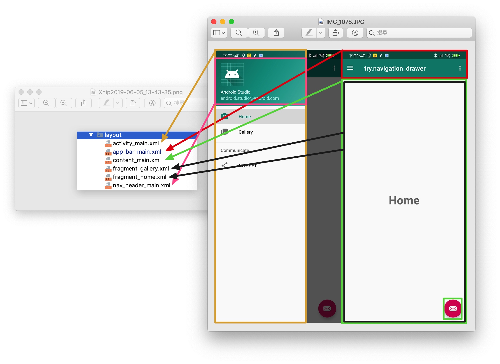

# Android Navigation Drawer with Fragments

> 可參考: https://www.youtube.com/playlist?list=PLrnPJCHvNZuDQ-jWPw13-wY2J57Z6ep6G
> https://github.com/WingCH/Sample_Navigation_Drawer

**架構: 一個Activity + n個Fragment**





```java
package com.example.trynavigation_drawer;

import ...

public class MainActivity extends AppCompatActivity
        implements NavigationView.OnNavigationItemSelectedListener {

    DrawerLayout drawer;

    @Override
    protected void onCreate(Bundle savedInstanceState) {
        super.onCreate(savedInstanceState);
        setContentView(R.layout.activity_main);

        //以下部份幾乎通用，Toolbar NavigationView DrawerLayout 成套
        //------------------------------------------------------//
        Toolbar toolbar = findViewById(R.id.toolbar);
        setSupportActionBar(toolbar);

        drawer = findViewById(R.id.drawer_layout);
        NavigationView navigationView = findViewById(R.id.nav_view);
        navigationView.setNavigationItemSelectedListener(this);


        ActionBarDrawerToggle toggle = new ActionBarDrawerToggle(
                this, drawer, toolbar, R.string.navigation_drawer_open, R.string.navigation_drawer_close);
        drawer.addDrawerListener(toggle);
        toggle.syncState();
        //------------------------------------------------------//

        //第一頁
        if (savedInstanceState == null) {
            getSupportFragmentManager().beginTransaction().replace(R.id.fragment_container,
                    new Home()).commit();
            navigationView.setCheckedItem(R.id.nav_home);
        }
    }
    
    @Override
    public void onBackPressed() {
        if (drawer.isDrawerOpen(GravityCompat.START)) {
            drawer.closeDrawer(GravityCompat.START);
        } else {
            super.onBackPressed();
        }
    }

    @Override
    public boolean onCreateOptionsMenu(Menu menu) {
        // Inflate the menu; this adds items to the action bar if it is present.
        getMenuInflater().inflate(R.menu.main, menu);
        return true;
    }

    @Override
    public boolean onOptionsItemSelected(MenuItem item) {
        int id = item.getItemId();
        if (id == R.id.action_settings) {
            return true;
        }
        return super.onOptionsItemSelected(item);
    }

    @SuppressWarnings("StatementWithEmptyBody")
    @Override
    public boolean onNavigationItemSelected(MenuItem item) {
        switch (item.getItemId()) {
            case R.id.nav_home:
                getSupportFragmentManager().beginTransaction().replace(R.id.fragment_container,
                        new Home()).commit();
                break;
            case R.id.nav_gallery:
                getSupportFragmentManager().beginTransaction().replace(R.id.fragment_container,
                        new Gallery()).commit();
                break;
            default:
                return false;
        }
        drawer.closeDrawer(GravityCompat.START);
        return true;
    }   
}
```