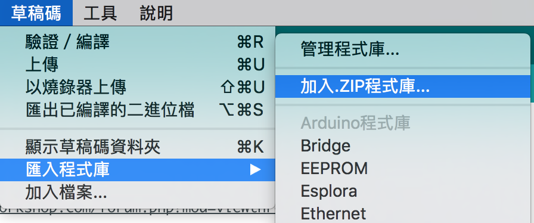

# Arduino OLED

顯示屏 : [SSD1306_128X64](https://item.taobao.com/item.htm?spm=a1z09.2.0.0.SLNsUs&id=37849023766&_u=opk465gc6d3)
參考文件 : [SPI接口Arduino文件](./media/14852444443298/arduino.rar)

-------

###### 將U8glib庫加入程式庫


###### 接法
| OLED | Arduino |
| :-: | :-: |
| GND | GND |
| VCC | 3.3V / 5v |
| D0 | 13 |
| D1 | 11 |
| RES | REST |
| DC | 9 |
| CS | 10 |

```c
#include "U8glib.h"

U8GLIB_SSD1306_128X64 u8g(13, 11, 10, 9);	// SW SPI Com: SCK = 13, MOSI = 11, CS = 10, A0 = 9

//U8glib教學 : http://geek-workshop.com/forum.php?mod=viewthread&tid=10634&page=1#pid71161

void setup(void) {
  Serial.begin(9600);
  // flip screen, if required
  // u8g.setRot180();
  
  // set SPI backup if required
  //u8g.setHardwareBackup(u8g_backup_avr_spi);

  // assign default color value
  if ( u8g.getMode() == U8G_MODE_R3G3B2 ) {
    u8g.setColorIndex(255);     // white
  }
  else if ( u8g.getMode() == U8G_MODE_GRAY2BIT ) {
    u8g.setColorIndex(3);         // max intensity
  }
  else if ( u8g.getMode() == U8G_MODE_BW ) {
    u8g.setColorIndex(1);         // pixel on
  }
  else if ( u8g.getMode() == U8G_MODE_HICOLOR ) {
    u8g.setHiColorByRGB(255,255,255);
  }
   
  pinMode(8, OUTPUT);
}

void loop(void) {
  // picture loop
  u8g.firstPage();  
  do {
    //坐標
    draw(0,10,"Hello");
    draw(0,40,"World");

  } while( u8g.nextPage() );
  // rebuild the picture after some delay
  delay(2000);
  
}

void draw(u8g_uint_t x, u8g_uint_t y, const char* display_word) {
  // graphic commands to redraw the complete screen should be placed here  

  //字體(部份用到) https://github.com/olikraus/u8glib/wiki/fontsize
  //字體大小系跟字體本身
  u8g.setFont(u8g_font_unifont);
  //u8g.setFont(u8g_font_osb21);
  u8g.drawStr( x, y, display_word);
}
```


