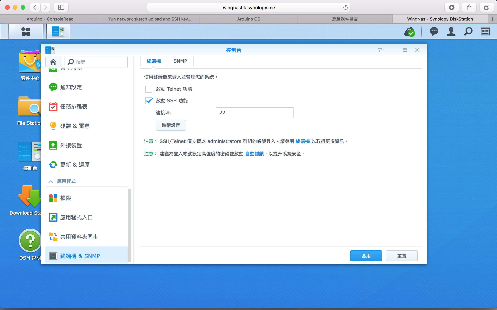

# Arduino Yun Console輸出 - Wifi

[ConsoleRead(官網教學)](https://www.arduino.cc/en/Tutorial/ConsoleRead)

如果出現`Auth fail` 檢查Wifi的ssh
我的情況是路由器是連接synology的server
而我在server 關了ssh 所以導致出現Auth fail的問題
開番就ok了

