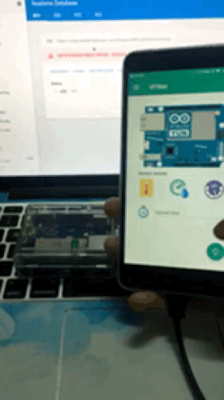

# Arduino Yun Firebase使用
Arduino Yun 有兩個CPU 其中一個運行Linux,內置REST API,所以可以直接使用REST API寫入資料到Firebase,不需要使用php.

[Firebase REST API使用文件](https://firebase.google.com/docs/database/rest/start)


Arduino Yun ---data---> Firebase

Other Arduino ---php(data)--> server ---data---> Firebase


### 寫入資料到Firebase


```c
#include <Process.h>

void setup()
{
  Bridge.begin();   // Initialise the Bridge
}

void loop()
{
  // 模擬數據
  int sensor = random(10, 20);
 
  Process p;
  //使用cURL Post資料去Firebase (有幾種寫法)
  p.runShellCommand("curl -k -X POST https://YOUR_ACCOUNT.firebaseio.com/temperature.json -d '{ \"value\" : " + String(sensor) + "}'");  
  //兩個value
  p.runShellCommand("curl -X POST -d '{\"sensor_a\":" + String(sensor) + " ,\"sensor_b\":" + String(sensor) + "}' \'https://YOUR_ACCOUNT.firebaseio.com/temperature.json'");


  while(p.running()); 
  delay(2000);                
}
//參考
//http://www.fabiobiondi.com/blog/2014/02/arduino-yun-angularjs-and-firebase-with-curl-realtime-data/
```

###Firebase拎資料 to Arduino 

Firebase輸出資料會以json格式顯示
使用`aJSON`解析json

###### 以下例子示範遠端控制LED燈開關


```c
#include <Process.h>
#include <aJSON.h>
//拎資料參考https://ioio.mah.se/tutorials/yunfirebase/
//aJSON : https://github.com/interactive-matter/aJson
//Clone or Download/Download ZIP --> 去Arduino IDE 草稿碼/匯入程式庫/加入.ZIP程式庫
void setup() {
    Bridge.begin();   // Initialize the Bridge
    Serial.begin(9600);//9600 類似波長 監察視窗要用番9600(右下角)
    pinMode(13, OUTPUT);//LED燈用Arduino 13 port

    delay(2000);  // wait 2 seconds
}

void loop() {
    
    delay(1000);
    String result;

    Process getDataWithFirebase;
    //拎網址的資料
    //-k = 允許不使用證書到SSL站點 http://man.linuxde.net/curl
    getDataWithFirebase.runShellCommand("curl -k 'https://YOUR_ACCOUNT.firebaseio.com/LED.json'");
    while(getDataWithFirebase.running());
    //getDataWithFirebase.available() = 成功
    while (getDataWithFirebase.available()) {
        //佢會一個一個字元出 所以要將全部字元連埋一齊
        char word = getDataWithFirebase.read();
        result +=word;
    }
      Serial.print("String result : ");
      Serial.println(result); 
      //String result : {"LED":"OFF"}
      
      //String --> char (aJson要char)
      char result_char[65];//唔一定系65 夠位就得
      result.toCharArray(result_char, 65);
      
      //解析  result_char : json
      aJsonObject *msg = aJson.parse(result_char);
      ComExecution(msg);
      aJson.deleteItem(msg);
      
}

void ComExecution(aJsonObject *msg)
{
    String LedStatus;
      aJsonObject *getLedStatus = aJson.getObjectItem(msg, "LED"); 

      if(getLedStatus) {
        //如果系int LedStatus =getLedStatus->valueint;
        LedStatus = getLedStatus->valuestring;
        //LedStatus = OFF
      }
      
      //如果系ON 開燈
      //如果系OFF 關燈
      if(LedStatus == "ON"){
        Serial.println("LED ON");
        digitalWrite(LED_BUILTIN, HIGH);
      }else if(LedStatus == "OFF"){
        Serial.println("LED OFF");
        digitalWrite(LED_BUILTIN, LOW);
      }
}

```




