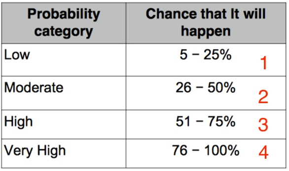

# COMP356F Software Engineering and Project Management

### Question 1 : Requirements Elicitation and Analysis [12 marks]

> 2018 :
> You should know how to write use case descriptions which are not to be confused with use case diagrams. You also need to know how to write user stories. You should know when use case descriptions are better than user stories and vice versa. Of course, you always need to know why.

---

> 2019 :
> You should know how to write **user stories** and **acceptance criteria**. 
> You should know how to break up a user story into **several developer tasks**.


#### User stories

> `As a <role>, I want <goal/desire> so that <benefit>.`

```
As a user of the library catalogue , I want to search from the system's front page with search refinement options.
```
#### Acceptance criteria 驗收標準

>  The number of acceptance criteria really depends on the user story. **Two or three acceptance criteria may be enough.**

```
1. I can search by format/type of the library item.
2. Results are ordered from newest items first and may be switched to ordering from oldest items first.
3. I can search by title, author, subject, place, publisher and call number.
4. I can search for items that are currently available to me.
```

#### `User story` into several `developer tasks`.

#####User story (Product backlog):
> As a KMB mobile app user, i want to find-out special offer by KMB, so that i can use it to deduct my octopus card.

#####Developer tasks (Sprint backlog):
> 1. Create database to store special offer location data
> 2. In UI menu add a link, user can click this lick to find special offer location.
> 3. **Option:** Unit test to make sure this function work.

-------
### Question 2 : Software Architectural Styles [12 marks]

> 2018 :
> You need to know the different styles and when to use which. I will be asking you two of the styles.

---

> 2019 :
> You need to know the different styles and when to use which. 
> I may ask you two of the styles taught.
> 可能抽兩個Styles, 比個情境你, 選邊個Styles? 原因


| Styles | ⭕️ | ❌ |  |
| :-: | :-: | :-: | :-: |
| Model/view/controller (MVC) | easy to development, update and debug | need time to learn | PHP/Js |
| Repository | easy to understand and use, programmer no need to handle access database part, just use repository is ok, access database part is responsible by repository | low Performance | only for data storage and retrieval |
| Client/server | The software is partition into two parts the server who provides services and resources and the client who consumes these services. | Confusion is to decide whether a task should be done by the server or the client. | Email Service, Web Service |
| Peer-to-peer (P2P) | Fast, all peers can do server and client roles, they share the source, so if one peer is down, the service still works | High power consumption | download/share file |
| 3-tier |  same to MVC, but A tier only can access B tier, B tier can receive A message and send it to C, but A and C cannot have any interaction.| same to MVC | Web|
| N-tier | | affect the performance | |
| Pipe and filter |  | Must match protocol | UNIX系統 |

> http://wayne265265.pixnet.net/blog/post/115771769-%E3%80%90%E7%AD%86%E8%A8%98%E3%80%91architectural-pattern-%28%E6%9E%B6%E6%A7%8B%E6%A8%A1%E5%BC%8F%29


##### MVC and 3-tier differ in two ways (Week 8 p.22)

How a system is divided?

> In MVC, the users see the view and input to the controller. In 3-tier, the user sees and input to the presentation tier only. All UI-related tasks are done in the presentation tier.

How the subsystems communicate to each other?

> In MVC, the 3 components relationship is circular. In 3-tier, the 3 components are each related to its neighboring tier(s).


-------


### Question 3 : Design Patterns and Code Refactoring [10 marks]

> 2018 :
> I will ask you one of the design patterns and one of the refactoring rules that we have taught in class.

---

> 2019 :
> I will ask you one of the design patterns and 
> one of the refactoring rules that we have taught in class.
> 要知道d名


##### Why Study Design Patterns? (設計模式) week8 p.27

* **To reuse design** - Use existing solution to solve similar problem 
* **To improve communication**
* **To make software understandable and maintainable** 
* **To improve your OO design techniques**

##### structural patterns 結構模式
* Facade
    * provides a simplified interface to a large body of code.
    

* Adapter
    * allows classes with incompatible interfaces to work together by wrapping its own interface around an existing class.
    


##### behavioral patterns(行為模式) 
* Observer
    * allows a number of clients to know the latest state of a subject.
    

* Strategy
    * allows algorithms to be selected on-the-fly.
    
    

>3. 3 creational patterns (Factory Method , Singleton and Abstract Factory) .

#### Refactoring

> Code smells cause the program to be hard to read. Code refactoring removes code smells.

* **Improve the program structures** - easy to read and maintain
* **Must not change program function or UI** - user will not know the program is refactored
* **Use some rule to Refactor coding** - usually just changes the program a little bit
* **detection of code smells in programs** - detect -> Refactoring

#### Refactoring rules


| Rules |  |
| --- | --- |
| [Extract Class](https://www.refactoring.com/catalog/extractClass.html) | |
| [Extract Method](https://refactoring.com/catalog/extractFunction.html) | |
| [Separate Query from Modifier](https://www.refactoring.com/catalog/separateQueryFromModifier.html) ||
| [Consolidate Conditional Expression](https://refactoring.com/catalog/consolidateConditionalExpression.html) / **Inline Method** (**powerpoint 有特別講**) | |
| [Collapse Hierarchy](https://refactoring.com/catalog/collapseHierarchy.html) | |
| Pull Up Field (**powerpoint 有特別講**)| 
|
| Pull Down Field (**powerpoint 有特別講**) | 
|


-------

### Question 4 : OCL [16 marks]

> 2018 : 
> You will be given an incomplete OCL specification. You will be asked to explain some part of it. You will also be asked to complete the missing part. The given OCL specification will remind you correct OCL syntax to reduce the rote memorization required.

---

> 2019 : 
You will be given an incomplete OCL specification. You will be asked to explain some part of it. 
> You will also be asked to complete missing parts. The given OCL specification can remind you correct OCL syntax to reduce the rote memorization required.


```
WEEK 8
```

#### OCL 
> [other](http://cs.ulb.ac.be/public/_./media/teaching/infoh302/oclnotes.pdf)


-------

### Question 5 : Testing

> 2018 :
> You should be able to explain TDD. You should know when and how to apply any of the testing techniques we have taught: equivalence testing, boundary testing, path testing, state-based testing and pairwise testing.

---

>2019 : 
>You should be able to explain TDD. 
>You should know when and how to apply one or two of the testing techniques we have taught: equivalence testing, boundary testing, path testing, state- based testing, pairwise and mutation testing.

#### Test-Driven Development (TDD)

> write unit tests before write the application 


|   | whitebox | blackbox |
| :-: | :-: | :-: |
|  |  uses knowledge , e.g. data structures and algorithms |  focuses on what output is produced from what input. |
| advantage | design takes into account of the program’s implementation | tests to be design without knowledge of the program design |
| disadvantage | Need to the code of program?? | cannot see through a black box so you can only design tests based on the program behavior. |


| Testing techniques |   |  |
| :-: | :-: | :-: |
| **(black)** equivalence testing (equivalence partitioning) | 同一類既一個partitions(分區) |  |
| **(black)** [boundary testing](https://kkboxsqa.wordpress.com/2013/11/29/20131129-%E9%82%8A%E7%95%8C%E5%80%BC%E5%88%86%E6%9E%90-boundary-value-analysis-bva/) | 邊界值分析 用最少最大數字做test |  |
| **(white)** [path testing](https://zh.wikipedia.org/wiki/%E5%BE%AA%E7%92%B0%E8%A4%87%E9%9B%9C%E5%BA%A6) | 測試程式中的每一線性獨立路徑(每一個可能性) | |
| **(black or white)** state-based testing | ensures that all possible states of an object are covered | |
| **(black)** [pairwise testing](http://kojenchieh.pixnet.net/blog/post/367444547-%E9%BB%91%E7%AE%B1%E6%B8%AC%E8%A9%A6%E6%96%B9%E6%B3%95%E5%A4%A7%E5%B0%8D%E6%B1%BA) | 當你有很多測試環境的組合, 例如 3 個 browser, 5 個 OS, 4 個資料庫, 你將會有很多環境組合要測試. PT 會利用每兩兩組合的方式, 而不是去測試所有的組合, 來降低索要測試的組合量 | |


-------

### Question 6 : Project Management and Software Measurements [20 marks]

> 2018 : 
> You should know how to estimate effort required in a software development project. You should also understand GQM.

---

>2019 :
>You should know how to estimate effort required in a software development project. 
>You should be able to explain or apply GQM.


##### Goal-Question-Metric 目標-問題-指標

##### 6 step

1. Develop goals for productivity and/or quality. **制定生產力和/或質量目標**

2. Generate questions for the goals based on some observable and measurable characteristics. **根據一些可觀察和可測量的特徵為目標生成問題**

3. Specify metrics to answer those questions. **指定度量來回答這些問題**

4. Develop mechanisms for data collection. **建立數據收集機制**

5. Collect, validate and analyse the data. **收集，驗證和分析數據**

6. Take actions to improve the current situation based on the result of analysis. **根據分析結果採取行動改善現狀**


-------

### Question 7 : Risk management and Code of Ethics [12 marks]

> 2018 :
> You need to know about risk management. You should be able to write a risk register for a situation.

---

>2019 :
>You need to know about risk management. 
>
>You should be able to write a risk register for a situation. (The risk register is a table.)
>
>You will be asked to make an ethical decision in a situation. You are advised to have read the short and long version of ACM-IEEE Software engineering Code of Ethics and Professional Practices. But rote memorization is not required.

####Risk register 
**risk register We used a 4-point system.**

| # | Risk Description | Likelihood 可能性 | Impact 影響| Risk Score | Mitigation |
| --- | --- | --- | --- | --- | --- |
|  ||  | | Likelihood x Impact<br> • **Green** for 1, 3 and 5<br> • **Orange** for 9 and 15 <br>• **Red** for 25</div> |  proactively(預防)<br/>reactively(補救) |

The higher the risk value, the more resources should be allocated to handle the risk.

<!-- 
## Waterfall
1. Requirements (客戶的需求)
2. Design (各種文件)
3. Implementation  (Coding)
4. Verification (做testing)
5. Maintenance (維護)
-->


