# COMPS362F Concurrent and Network Programming

## Outcome 1 - Explain concurrent computing concepts

> 文字題
> Sir : I may just ask one of the two topics

### Types of networks (message-switching vs packet switching)

> https://www.youtube.com/watch?v=qtGu7B8iy4Q

- message is mean a **complete unit**, such as text, sound and video.

#### Message switching

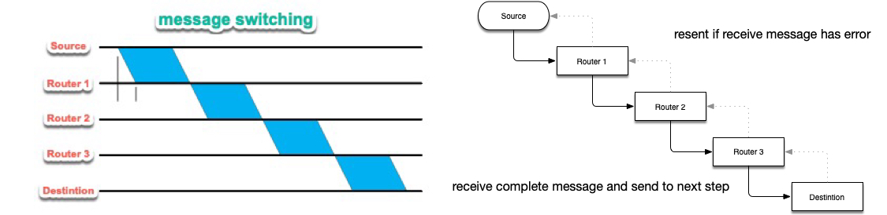

1. `Source` send complete message to `Router 1`
2. `Router 1` receive and check message have an error? if have source resent message
3. `Router 1` send receive complete message to `Router 2`, repeat Step 2

- if the  message has error, **need resend complete message**, cannot just resent the error part
- the retractive action in case of error will be cumbersome and chaotic.
- Only one of the 4 links is working at any time
- more time for transmission

#### Packet switching


1. `Source` send a part of message to different routes in parallel
2. `Router 1` receive a part of message, and then send to next step
3. `Destination` will  receive and re-assemble all part of message 

- if the a part of message has error, **only need resend the error part**, no need send complete message
- **Save many transmission time** when the number of hops over which the data is transmitted is very large and the propagation delay is relatively long. 
-  Re-assemble a part of message need some time, but since CPUs are fast, **saved transmission time can cover re-assemble time.**

### Load balancing

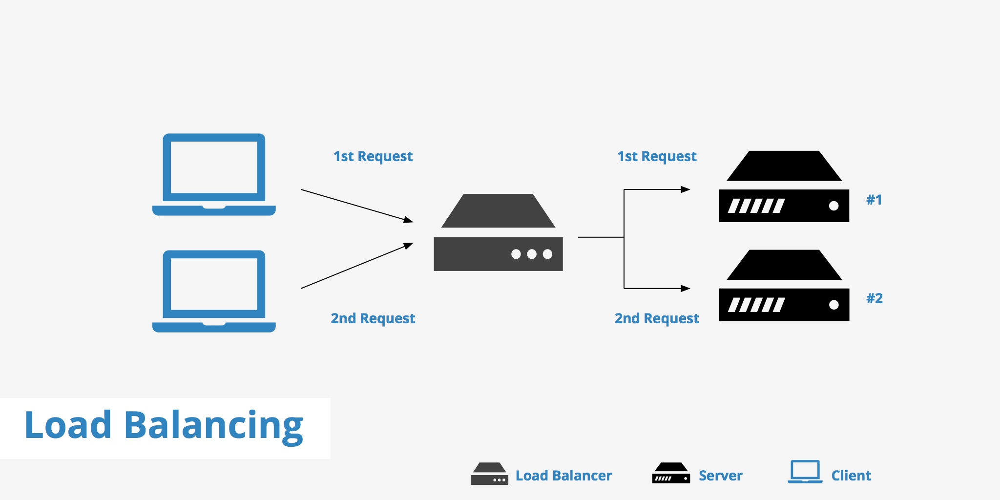

- **Simplistic round-robin load balancer** – Assume 3 servers. The load balancer sends task 1 to server 1, task 2 to server 2, task 3 to server 3, task 4 to server 1, and so on.

- **Weighted round robin load balancer** takes into account of the different task sizes and server processing power.

- **Dynamic round robin** - If the servers frequently tells the load balancer their current workload, the load balancer can assign the next task to the least busy server.

#### How does it work?

> 參考：https://www.keycdn.com/support/load-balancing

1. load balancer is in most cases a software program to listen request and forwards it to a backend server which the server can handle it.
2. server reply the load balancer after request done
3. the load balancer passes on the reply from the backend server to the client.

> user never know the process between load balancer and server, which server is handle their request.

#### Benefits
1. A better user experience, fast loading time
2. Less stress on a single server
3. Diffusion risk, if a part of server down, the website still can run

---

## Outcome 2 - Apply threads and processes to build concurrent programs

>  Programming question
>  Sir : this one likely asked both topics
> 1. this program is trying to do
> 2. What's the meaning of this program
> 3. Whether this program has bug 
> 4. does it behave in a certain way
> 5. add a feature which to do certain things (same one in the lab or really simple)

### Semaphores, locks, conditions 
> Sir : I think this one have the most weight

### Semaphores

- Semaphores represent resources

- Semaphores work a little bit like locks and helps to count remaining resources
- acquire() called, counter - 1
- release() called, counter + 1
- when counter is 0, the request will be blocked until counter more than 1

> http://www.zhangdongshengtech.com/article-detials/184

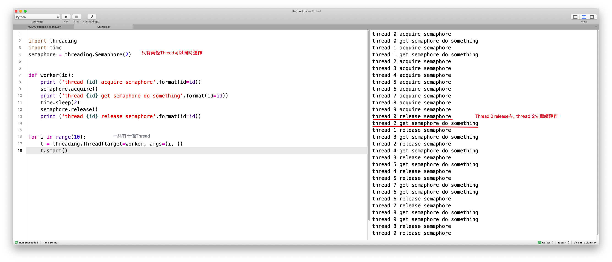


```python
semaphore = threading.Semaphore(2) //counter = 2
semaphore.acquire() # counter - 1, if count == 0 wait until count > 0
... access shared resource
semaphore.release() # counter + 1 
```
#### Locks


```python
lock = Lock()

lock.acquire() # will block if lock is already held
... access shared resource
lock.release()
```

#### Conditions

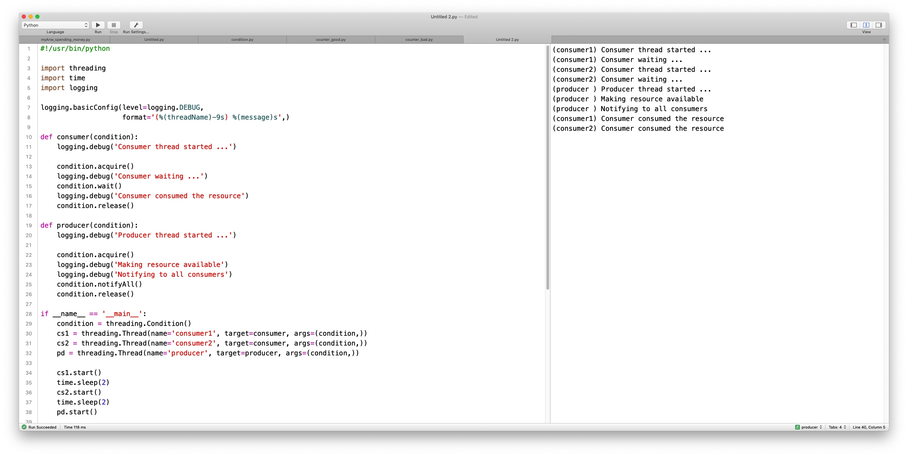


```python
lock = threading.Condition()

lock.acquire() # unlocked -> locked, locked -> wait release
lock.release() # locked -> unlocked, unlocked -> error

lock.wait() # wait notify 
lock.notify_all()
```


### Message passing in processes / master-worker paradigm

1. One process sends data in a message to another process.

2. Programming technique:
    1. The sender executes a send operation.
    2. The receiver executes a receive operation.

3. In synchronized communication, the sending process waits for the receiving process to accept the message before proceeding to execute its next statement.

4. In asynchronized communication, the sending process does NOT wait for the message to be received before proceeding.
 
> Lab 11

```python
#!/usr/bin/python

from multiprocessing import Process, Pipe

def master_task():
	conn1A, conn1B = Pipe()
	conn2A, conn2B = Pipe()
	conn3A, conn3B = Pipe()
	worker1 = Process(target=worker_task, args=(25, conn1B))
	worker2 = Process(target=worker_task, args=(25, conn2B))
	worker3 = Process(target=worker_task, args=(25, conn3B))
	worker1.start()
	worker2.start()
	worker3.start()
	
	sum = 0
	
	for i in range(1, 26):
		sum = sum + i
		conn1A.send(i+25) #2.1
		conn2A.send(i+50)
		conn3A.send(i+75)
		
	print("Master calculated partial sum as {}".format(sum))

	recv_conn1A = conn1A.recv()  # 2.2 
	print("Worker {} calculated partial sum as {}".format(0,recv_conn1A))
	sum = sum + recv_conn1A
	
	recv_conn2A = conn2A.recv()
	print("Worker {} calculated partial sum as {}".format(1,recv_conn2A))
	sum = sum + recv_conn2A

	recv_conn3A = conn3A.recv()
	print("Worker {} calculated partial sum as {}".format(2,recv_conn3A))
	sum = sum + recv_conn3A
	
	print('Sum is {}'.format(sum))
	
	conn1A.close()
	conn2A.close()
	conn3A.close()
	child_conn.close()
	
def worker_task(n,conn):
	sum = 0
	for i in range(n):
		sum = sum + conn.recv() # 2.2, 3
	conn.send(sum)
	conn.close()

if __name__ == '__main__':
	parent_conn, child_conn = Pipe()
	master = Process(target=master_task, args=())
	master.start()
```

---
## Outcome 3 - Select a suitable protocol (technique) to solve the problem at hand


### TCP

- reliable (for omission and transmission error)
- slower
- use on Email...

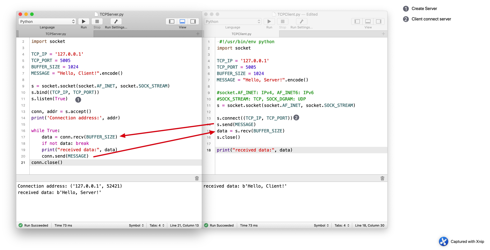


### UDP

- retransmitting a packet is bad
- not reliable (for omission and transmission error)
- faster
- use on Skype, Real-time game...

> like push method

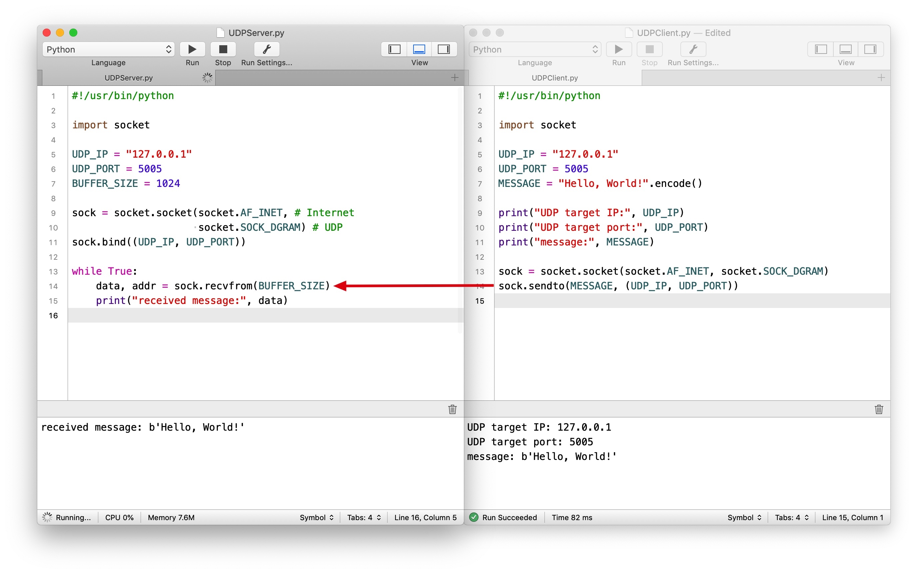


- TCP need connect of server and client
UDP no need connect

- since tcp need connection, so need more system resource

- tcp can make sure data is complete, udp cannot


### Message queues (P2P and publish/subscribe, Amazon SQS)
#### P2P

> point-to-point

1. The sender places a message on a queue which holds the messages until they expire or are received by someone.
2. A message will be received at most once even several receivers are working together to process all messages.
3. In the example of online order fulfillment, we don’t want one order to be shipped twice or more.
4. Like WhatsApp talking
 

#### publish/subscribe

* A message in Publish/subscribe can be seen by all (subscribed) users
* Some message queues will remove messages that are too old and yet no one comes to receive them. It is possible to set an expiry date so that the old messages will be deleted whether or not anyone receives them.

#### Amazon SQS – Cloud for Messaging

> 1. Queues - CreateQueue, ListQueues, DeleteQueue

> 2. Messages - SendMessage, ReceiveMessage, DeleteMessage, ChangeMessageVisibility

> 3. Queue attributes - SetQueueAttributes, GetQueueAttributes

> 4. Access - AddPermission, RemovePermission

1. SQS stands for Simple Queue Service.

2. Runs on a distributed system with
    1. Fault tolerance - A message is stored on multiple message servers.
    2. Scalability - Multiple message servers can share the load.

3. Tradeoff – To make it easy to realize the advantages fault tolerance, scalability and performance, Amazon SQS compromises by **NOT** making the messages FIFO (first-in-first-out).

##### Cloud benefit

* easy upgrade to satisfy different needs
* faster to handle server error
* is great for start-ups.

---
## Outcome 4 - Develop concurrent programs to communicate in XML, JSON or object serialization
> It is less likely I will give a programming question here.
> XML and JSON is for programs to understand data.

### Elementtree & XPath

#### Elementtree : 
 

#### XPath 
[http://www.w3school.com.cn/xpath/xpath_syntax.asp](http://www.w3school.com.cn/xpath/xpath_syntax.asp)

### Comparison with JSON and XML

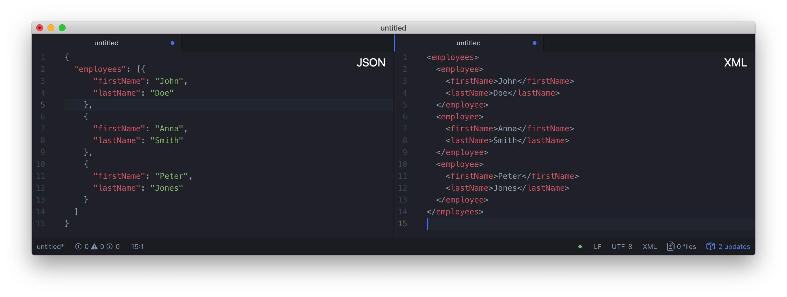

|  | Readable | Cleary | Faster |Support Array | Support Comment |Easy Parsing in programming|
| :-: | :-: | :-: | :-: | :-: | :-: |:-: |
| JSON | ✔️ | ✔️ | ✔️(less size) | ✔️ ||✔️|
| XML |  |  |  |  |✔️||

https://www.w3schools.com/js/js_json_xml.asp

---

## Outcome 5 - Use and provide web services
### Bottle framework
> Bottle is a Python Web Frameworks.

```python
from bottle import request, route, run, template
...
# POST: http://localhost:8080/add
@route('/add', method='POST')
def add():
    # form : <input name="value_name" type="text" value="hi"/>
    form__value  = request.forms.get('value_name') # = hi
    ...

# Web server run on localhost
run(host='localhost', port=8080)   
```

>Lab 12

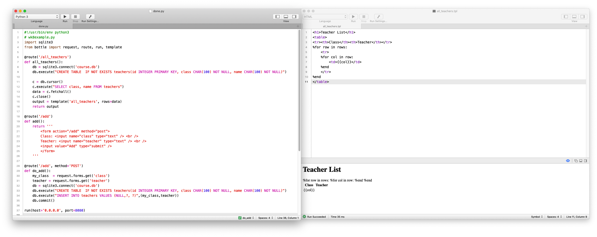

### API vs no API

> You want to be able to explain the difference of using API and non-API approaches. How it affects the code? Which approach is more beneficial for (1) software maintenance and (2) third-party development

#### Software maintenance

API is more structure, can easy use on different part, for example the website have two page need to use same data, if use api, programmer just change api code, no need to change code in each page

#### 3 rd party software development


|| API | no API ||
| :-:| :-: | :-: |:-: |
|easy take data, just call api which will return data what you want | more reliable | unreliable | get html code and then extract the data, if some data have some change pattern or something, it will not work, programmer need to spend time to extract the data again|
|eg: facebook login|easy combine information from different APIs| very difficult|need spend many time to study webpage pattern of different websites|

---
## Outcome 6 - Apply best software engineering practices to build concurrent Python programs

### TDD, doctest, unit test and mutation testing

> Lab 07

1. TDD: Test-Driven Development
    1. doctest
    2. unit test
2. mutation testing

#### doctest, unit test

> doctest

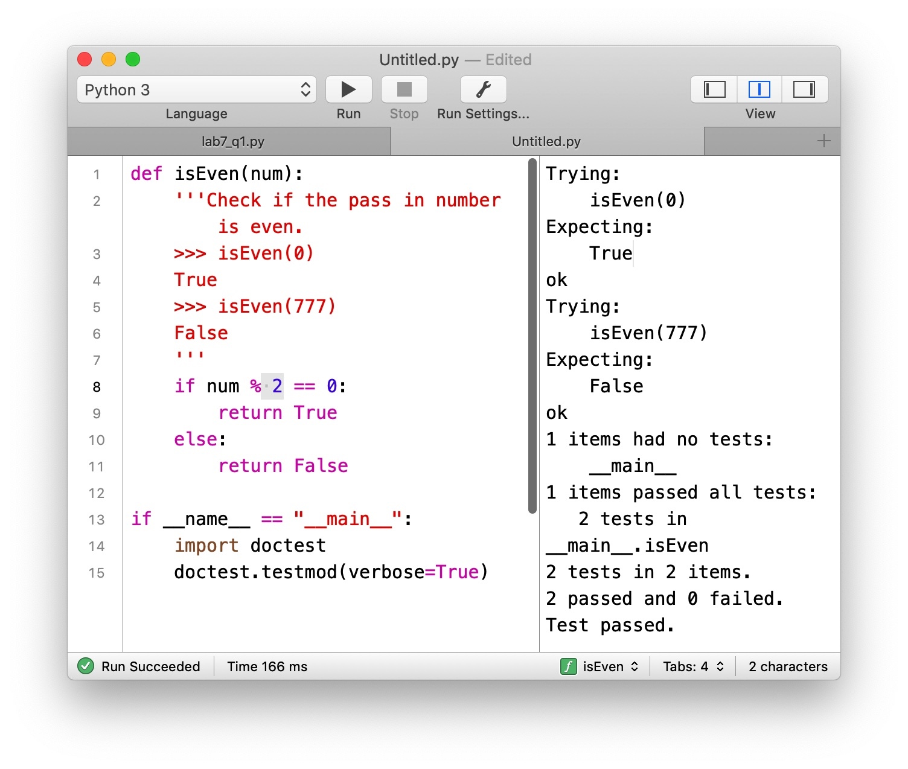
> unit test

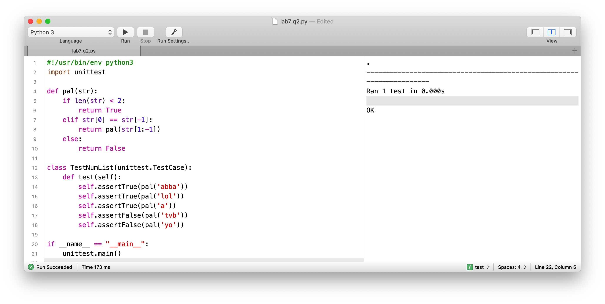
>   self.aseertEquals(func(val), 3)

#### mutation testing

>參考:https://xebia.com/blog/mutation-testing-how-good-are-your-unit-tests/

Mutation testing will change some code such as change `True` to `False` and rerun the code to test there have an abnormal situation, this can help you find omissions in your unit tests, because doctest and unit test is designed by people, people may ignore some part, Even if there is a problem, the   doctest, and unit test cannot detect.


### Spring concepts and aspect oriented programming (AOP)
> copy from Week7 page18

1. Spring supports dependency injection (DI) and AOP.

2. Spring integrates with other frameworks like Hibernate.

3. Spring requires programmers to write configuration files.

4. Spring generate code from configuration files.

5. Spring programmers can better communicate.

6. Software is more maintainable.


### Multiple inheritance and mixins

#### Multiple inheritance

> 參考
> https://www.liaoxuefeng.com/wiki/001374738125095c955c1e6d8bb493182103fac9270762a000/0013868200511568dd94e77b21d4b8597ede8bf65c36bcd000
> https://www.quora.com/What-are-the-disadvantages-of-using-multiple-inheritance-in-Java

- Multiple inheritance will designed to be very complicated, it will have many problem, the main problem is the diamond problem
    - 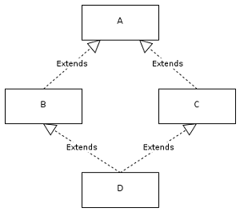 when `D` run, `A` will be error run twice
    
- Many language not friendly to Multiple inheritance, in order to avoid multiple inheritance problems
    - Java
    - Swift
    - PHP
    - JavaScript
    - etc...

#### Mixins

> Usually call -able

```python
#狗(哺乳動物,爬行,肉食)
class Dog(Mammal, RunnableMixin, CarnivorousMixin):
    pass
```

- easy to reuse code, no need rewrite same code in difference location
- clearly structure, avoid diamond problem
- Many language support Mixins
    - Java
    - Swift
    - PHP
    - python
