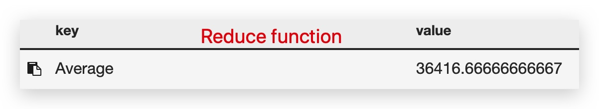

# COMPS363F Exam

## Q: Hot code swap (Week 7)


> What is hot code swap feature?
> P.8

* Hot code swap means that you update the code being run without shutting it down.


> How to use hot code swap in Erlang?
> P.9 - P.16


When a module is loaded for the first time(1), the module code becomes current. 2 & 3. When a new instance of the module is loaded, the original version becomes old.

Erlang saving two version code (Old, Current), so we must use **fully qualified function name** 
`moduleName :functionName.`, Otherwise the old version will continue to be used after a new version is complied.

### By human through the Erlang shell


```erlang
-module(modtest1).
-export([main/0, loop/0, add/1, do/1]).

main() ->
  register(foo, spawn(modtest1, loop, [])).

loop() ->
  receive
    {Sender, N} ->
      %% Sender ! add(N)
      Sender ! ?MODULE:add(N) %% fully qualified function name
  end,
  %% loop().
  ?MODULE:loop(). %% fully qualified function name

do(M) ->
  foo ! {self(), M},
  receive Y ->
    Y
  end.

add(N) -> N + 2.
```

### By program through a message to request software upgrade

```erlang
-module(reloading).
-export([loop/0]).
loop() ->
    receive
        upgrade ->
            code:purge(?MODULE),
            compile:file(?MODULE),
            code:load_file(?MODULE),
            ?MODULE:loop();
        hello ->
            %% change here before call "upgrade"
            io:format("It is changed to the new version.~n"),
            loop();
        _ ->
            loop()
    end.
```


###### After programmers update the source code, Erlang makes the switch to new code easier without a shutdown of the running process.

## Q: Exit Signal Processing

> What are spawn and link used for ?

* **spawn** : Creates a new **process** and returns the pid.

* **link** : Creates **a two way link** between two process.


> What is the benefit of combining them  in a single operation (`spawn_link`)?

call `spawn` and then call `link` is same operation to spawn_link, but it is not in same time, because `spawn` and `link` is two operation, they start time is not same, so in some case the parent process may suspended, child process cannot link to parent process, This will have runtime error instead of an exit signal being received. 
if use `spawn_link`, it is the atomic operation, so it cannot be suspended in between the spawn and the link, avoid error of call `spawn` and then call `link`.


> What is Erlang’s philosophy in handling process crashing?
> P.28

1. In the real world, not everyone can solve his or her own problem.

2. It should be the same for the large number of parallel processes

3. By default, the normal process just crashes and propagates the exit signal to the linked processes.

4. When there are no supervisor processes, human users should be smart enough to restart the multi-processed program.

5. When there are supervisor processes, the exit signal will be trapped. The supervisor process can take corrective actions , for example recreating new processes or killing off incorporative processes.

6. The normal code and the error handling code are not intermixed but execute in normal processes and supervisor processes respectively. The benefit is simpler program structure.


> How to trap exit signals in Erlang?
> P.29


```erlang
-module(add_two).
-export([start/0, request/1, loop/0]).

start() ->
  %%Sets the current process to convert exit signals to exit messages. 
  process_flag(trap_exit, true), 
  Pid = spawn_link(add_two, loop, []),
  register(add_two, Pid),
  {ok, Pid}.

request(Int) ->
  add_two ! {request, self(), Int},
  receive
    {result, Result}       -> Result;
    %%received error Reason, print and restart
    {'EXIT', _Pid, Reason} -> start(), {error, Reason}
    after 1000             -> timeout
  end.

loop() ->
  receive
    {request, Pid, Msg} ->
       Pid ! {result, Msg + 2}
  end,
  loop().
```

## Q: MapReduce paradigm of Hadoop and CouchDB (Week9 10)
> MapReduce : https://sls.weco.net/CollectiveNote20/MR


-------

> You should be familiar with the map-reduce pseudo code of word counting and index building programs.

> index 睇 mapreduce.erl (lab 10)

#####pseudo code of word counting

```
mapper (filename, file-contents):
    for each word in file-contents:
        emit (word, 1)
reducer (word, values):
    sum = 0
    for each value in values:
        sum = sum + value
    emit (word, sum)
```

Run this program on two files:
1.  foo.txt with content “Sweet, this is the foo file”
2.  bar.txt with content “This is the bar file”

End result will be (sweet,1), (this,2), (is,2), (the,2), (foo,1), (bar,1) and (file,2).


#### Pseudo-code for "inverted index"

```
map(String key, String value):
 // key: document URL,
 // value: document contents
 vector words = tokenize(value)
 for position from 0 to len(words):
     EmitInter./mediate(w, {key, position});

reduce(String key, Iterator values):
 // key: a word
 // values: a list of {URL, position} tuples.
 postings_list = [];
 for each v in values:
    postings_list.append(v);
 sort(postings_list); // Sort by URL, then position
 Emit(key, AsString(postings_list));
```


> ~~You should be familiar with the salary example in CouchDB that also uses map-reduce paradigm.~~
> Week10, p.73

<!--


```js
//Map function
function (doc) {
  emit(doc.department, 1);
}

//Reduce function
function (keys, values, rereduce) {
    return sum(values);
}
```


```js
//Map function
function (doc) {
    emit("Average",doc.salary)
}

//Reduce function
function (keys, values, rereduce) {
    return (sum(values))/values.length
}
```



-->
>  I may ask you concepts.

...

> ~~I may give you a program and ask you to modify it to do something slightly different.~~
...

## Q: Distributed Algorithms

> Three families of distributed algorithms were taught; one or two will be asked in the exam.

1. clock synchronization algorithms
    1. https://youtu.be/dFGczTapZns?t=611 好似話唔考？

2. Snapshot algorithm
	⁃	1. Each processor counts the tokens on itself and its incoming link.
	⁃	2. One processor initiates the counting by sending out a marker.
	⁃	3. Other processors count after receiving the marker. They propagate the marker.
	⁃	4. The markers differentiate what have or have not been counted.
	⁃	5. All counts will be returned to the original requestor.
	⁃	6. The counting finishes when the original requestor receives the token counts on
every processor and every directed link.

1. election algorithms
    1. 

> Snapshot algorithm is too tedious for you to apply in exam; if a question is asked, it will likely be about concepts.

> You should know how the ring-based election algorithm work.

## Q: Software architecture for distributed systems <br/>分散式系統的軟體體系結構

> Data partitioning, data replication and data caching are three important design techniques.
> You should know when to use which.

### Data partitioning
* **Advantage**
    * Increase availability
        * easy update when one server is full
    * Improve availability
        * avoids a single point of failure. If one instance fails, only the data in that partition is unavailable. Operations on other partitions can continue
* **Disadvantage**
    * 

### Data replication
* **Advantage**
    * Availability
        * if a name server is down, another name server can provide the name resolution service.
    * Improvement Performance
        * if server is proximity will reduced network traffic
    * Small extra work and traffic
        *  Since the domain names - IP addresses mapping does not change frequently
* **Disadvantage**
    * Slow response
        * The distance will result in slow response if number of server replicated servers are less distributed around the world.
    * The distance to travel for name resolution adds to the costs.?????
    
**In general , data replication is fit on the number of reads is much higher than the number of updates.**

### Data caching
> Caching stores frequently used data in fast memory.

* **Advantage**
    * fast
        * Cache in RAM to speed up access to hard disks
* **Disadvantage**
    * Less space
        * cannot put all data to ram, because ram less space
    * Expensive
        * usually faster memory is also more expensive.
    * overhead
        * The use of caching has overhead. When something is updated, the update needs to be made on two levels of memory.

## Q: Petri nets

> What is modelling? 

A model is a high-level structure capturing the essence of the product to be built. A model will not have all the details of the final product.

> Why do we want to model before building a piece of software?

A model can serve at least 2 purposes. It can be used to compare different high-level designs. It can guide people to build the final product.

>  What is the special strength of Petri nets comparing to other modelling notation?

Petri Nets share a a strength of other formal notations that they facilitate automated reasoning of a model. An added strength of Petri Nets is that they can show the design in a graphical form for better understanding.

> Can you use Petri nets to find out if a model can (1) reach a specific state, (2) have a deadlock or (3) have certain characteristics?

1. Automated reasoning allows us to find out that the distributed system represented by a Petri Net can reach a certain desirable state.

2. Deadlock is an undesirable state in which no further progress can be made. An automated tool can take a Petri Net to figure out whether a deadlock exists.
3. Certain characteristics: Bounded, Safe, and Deadlock.
    1. Bounded
    2. Safe
    3. Deadlock

Deadlock is an undesirable state in which no further progress can be made. An automated tool can take a Petri Net to figure out whether a deadlock exists.


> Can you create or explain a Petri net trying to solve for a simple problem?
> 

> You need to be able to draw a Petri net in the graphical notation and textual notation (P,T,F)

> You need to know how to represent the state of a Petri net with its marking

[Lab 9](https://drive.google.com/open?id=1ww3ygbBOlEU5TJTzePqTOn1h8N9MXrBy)

## Q: OTP Framework
OTP is a good framework for Erlang.

> What are the benefits and costs of using OTP or other similar software development frameworks?

* benefits
    * A framework comes with code and default behavior.
    * It tries to improve programmer productivity .
* costs
    *  programmer need to learn how to program them to benefit.

> You need to be able to read and explain programs that use OTP.

> You may be asked to modify or complete a given program using OTP.

#### Steps to Write a Callback Module for gen_server
1. Choose a module name - We choose my_bank for our module.

2. Write client functions for our module . Our banking module has
    1. start( ) - open the bank
    2. stop( ) - close the bank
    3. new_account(Who) - create a new account
    4. deposit(Who , Amount)
    5. withdraw(Who , Amount)

3. Provide the mandatory callback functions : iniU1, handle_call/3 , handle_casU2, handle_info/2 , terminate/2 and code_change/3 .

> **ets** provide the ability to store very large quantities of data in an Erlang runtime system, and to have constant access time to the data

```erlang
-module(my_bank).

-behaviour(gen_server).
-export([start/0]).
%% gen_server callbacks
-export([init/1, handle_call/3, handle_cast/2, handle_info/2,
	 terminate/2, code_change/3]).
-compile(export_all).
-define(SERVER, ?MODULE). 

start() -> gen_server:start_link({local, ?SERVER}, ?MODULE, [], []).
stop()  -> gen_server:call(?MODULE, stop).

new_account(Who)      -> gen_server:call(?MODULE, {new, Who}).
deposit(Who, Amount)  -> gen_server:call(?MODULE, {add, Who, Amount}).
withdraw(Who, Amount) -> gen_server:call(?MODULE, {remove, Who, Amount}).

init([]) -> {ok, ets:new(?MODULE,[])}.

handle_call({new,Who}, _From, Tab) ->
    Reply = case ets:lookup(Tab, Who) of
		[]  -> ets:insert(Tab, {Who,0}), 
		       {welcome, Who};
		[_] -> {Who, you_already_are_a_customer}
	    end,
    {reply, Reply, Tab};
	
handle_call({add,Who,X}, _From, Tab) ->
    Reply = case ets:lookup(Tab, Who) of
		[]  -> not_a_customer;
		[{Who,Balance}] ->
		    NewBalance = Balance + X,
		    ets:insert(Tab, {Who, NewBalance}),
		    {thanks, Who, your_balance_is,  NewBalance}	
	    end,
    {reply, Reply, Tab};
	
handle_call({remove,Who, X}, _From, Tab) ->
    Reply = case ets:lookup(Tab, Who) of
		[]  -> not_a_customer;
		[{Who,Balance}] when X =< Balance ->
		    NewBalance = Balance - X,
		    ets:insert(Tab, {Who, NewBalance}),
		    {thanks, Who, your_balance_is,  NewBalance};	
		[{Who,Balance}] ->
		    {sorry,Who,you_only_have,Balance,in_the_bank}
	    end,
    {reply, Reply, Tab};
	
handle_call(stop, _From, Tab) ->
    {stop, normal, stopped, Tab}.
handle_cast(_Msg, State) -> {noreply, State}.
handle_info(_Info, State) -> {noreply, State}.
terminate(_Reason, _State) -> ok.
code_change(_OldVsn, State, _Extra) -> {ok, State}.
```


```shell
2> my_bank:start(). 
{ok,<0.84.0>}
    When gen_server start (line 11), this will call method init (line 18)
    ets:new(?MODULE,[]) -> Create a table

3> my_bank:new_account("wing").
{welcome,"wing"}
    lookup table (line 21)
    if name existed print {Who, you_already_are_a_customer}, 
    else insert name to table and print {welcome, Who}; 

4> my_bank:deposit("wing",20).
{thanks,"wing",your_balance_is,20}
    lookup table (line 29)
    if result is empty mean no this user name in table, ptint not_a_customer
    else add balance and insert to table(update), print {thanks, Who, your_balance_is,  NewBalance}	f
    
    
5> my_bank:withdraw("wing",80).
{sorry,"wing",you_only_have,20,in_the_bank}
6> my_bank:withdraw("wing",10).
{thanks,"wing",your_balance_is,10}
    lookup table (line 39)
    if result is empty mean no this user name in table, ptint not_a_customer
    else Check if the balance is enough
        Yes: withdraw money and insert to table(update), print {thanks, Who, your_balance_is,  NewBalance}
        No: print {sorry,Who,you_only_have,Balance,in_the_bank}
```
