# COMPS380F Exam

> Kevin: 唔準撕爛份卷 

## Review: Lecture 1 & 2
>  **Concept:** Differences between Web (HTTP) servers, Java EE application server, Web container 

1. Web(HTTP) servers
    1. Web server is responsible for accepting HTTP requests from clients and serving them HTTP responses.
    2. only handling HTTP requests and serve static HTML content.
    
2. Java EE application server
    1. implements the full Java EE specification.
    
3. Web container
    1. is the component of a web server that interacts with Java servlets.
    2. Apache Tomcat
    3. Most web containers implement only the Servlet, JSP and JSTL specifications.

-------

>  **Apply:** Understand Servlet’s life cycle

| Lifecycle call | When | What it is for? | Override it? |
| :-: | :-: | :-: | :-: |
| init( ) | Container call | getting a database connection... | Maybe |
| service( ) | When the first client request comes in, the container starts a new thread and calls service( ) method. | check request HTTP method to call the matching doXX( )  | No |
| doXX( ) | Service( ) call | anything, based on programmer coding | Always |
| destroy( ) | Container call | save any persistent state, and release the database object created... | Maybe |


-------

>  **Apply:** Understand how the web container handles a Servlet requestr


> 參考：
> L02 p.10-12
> https://www.jianshu.com/p/99f34a91aefe
> https://www.studytonight.com/servlet/how-a-servlet-application-work.php

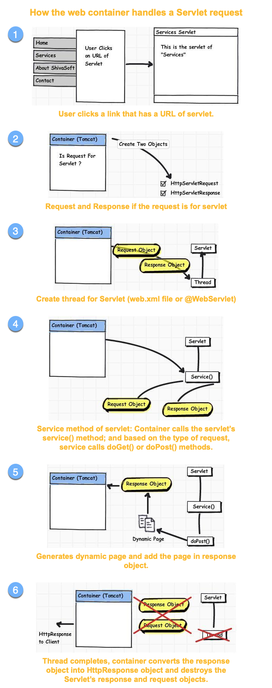

-------

>  **Apply:** Understand the difference of ServletConfig and ServletContext

> https://www.oreilly.com/library/view/head-first-servlets/9780596516680/ch05s10.html

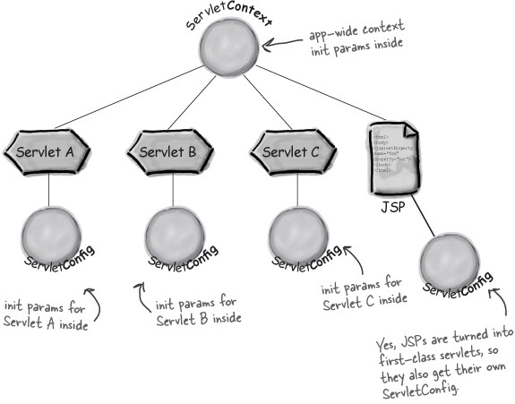

| ServletConfig | ServletContext |
| :-: | :-: |
| Each Servlet has its own ServletConfig object. <br/>(One web application can have many Servlet) | One web application only have one ServletContext |
| Only own servlet can use | Can be configured for all servlet |
| Update ServletConfig no need recompiling <br/>(just change web.xml) | like a Global Variable |


* Also in `web.xml` setup

```xml
<!--*****ServletConfig*****-->
<servlet>
    <servlet-name>ServletConfigTest</servlet-name>
    <servlet-class>com.javapapers.ServletConfigTest</servlet-class>
    
    <!--setup ServletConfig-->
    <init-param>
        <param-name>topic</param-name>
        <param-value>ServletConfig vs. ServletContext</param-value>
    </init-param>

</servlet>
```

```xml
<!--*****ServletContext*****-->

<!--setup ServletContext-->
<context-param>
    <param-name>globalVariable</param-name>
    <param-value>comps380f</param-value>
</context-param>
```


-------

> **Apply:** Understand the difference between Attributes and Parameters 
> * Context init param, Request param, Servlet init param 
> * Context attribute, Request attribute, Session attribute


|  | Attributes | Parameters |
| :-: | :-: | :-: |
| Types | Context attributes<br/>Request attributes<br/>Session attributes | Context init parameters<br/>Request parameters<br/>Servlet init parameters |
| Method to set | setAttribute(String name, Object value) | in Deployment Descriptor (DD), or via client input |
| Return type | Object | String |
| Method to get | getAttribute(String name)... | getParameter(String name)... |

1. Different sources
    1. Parameters is provided by the user from the client.
    2. Attribute is  set by server-side using requst.setAttribute()
    
2. Return type
    1. Parameters return type is a **String**.
    2. Attributes return type is an **Object**.
    
-------
> **Apply:** Able to write a simple Servlet:
> * Servlet class with init(), doGet(), doPost(), destroy() 
> * Deployment descriptor (/WEB-INF/web.xml)
> * @WebServlet annotation

```html
<!--/WEB-INF/jsp/email_form.jsp:-->
…
<form method="POST" action="echoEmail">
    <p>Name: <input type="text" name="name"/></p>
    <p>Email: <input type="text" name="email"/></p>
    <p><input type="submit" value="Send"/></p>
</form>
…

<!--/WEB-INF/jsp/email_output.jsp:-->
…
<ul>
    <li> Name: ${myName} </li>
    <li> Email: ${myEmail} </li>
</ul>
…
```

```java
//Servlet class with init(), doGet(), doPost(), destroy()

@Override
public void init() throws ServletException {
    System.out.println("Servlet " + this.getServletName() + " has started.");
}

@Override
protected void doGet(HttpServletRequest request, HttpServletResponse response) 
    throws ServletException, IOException {
        //same doPost
}

@Override
protected void doPost(HttpServletRequest request, HttpServletResponse response)
    throws ServletException, IOException {
    
        String name = request.getParameter("name");
        String email = request.getParameter("email");
        //if String[] use request.getParameterValues("name");
        
        request.setAttribute("myName", name);
        request.setAttribute("myEmail", email);
        
        request.getRequestDispatcher("/WEB-INF/jsp/email_output.jsp").forward(request, response);
    
}

@Override
public void destroy() {
    System.out.println("Servlet " + this.getServletName() + " has stopped.");
}
```


```xml
<!--Deployment descriptor (/WEB-INF/web.xml)-->
<servlet>
    <servlet-name>{{ Servlet Name }}</servlet-name> 
    <servlet-class> {{ package.{{ Servlet Name }} }}</servlet-class>
</servlet>
<servlet-mapping>
    <servlet-name>{{ Servlet Name }}</servlet-name> 
        <url-pattern>{{ /url-pattern }}</url-pattern>
</servlet-mapping>

<!--e.g-->
<servlet-mapping>
    <servlet-name>helloServlet</servlet-name> 
    <url-pattern>/hello</url-pattern> 
    <url-pattern>/greeting</url-pattern>
</servlet-mapping>
```

```java
//servlet 
//@WebServlet annotation
@WebServlet( name = "helloServlet", urlPatterns = {"/hello", "/greeting"} )
```

-------

## Review: Lecture 3
> **Apply:** Able to write a simple JavaBean
> L03 p.41 46-48


A JavaBean is a specially constructed Java class written in the Java and coded according to the JavaBeans API specifications.


```java
//JavaBean
public class HelloBean implements Serializable { //implements Serializable 要背

    private String name; //每個var 都要有getter setter
    private String email;
    
    public HelloBean() {
    
    }

    public String getName() { 
        return name; 
    }
    
    public String getEmail() { 
        return email; 
    }
    
    public void setName(String name) { 
        this.name = name; 
    }
    
    public void setEmail(String email) { 
        this.email = email; 
    }

}
```

```html
<!--From html-->
<!DOCTYPE html>
<html>
<head>
    <title>Email Form</title>
</head>
<body>
    <h1>Email Form</h1>
    <form method="POST" action="echoEmail">
        <p>Name: <input type="text" name="name" size="30" /></p>
        <p>Email address: <input type="text" name="email" size="30" /></p>
        <p><input type="submit" value="Send" /></p>
    </form>
</body>
</html>
```

```html
<!--jsp-->
<!DOCTYPE html>
<html>
    <body>
        <!--聲明 'id:hello' = 上面define左個個 "HelloBean" 既JavaBean (類似swift object 既概念)-->
        <jsp:useBean id="hello" scope="session" class="edu.ouhk.comps380f.lecture03example.HelloBean" />
        <!--name 姐係上面個id, setProperty會自動搵property既setter, 呢度係setName-->
        <jsp:setProperty name="hello" property="name" value='<%=request.getParameter("name")%>' />
        <jsp:setProperty name="hello" property="email" value='<%=request.getParameter("email")%>' />
        
        <!--getProperty會自動搵property既getter, 呢度係getName-->
        <jsp:getProperty name="hello" property="name" />
        <jsp:getProperty name="hello" property="email" />
    </body>
</html>
```
-------
> **Apply:** Understand JSP page’s life-cycle

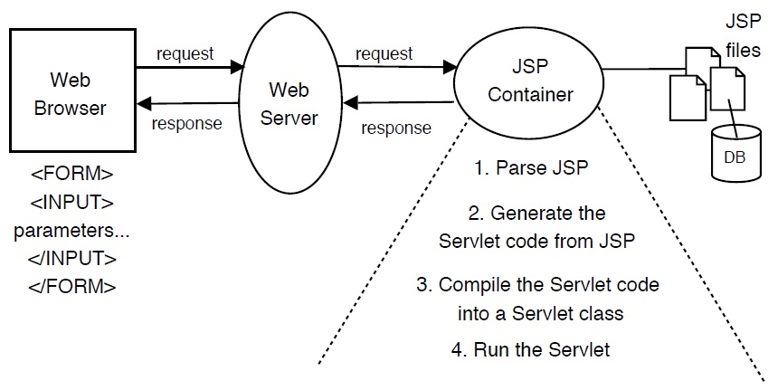

-------

> JSP implicit objects
> Sir: 唔洗大家背既，但要識用

request: the HttpServletRequest object
response: the HttpServletResponse object
session: the HttpSession object associated with the request
out: the PrintWriter object
config: the ServletConfig object 
application: the ServletContext object


-------
> ###JSP elements:
> http://tsuozoe.pixnet.net/blog/post/24142576-jsp-%E5%AD%B8%E7%BF%92_3_%E8%AA%9E%E6%B3%95-directive-elements-%E6%8C%87%E4%BB%A4%E5%85%83%E7%B4%A0

* JSP directives: page, include, taglib
    * page
        * `<%@ page xxx="yyy" %>`
            * `<%@ page contentType="text/html" pageEncoding="UTF-8" language="java" %>`
                * **Servlet->** `response.setContentType("text/html;charset=Big5");`
            * `<%@ page import="java.util.*" %>`
                * **Servlet->** `import="java.util.*"`
    * include
        * `<%@ include file="xxx.yyy" %>`
            * `<%@ include file="footer.html" %>`
                * **html->** `<footer> ... </footer>`
    * taglib 標籤庫 https://www.tutorialspoint.com/jsp/taglib_directive.htm
        * `<%@ taglib uri="/xxx/" %>`
            * `<%@ taglib uri = "http://www.example.com/custlib" prefix = "mytag" %>`
            
-------
> ###JSP scripting:
> JSP expression, JSP comments

* <%= expression %>
    * is used for expressions.
    * E.g Current time: <%= new java.util.Date( ) %>
    *  **html->** Current time: Sat Apr 27 18:50:07 HKT 2019
* <%-- our comment --%>
    * developers' comments that are not sent to the client page
    * **html->** `<!--our comment-->`

> JSP scriptlet vs. declaration
> L03 p.31

* scriptlet
    * is used for straight Java code.
    * `<% ... %>`
        * `<% if (x > 5) { ... %>`
* declaration
    * * is used for declarations.
    * `<%! ... %>`
        * `<%! String name; %>`
        * `<%! String email = "abc@email.com";  %>`

* JSP scriptlet and JSP declaration are different: 
    * JSP scriptlet only allows you to define **local variables** which is inside a method of the Servlet class. 
        * JSP declaration only allows you to define **instance variables** of the Servlet class. 
    * In JSP scriptlet, you can use conditional statements, manipulate objects, and perform arithmetic, which you cannot do within a JSP declaration.

> ###JSP actions:
> `<jsp:include>` (vs. `<%@include %>`)
> * L03 p.37 or http://blog.kenyang.net/2010/11/06/jsp-include

|  | jsp:include action | include directive |
| --- | --- | --- |
| Syntax | `<jsp:include page=.../>` | `<%@include file= %>` |
| When does in clusion occur? | Request time | Page translation time |
| What is in-cluded? | Output of the included page | Actual content of file |
| How many servlets result? | More than one | one |

> `<jsp:useBean>`, `<jsp:getProperty>`, `<jsp:setProperty>`

* [see Review: Lecture 3](#toc_1)

------

> **Apply:**  Able to write a simple JSP page

```html
<!DOCTYPE html>
<html>
    <head>
        <title>Hello User Application</title>
    </head>
    <body>
        <h1>Your Selections</h1> 
        <%  String[] fruits = request.getParameterValues("fruit");
            if (fruits == null) { %>
        You did not select any fruits
        <% } else { %>
        <ul>
            <% for (String fruit : fruits) {%>
                <li><%= fruit%></li>
            <% } %>
        </ul>
        <% }%>
    </body>
</html>
```

-------
> **Apply:** Forward the request & response in Servlet using RequestDispatcher

```java
//use in doGet or doPost
//see Review: Lecture 1 & 2 -> Able to write a simple Servlet -> doPost
request.getRequestDispatcher("hello.jsp").forward(request, response);
```
------

## Review: Lecture 4

> **Concept:** Session Tracking Techniques


* URL rewriting
    * http://myserver:port/COMPS380F/nextservlet?userId=168
        * **Servlet ->** request.getParameter("userId");
    * Advantage
        * Work even if cookies are disabled or unsupported.

    * Disadvantage
        * URL **cannot be longer** than 2,000 characters
        * Special characters such as &, ? or spaces should be encoded.
        * Work even if cookies are disabled or unsupported.

* HTML hidden fields
    * A token or identifier is passed as the value for an HTML hidden field in a form.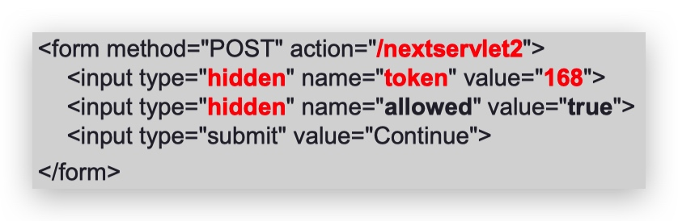
        * **"Servlet ->"** `request.getParameter("token");...`
    * Advantage
        * Work even if cookies are disabled or unsupported.
        
    * Disadvantage
        * The hidden fields cannot be seen by the user, but they can still be seen by viewing the HTML source.
        * An HTML form is always required in every page.
        * All pages must be the result of form submissions.

* Cookies (唔洗寫)
    * Cookies are text files stored on the client computer and they are kept for various information tracking purpose.
    
    * Advantage
        * Servlet transparently supports HTTP cookies.
    
    * Disadvantage
        * Cookies can be deleted / disabled by client.
        * Cannot Work even if cookies are disabled or unsupported.

* HTTP Session object (HttpSession)
    * The HttpSession object acts like a Hashtable into which you can store any number of key-object pairs called session attributes.
    
    * Advantage
        * The servlet automatically create a session cookie.
        * Any kind of object can be stored into a session, be it a text, database, dataset etc.
        * Work even if cookies are disabled or unsupported.
            * If the browser **supports** cookies 
                * The session ID is stored within the session cookie.
            * If the browser **does not support** cookies
                * The Servlet will put the session ID to the URL.
    * Disadvantage
        * Performance overhead due to session object being stored on server
        * Overhead due to serialization and de-serialization of data


-------
> **Concept:** Session Vulnerabilities and their Prevention (作個example)
> 類似test

* Copy and Paste Mistake
    * An user copies and pastes  have a session ID URL in lihkg, other people can go to that URL before the session expires.
        * Personal information might be seen.
        * The account may be taken complete control.
    * Prevention
        * disable embedding session IDs in URLs.
        * The session ID must be stored within a session cookie.
        
* Session Fixation
    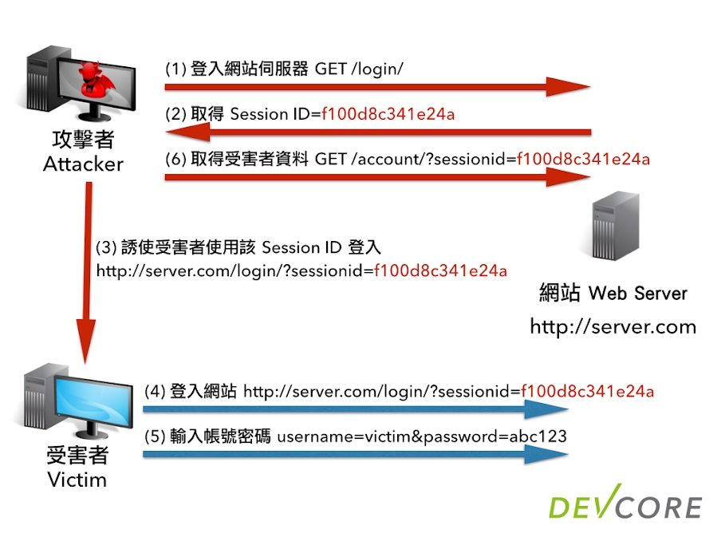
    * The attacker goes to a website and get a URL with an  session ID and sends this URL to a user, e.g.,  email, facebook etc. When the user clicks the link and logs in to the website with this session, the attacker will also be logged in.

    * Prevention
        * disable embedding session IDs in URLs
        * change session ID after login
    
* Cross-Site Scripting (XSS)
    * Cross-site scripting (XSS) is the ability to get a website to display user-supplied content laced with malicious HTML / JavaScript.
    * Attacker can add some bad code into website, Suppose user click one button the code will run, for example use post image use `document.write("");` , the attacker change the code to `document.write("");`
        * user cannot see true image or make true request
       
    * Prevention
        * Flagging all your cookies with the **HttpOnly** attribute.
    
* Cross-Site Request Forgery (CSRF)
    * attacker find the form request url to remove post by id, such as `www.abc.com/removePost?id=1`, attacker lure user to visit other page But actually it is call removePost url. When user clicked the post will be removed.
    
    * Prevention
        * use a random value of synchronizer token and put into html form, in server side need verify the token
        * The value of a synchronizer token is known as a nonce (number-usedonce).
        
* Insecure cookies 
    * Man-in-the-middle attack (MitM attack)
        * An attacker can see all information of the insecure cookies between the client and server.
    
        * Prevention
            * use HTTPS
                * Used only for protecting data sensitive enough to warrant the performance overhead and hassle of securing every request with HTTPS.
                    
-------

## Review: Lecture 5

> **Apply:** EL

* EL implicit objects
    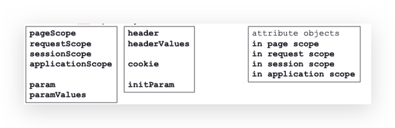
    1. **param & paramValues**
        1. Access user request parameter(e.g get method)
        2. paramValues: Array 
    2. **header & headerValues**
        1. HTTP request header values
        2. e.g "User-Agent"
    3. **initParam**
        1. access context initialization parameters (set in web.xml)
    4. **cookie**
        1. access cookie
    5. **pageScope, requestScope, sessionScope, applicationScope**
        1. https://blog.csdn.net/qq_19865749/article/details/70046038
        2. 如果無話用邊個Scope, 順序搵
    6. **pageContext**:
        1. access current page information
            1. e.g `${pageContext.request.remoteAddr}`<br/>取得用户的IP 地址
* Using dot and [ ] operators
    * dot
        * ${person.name}
            * Cannot -> number, java keyword, spaces
    * [  ]operators
        * ${person[name]}
* Accessing scoped variables <br/> (seems same EL implicit objects-> `pageScope, requestScope, sessionScope, applicationScope`)
    * 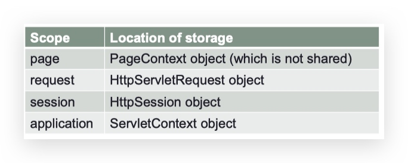

-------
>**Apply:** JSTL

* `<c:if>`
    
```xml
<c:if test="<boolean>">
   ...
</c:if>
```
* `<c:forEach>`

```xml
<c:forEach var="course" items="${courseList}">

    <tr><td>${course}</td></tr>

</c:forEach>
```
* `<c:choose>`
* `<c:when>`
* `<c:otherwise>`

```xml
<c:choose>
    <c:when test="<boolean>">
        ...
    </c:when>
    <c:otherwise>
        ...
    </c:otherwise>
</c:choose>
```

* `<c:set>`: setting an attribute vs. setting a Map / Bean
    * attribute
        * `<c:set var="userLevel" value="full_access" />`
    * Map / Bean
        * `<c:set target="${person}" property="name" value="Keith" />`   
* `<c:url>`
* `<c:param>`

```xml
<c:url value="/nextpage.jsp">
    <c:param name="first" value="${first}" />
    <c:param name="last" value="${last}" />
</c:url>
```
* `${fn:length(Object)}`
    * if string string -> string length
    * if Collection, Map, or array -> size
* `${fn:escapeXML(String)}`
    * ${fn:escapeXml("`<p>`")} 👉🏻 &lt;p&gt;
    * **prevention** of cross-site scripting (XSS) attacks.


------
## Review: Lectures 6 & 7

>**Apply:** Understand each components of MVC (Model, View, Controller)

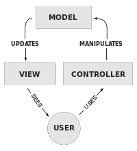

* Model
    * Represent the data and rule
    * Access and update of the data
* View
    * Render the contents of a model data
    * Present how to show data
* Controller
    * Translate the user interactions with the view and model data into action

------
    
> MVC Model 1 vs. MVC Model 2

#### Model 1 
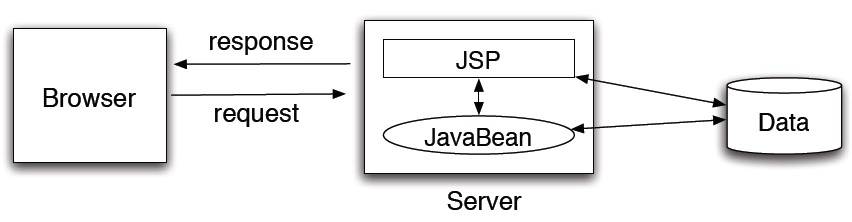

1. HTTP requests are sent to JSP pages.
2. The JSP pages implement the business logic and calls out to the model (JavaBeans) for data to update the view.

#### Model 2 (MVC pattern)
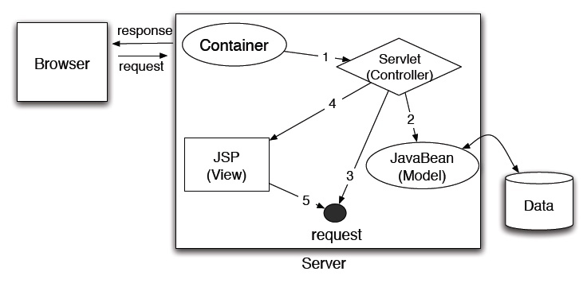
* javabeans: Module
* jsp: View
* Servlet: Controller

1. `Browser` submits request to the `Server`. 
2. In `Server`, Container call the `servlet`, `servlet` instantiates and calls `javabeans`
    1. `javabeans` access to the database.
3. -
4. `servlet` passes the access result to the jsp.
5. `jsp`(View) return to display 


**MVC Model 1 and Model 2 simply refer to controller servlet, which selects views based on client requests.**

------
> Pros and cons of each model

| MVC | Model 1 | Model 2 |
| :-: | :-: | :-: |
| ✅ | Easy and quick for development. | More easy to maintain and to extend. |
| ❌ | Controllers and views are mixed together, difficult to maintain and to extend.| Not fit for small and static applications. |

------
> Understand what Spring MVC is
> L07 P.8

* MVC Web Framework
* Developed by the Spring team
* Deeply integrated with Spring
* RESTful Web Services

------

> **Apply:** Understand the role of different components in Spring MVC
> https://zhuanlan.zhihu.com/p/22420952

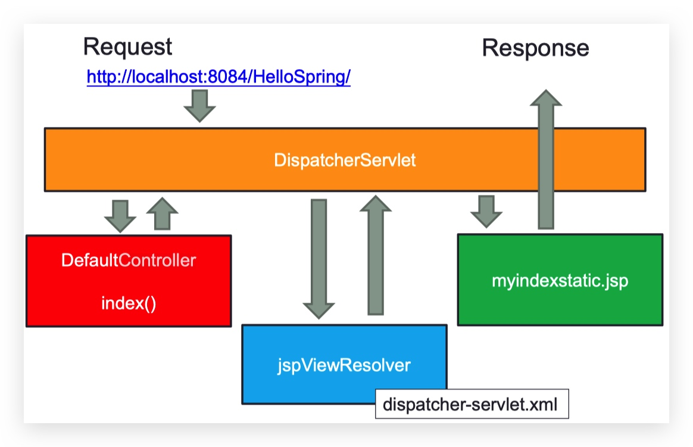

* **Dispatcher Servlet**
    * Configuration in web.xml
    * responsible send requests to the fit controllers
* **Four components are available** 
    * Controller
    * Handler Mapping
    * View Resolver
    * View: JSP View


```xml
<!--web.xml-->
...
    <servlet-mapping>
        <servlet-name>dispatcher</servlet-name>
        <url-pattern>/</url-pattern>
    </servlet-mapping>
...
```

```xml
<!--format: [servlet-name]-servlet.xml-->
<!--dispatcher-servlet.xml-->
...
    <bean id="jspViewResolver" class="org.springframework.web.servlet.view.InternalResourceViewResolver" >
        <property name="prefix" value="/WEB-INF/jsp/view/" />
        <property name="suffix" value=".jsp" />
    </bean>
    
    <!--prefix + ViewName + suffix = JSP File Path-->
...
```

```java
// DefaultController.java
import org.springframework.stereotype.Controller;
import org.springframework.ui.ModelMap;
import org.springframework.web.bind.annotation.RequestMapping;
...

@Controller
public class DefaultController {

    @RequestMapping(value = "/", method = RequestMethod.GET)
    public String index() {
        return "myindexstatic";
        // /WEB-INF/jsp/view/myindexstatic.jsp
    }

    @RequestMapping("/dynamic")
    public String dynamicindex(ModelMap map) {
        map.addAttribute("hello", "Welcome to COMPS380F Spring Lecture !");
        return "myindex";
        // http://localhost:8084/HelloSpring/dynamic
    }
}
```
------
> **Apply:** Model: ModelMap and ModelAndView
> 
> Able to read and write code for controller methods
> * Form handling in JSP page: Form backing object


```java
@Controller
public class DefaultController {
    
    ...
    
    @RequestMapping(value = "/myform", method = RequestMethod.GET)
    public ModelAndView myform() {
        return new ModelAndView("myform", "command", new MyData());
    }

    @RequestMapping(value = "/formhandle", method = RequestMethod.POST)
    public String formHandle(MyData mydata, ModelMap map) {
        map.addAttribute("data", mydata);
        return "myoutput";
    }
    
    ...

}
```

```html
<!--myform.jsp-->
...
<form:form id="command" method="POST" action="/HelloSpring/formhandle">
    <form:label path="name">Enter a name</form:label>
    <form:input path="name"/><br />
    <form:label path="num">Enter a number </form:label>
    <form:input path="num"/> <br />  
    <input type="submit" value="Submit" />
</form:form>
```

```html
<!--myoutput.jsp-->
<!DOCTYPE html>
<html>
    ...
        <h1>Form Output</h1>        
        <p>${data.name}: ${data.num}</p>
    ...
</html>
```

------

## Review: Lecture 8

>**Comprehend:** Understand what a Servlet Filter is

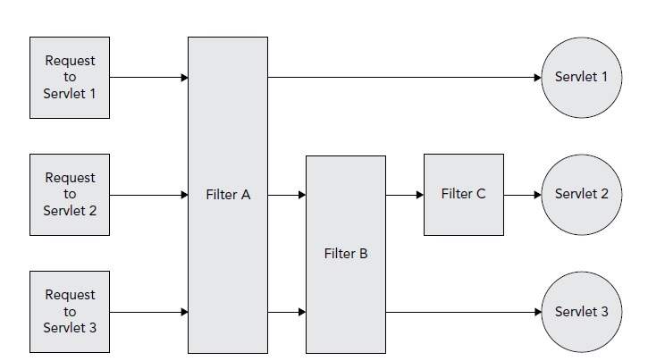

* To **intercept(capture) requests**  from a client before they access a resource at the back end of the web application

* To **manipulate(handling) responses** from server before they are sent back to the client

------

> **Comprehend:** Understand what Spring Security is

* Provide Enterprise-level authentication and authorization services
    * Logging in with a username and password
    * Different user type: ROLE_USER, ROLE_ADMIN, etc.
    * Authorization is based on Access Control List


-------

>**Comprehend:**  Able to identify different user stores (in-memory, relational database)

* in-memory (in Web container)
    * local config, hard code
    * Suitable for debugging and developer testing purposes
    * Not suitable for production application
* relational database
    * It is better to maintain user data in a database

------

> **Comprehend:**  Understand different components and settings in Spring Security
> 要識睇

* `<http> element`

```html
<http auto-config="true" use-expressions="true">

<!--auto-config automatically adds 
    <http-basic />, 
    <form-login>, 
    <logout>-->

<!--use-expressions allows us to configure with 
    Spring EL expressions (default is true)-->

</http>
```

* `<intercept-url>` **(Declaration order is important!)**

```xml
<http auto-config="true">
    <intercept-url pattern="/guestbook/edit" access="hasRole('ADMIN')" />
    <intercept-url pattern="/guestbook/**" access="hasAnyRole('USER','ADMIN')" />
</http>
```
**e.g:**
www.xxx.com/guestbook/edit, base on intercept-url, only **ADMIN** can use `/guestbook/edit` page, so will auto redirect to login page, people need to login **ADMIN** account to access `/guestbook/edit` page.

www.xxx.com/guestbook/show, base on first intercept-url, `"/guestbook/edit"` is not match on this url, so will pass to next intercept-url `/guestbook/**" ` ...

so **Declaration order is important!**

* `<form-login>`
* `<logout>`


```xml
<!--security.xml-->
<http auto-config="true">
    <form-login 
            login-page="/login" 
            authentication-failure-url="/login?error" 
            username-parameter="username" 
            password-parameter="password" 
    />
    <logout logout-url="/logout"
            logout-success-url="/login?logout" 
            invalidate-session="true"
            delete-cookies="JSESSIONID" 
    />

</http>
```
* `<remember-me>`

```html
<h1>Login</h1>

<form action="login" method="POST">
  User: <input type="text" name="username" /><br />
  Password: <input type="password" name="password" /><br />
  Remember Me: <input type="checkbox" name="remember-me" /><br />
  <input name="submit" type="submit" value="Log In" /><br />
</form>
```

* `Spring Expression Language (SpEL)`
    * We may use logical operator in SpEL like and, or:
   
| Expression | Description |
| :-: | :-: |
| principal | Allows access the current user |
| authentication | The user’s authentication object |
| hasRole(role) | True if the current user has the given role. |
| hasAnyRole(list of roles) | True if the current user has any of the given roles |
| hasIpAddress(IP address) | True if the request comes from the given IP address |

```xml
<intercept-url pattern="/spitter/**" access="hasRole('STUDENT') and hasIpAddress('192.168.1.2')" />
```

------
> **Comprehend:** Understand how to achieve view layer security


| JSP tag | What it does |
| :-: | :-: |
| `<security:accesscontrollist>` | Display content if user have permission |
| `<security:authentication>` | Display details of authentication |
| `<security:authorize>` | Display content if user match access permission |


```html
<sec:accesscontrollist hasPermission="1,2" domainObject="someObject">

    This will be shown if the user has either of the permissions 
    represented by the values "1" or "2" on the given object.
    
</sec:accesscontrollist>
```


```html
<p>Hello <security:authentication property="principal.username" />!</p>

    <security:authorize access="isAuthenticated() and principal.username=='keith'">
    <p>This paragraph can only be seen by keith</p>

</security:authorize>
```

## Review: Lecture 9

> **Comprehend:** Motivations of Object-Relational Mapping (ORM)

* ORM is a layer of software that helps map your code Objects to your database.

* Advantages
    * easy to change other database, no need to recode
    * avoid SQL injection attacks
* Disadvantages
    * need more performance

------
> Understand the DAO design pattern and its advantages
> 要識睇 

* all database object 放入去DAO
* 所有database get match 既介面

* Changes to persistence access layer do not affect DAO clients

------
> **Comprehend:** Able to read code of an entity class

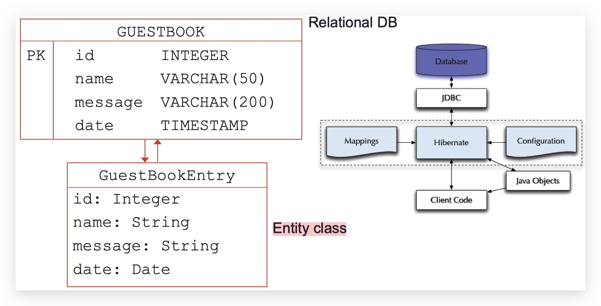


```java
@Entity
@Table(name = "guestbook")

public class GuestBookEntry {

    @Id
    @GeneratedValue(strategy = GenerationType.IDENTITY)
    private Integer id;
    
    private String name;
    private String message;
    
    @Temporal(TemporalType.TIMESTAMP)
    private Date date;
    
    // getters and setters for id, name, message, date

}
```

------
> **Comprehend:** JPA vs. Hibernate

* JPA Better than Hibernate
* easy to change to other lib

------
> **Comprehend:** Spring Data JPA vs. JPA

* Spring Data JPA auto support to many function, no need write a lot of code


## Review: Lecture 10
> **Concept:** Four types of data sources for Spring
> Specimen出過!!! 應該唔會再出？？

* JDBC driver-based
    * not support-multithreading, it is suitable for small project.
* JNDI
    * It is suitable for JNDI data source that is already configured externally.
* Pooled
    * It supports multithreading and is suitable for large-scale project with many users.
* Embedded database
    * It is suitable for development and testing purpose.
------

> **Concept:** Spring JDBC Template vs. JDBC
> Specimen出過!!! 應該唔會再出？？

Spring JDBC Advantages: 
* The Spring JDBC template allows to clean-up the resources automatically, e.g. release the database connections.
* more easily by removing repetitive data access code blocks in the application and properly handling resource cleanups.

## Review: Lecture 11
> **Concept:** Java interfaces vs. Dependency Injection (DI)


define in xml 
快好多

------

> **Concept:** Understand auto-wiring of Spring beans
> https://wiki.jikexueyuan.com/project/spring/beans-auto-wiring/spring-autowiring-byType.html


```xml
<bean id="ops" class="edu.ouhk.examples.OpMultiply" />
```
```xml
<!--Beans.xml-->
<bean id="opsbean" class="edu.ouhk.examples.CalculateSpring">
    <property name="ops" ref="ops" />
</bean>
```

user auto-wiring

```xml
<bean id="opsbean" class="edu.ouhk.examples.CalculateSpring" autowire="byName" />
``` 

* The property name “ops” will be wired automatically to bean id “ops” for the matching name.
* Other possible values for the autowire attribute are byType, constructor and autodetect.
* As we have seen previously, we can also use the annotation **@Autowired** when declaring the property in the Java class for autowiring.


```java
...
@Autowired
ApplicationContext context;
...
CalculateSpring cs = (CalculateSpring) context.getBean("opsbean");
```

------
> **Concept:** Aspect-Oriented Programming (AOP)
> * Understand what aspect, pointcut, advice are.

reuse-able
aspect= advice+pointcut
* advice
    * 做d乜
* pointcut
    * when

