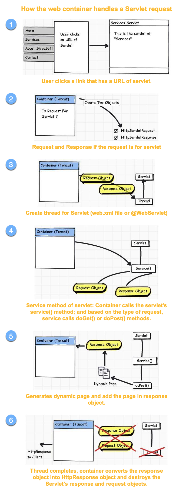
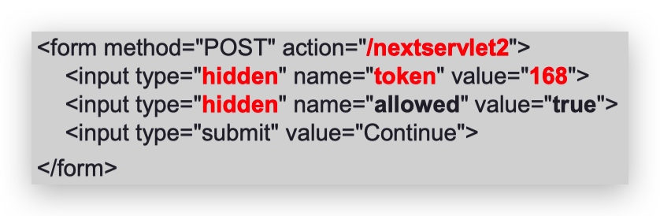
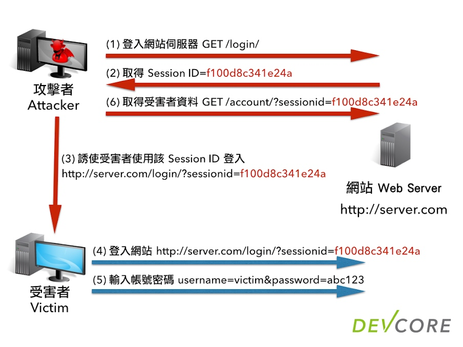

# COMPS380F Mid-term Test

## Review: Lecture 1 & 2
>  Differences between Web (HTTP) servers, Java EE application server, Web container

1. Web(HTTP) servers
    1. Web server is responsible for accepting HTTP requests from clients and serving them HTTP responses.
    2. only handling HTTP requests and serve static HTML content.
    
2. Java EE application server
    1. implements the entire Java EE specification.
    
3. Web container
    1. is the component of a web server that interacts with Java servlets.
    2. Apache Tomcat
    3. Most web containers implement only the Servlet, JSP and JSTL specifications.


-------

> Understand Servlet’s life cycle

**Step:**
1. init()
2. service()
3. doXX()
    1. doGet()
    2. doPost()
4. destroy()

* define the URL mappings

```xml
<!--web.xml-->
<servlet>
    <servlet-name>helloServlet</servlet-name> 
    <servlet-class>edu.ouhk.comps380f.HelloServlet</servlet-class>
</servlet>
<servlet-mapping>
    <servlet-name>helloServlet</servlet-name> 
    <url-pattern>/hello</url-pattern> 
    <url-pattern>/greeting</url-pattern>
</servlet-mapping>
```

```java
//servlet 
//@WebServlet annotation
@WebServlet( name = "helloServlet", urlPatterns = {"/hello", "/greeting"} )
```


-------

> Understand how the web container handles a Servlet request

> 參考：
> L02 p.10-12
> https://www.jianshu.com/p/99f34a91aefe



-------

> Understand the difference between **Attributes** and **Parameters**

> * Context init param(save in Servlet Context), Request param(user provide), Servlet init param(save in each servlet config object)

> * Context attribute(save in applicationScope) , Request attribute(save in requestScope), Session attribute(save in sessionScope)
> 
> 參考：https://xiebh.iteye.com/blog/1006324

* Attributes
    * Context init param
        * save in Servlet Context
    * Request param
        * user provide
    * Servlet init param
        * save in each servlet config object

* Parameters
    * Context attribute
        * save in applicationScope
    * Request attribute
        * save in requestScope
    * Session attribute
        * save in sessionScope


1. Different sources
    1. Parameters is provided by the user from the client.
    2. Attribute is  set by server-side using requst.setAttribute()
    
2. Return type
    1. Parameters return type is a **String**.
    2. Attributes return type is an **Object**.
    
-------

> Able to write a simple Servlet:

> * Servlet class with init(), doGet(), doPost(), destroy()

> * Deployment descriptor (/WEB-INF/web.xml)

```html
<!--/WEB-INF/jsp/email_form.jsp:-->
…
<form method="POST" action="echoEmail">
    <p>Name: <input type="text" name="name"/></p>
    <p>Email: <input type="text" name="email"/></p>
    <p><input type="submit" value="Send"/></p>
</form>
…

<!--/WEB-INF/jsp/email_output.jsp:-->
…
<ul>
    <li> Name: ${myName} </li>
    <li> Email: ${myEmail} </li>
</ul>
…
```

```java
//Servlet class with init(), doGet(), doPost(), destroy()

@Override
public void init() throws ServletException {
    System.out.println("Servlet " + this.getServletName() + " has started.");
}

@Override
protected void doGet(HttpServletRequest request, HttpServletResponse response) 
    throws ServletException, IOException {
        //same doPost
}

@Override
protected void doPost(HttpServletRequest request, HttpServletResponse response)
    throws ServletException, IOException {
    
        String name = request.getParameter("name");
        String email = request.getParameter("email");
        
        request.setAttribute("myName", name);
        request.setAttribute("myEmail", email);
        
        request.getRequestDispatcher("/WEB-INF/jsp/email_output.jsp").forward(request, response);
    
}

@Override
public void destroy() {
    System.out.println("Servlet " + this.getServletName() + " has stopped.");
}
```


```xml
<!--Deployment descriptor (/WEB-INF/web.xml)-->
<servlet>
    <servlet-name>{{ Servlet Name }}</servlet-name> 
    <servlet-class> {{ package.{{ Servlet Name }} }}</servlet-class>
</servlet>
<servlet-mapping>
    <servlet-name>{{ Servlet Name }}</servlet-name> 
        <url-pattern>{{ /url-pattern }}</url-pattern>
</servlet-mapping>
```


-------

## Review: Lecture 3
> Able to write a simple JavaBean
> L03 p.41 46-48


A JavaBean is a specially constructed Java class written in the Java and coded according to the JavaBeans API specifications.


```java
//JavaBean
public class HelloBean implements Serializable { //implements Serializable 要背

    private String name; //每個var 都要有getter setter
    private String email;
    
    public HelloBean() {
    
    }

    public String getName() { 
        return name; 
    }
    
    public String getEmail() { 
        return email; 
    }
    
    public void setName(String name) { 
        this.name = name; 
    }
    
    public void setEmail(String email) { 
        this.email = email; 
    }

}
```

```html
<!--From html-->
<!DOCTYPE html>
<html>
<head>
    <title>Email Form</title>
</head>
<body>
    <h1>Email Form</h1>
    <form method="POST" action="echoEmail">
        <p>Name: <input type="text" name="name" size="30" /></p>
        <p>Email address: <input type="text" name="email" size="30" /></p>
        <p><input type="submit" value="Send" /></p>
    </form>
</body>
</html>
```

```html
<!--jsp-->
<!DOCTYPE html>
<html>
    <body>
        <!--聲明 'id:hello' = 上面define左個個 "HelloBean" 既JavaBean (類似swift object 既概念)-->
        <jsp:useBean id="hello" scope="session" class="edu.ouhk.comps380f.lecture03example.HelloBean" />
        <!--name 姐係上面個id, setProperty會自動搵property既setter, 呢度係setName-->
        <jsp:setProperty name="hello" property="name" value='<%=request.getParameter("name")%>' />
        <jsp:setProperty name="hello" property="email" value='<%=request.getParameter("email")%>' />
        
        <!--getProperty會自動搵property既getter, 呢度係getName-->
        <jsp:getProperty name="hello" property="name" />
        <jsp:getProperty name="hello" property="email" />
    </body>
</html>
```

-------

> Understand JSP page’s life-cycle


-------
> JSP implicit objects

request: the HttpServletRequest object
response: the HttpServletResponse object
session: the HttpSession object associated with the request
out: the PrintWriter object
config: the ServletConfig object 
application: the ServletContext object


-------
> JSP elements:
> http://tsuozoe.pixnet.net/blog/post/24142576-jsp-%E5%AD%B8%E7%BF%92_3_%E8%AA%9E%E6%B3%95-directive-elements-%E6%8C%87%E4%BB%A4%E5%85%83%E7%B4%A0

* JSP directives: page, include, taglib
    * page
        * `<%@ page xxx="yyy" %>`
            * `<%@ page contentType="text/html" pageEncoding="UTF-8" language="java" %>`
                * **Servlet->** `response.setContentType("text/html;charset=Big5");`
            * `<%@ page import="java.util.*" %>`
                * **Servlet->** `import="java.util.*"`
    * include
        * `<%@ include file="xxx.yyy" %>`
            * `<%@ include file="footer.html" %>`
                * **html->** `<footer> ... </footer>`
    * taglib 標籤庫 https://www.tutorialspoint.com/jsp/taglib_directive.htm
        * `<%@ taglib uri="/xxx/" %>`
            * `<%@ taglib uri = "http://www.example.com/custlib" prefix = "mytag" %>`
            
-------
> JSP comments

* <%-- our comment --%>
    * **html->** `<!--our comment-->`

-------

> JSP scriptlet vs. declaration 
> L03 p.31

* scriptlet
    * is used for straight Java code.
    * `<% ... %>`
        * `<% if (x > 5) { ... %>`
* declaration
    * * is used for declarations.
    * `<%! ... %>`
        * `<%! String name, email; %>`

* JSP scriptlet and JSP declaration are different: 
    * JSP scriptlet only allows you to define **local variables** which is inside a method of the Servlet class. 
        * JSP declaration only allows you to define **instance variables** of the Servlet class. 
    * In JSP scriptlet, you can use conditional statements, manipulate objects, and perform arithmetic, which you cannot do withina JSP declaration.

-------
> JSP actions:

* <jsp:include> (vs. <%@include %>) 
    * L03 p.37 or http://blog.kenyang.net/2010/11/06/jsp-include


    * |  | jsp:include action | include directive |
| --- | --- | --- |
| Syntax | `<jsp:include page=.../>` | `<%@include file= %>` |
| When does in clusion occur? | Request time | Page translation time |
| What is in-cluded? | Output of the included page | Actual content of file |
| How many servlets result? | More than one | one |

* <jsp:useBean>, <jsp:getProperty>, <jsp:setProperty>
    * see **Review: Lecture 3**


-------
> Able to write a simple JSP page

```html
<!DOCTYPE html>
<html>
    <head>
        <title>Hello User Application</title>
    </head>
    <body>
        <h1>Your Selections</h1> 
        <%  String[] fruits = request.getParameterValues("fruit");
            if (fruits == null) { %>
        You did not select any fruits
        <% } else { %>
        <ul>
            <% for (String fruit : fruits) {%>
                <li><%= fruit%></li>
            <% } %>
        </ul>
        <% }%>
    </body>
</html>

```
-------
> Forward the request & response in Servlet using RequestDispatcher


```java
//use in doGet or doPost
//see Review: Lecture 1 & 2 -> Able to write a simple Servlet -> doPost
request.getRequestDispatcher("hello.jsp").forward(request, response);
```

-------

## Review: Lecture 4
> Session Tracking Techniques

* URL rewriting
    * http://myserver:port/COMPS380F/nextservlet?userId=168
        * **Servlet ->** request.getParameter("userId");
    * Advantage
        * Work even if cookies are disabled or unsupported.

    * Disadvantage
        * URL **cannot be longer** than 2,000 characters
        * Special characters such as &, ? or spaces should be encoded.
        * Work even if cookies are disabled or unsupported.

* HTML hidden fields
    * A token or identifier is passed as the value for an HTML hidden field in a form.
        * **"Servlet ->"** `request.getParameter("token");...`
    * Advantage
        * Work even if cookies are disabled or unsupported.
        
    * Disadvantage
        * The hidden fields cannot be seen by the user, but they can still be seen by viewing the HTML source.
        * An HTML form is always required in every page.
        * All pages must be the result of form submissions.

* Cookies (唔洗寫)
    * Cookies are text files stored on the client computer and they are kept for various information tracking purpose.
    
    * Advantage
        * Servlet transparently supports HTTP cookies.
    
    * Disadvantage
        * Cookies can be deleted / disabled by client.
        * Cannot Work even if cookies are disabled or unsupported.

* HTTP Session object (HttpSession)
    * The HttpSession object acts like a Hashtable into which you can store any number of key-object pairs called session attributes.
    
    * Advantage
        * The servlet automatically create a session cookie.
        * Any kind of object can be stored into a session, be it a text, database, dataset etc.
        * Work even if cookies are disabled or unsupported.
            * If the browser **supports** cookies 
                * The session ID is stored within the session cookie.
            * If the browser **does not support** cookies
                * The Servlet will put the session ID to the URL.
    * Disadvantage
        * Performance overhead due to session object being stored on server
        * Overhead due to serialization and de-serialization of data


-------
> Session Vulnerabilities and their Prevention (作個example)

* Copy and Paste Mistake
    * An user copies and pastes  have a session ID URL in lihkg, other people can go to that URL before the session expires.
        * Personal information might be seen.
        * The account may be taken complete control.
    * Prevention
        * disable embedding session IDs in URLs.
        * The session ID must be stored within a session cookie.
        
* Session Fixation
    
    * The attacker goes to a website and get a URL with an  session ID and sends this URL to a user, e.g.,  email, facebook etc. When the user clicks the link and logs in to the website with this session, the attacker will also be logged in.

    * Prevention
        * disable embedding session IDs in URLs
        * change session ID after login
    
* Cross-Site Scripting (XSS)
    * Cross-site scripting (XSS) is the ability to get a website to display user-supplied content laced with malicious HTML / JavaScript.
    * Attacker can add some bad code into website, Suppose user click one button the code will run, for example use post image use `document.write("");` , the attacker change the code to `document.write("");`
        * user cannot see true image or make true request
       
    * Prevention
        * Session ID cookies should always include the HttpOnly attribute.
    
* Cross-Site Request Forgery (CSRF)
    * attacker find the form request url to remove post by id, such as `www.abc.com/removePost?id=1`, attacker lure user to visit other page But actually it is call removePost url. When user clicked the post will be removed.
    
    * Prevention
        * use a random value of synchronizer token and put into html form, in server side need verify the token
        * The value of a synchronizer token is known as a nonce (number-usedonce).
        
* Man-in-the-middle attack (MitM attack)
    * The network is invaded, An attacker can see all request or response  between the client and server.
    
    * Prevention
        * use HTTPS
            * Used only for protecting data sensitive enough to warrant the performance overhead and hassle of securing every request with HTTPS.
            
           
-------
## Review: Lecture 5
> EL

* EL implicit objects
    
* Using dot and [ ] operators
    * dot
        * ${person.name}
            * Cannot -> number, java keyword, spaces
    * [  ]operators
        * ${person[name]}
* Accessing scoped variables
    * 

-------
>JSTL

* `<c:if>`
    
```xml
<c:if test="<boolean>" var="<string>" scope="<string>">
   ...
</c:if>
```
* `<c:forEach>`

```xml
<c:forEach var="course" items="${courseList}">

    <tr><td>${course}</td></tr>

</c:forEach>
```
* `<c:choose>`
* `<c:when>`
* `<c:otherwise>`

```xml
<c:choose>
    <c:when test="<boolean>">
        ...
    </c:when>
    <c:otherwise>
        ...
    </c:otherwise>
</c:choose>
```

* `<c:set>`: setting an attribute vs. setting a Map / Bean
    * attribute
        * `<c:set var="userLevel" scope="session" value="full_access" />`
    * Map / Bean
        * `<c:set var="userLevel" scope="session" value="full_access" />`   
* `<c:url>`
* `<c:param>`

```xml
<c:url value="/nextpage.jsp" var="nextURL">
    <c:param name="first" value="${first}" />
    <c:param name="last" value="${last}" />
</c:url>
```
* `${fn:length(Object)}`
    * if string string -> string length
    * if Collection, Map, or array -> size
* `${fn:escapeXML(String)}`

```
使用 escapeXml() 函数:

string (2) : This <abc>is second String.</abc>

不使用 escapeXml() 函数:

string (2) : This is second String.
```
