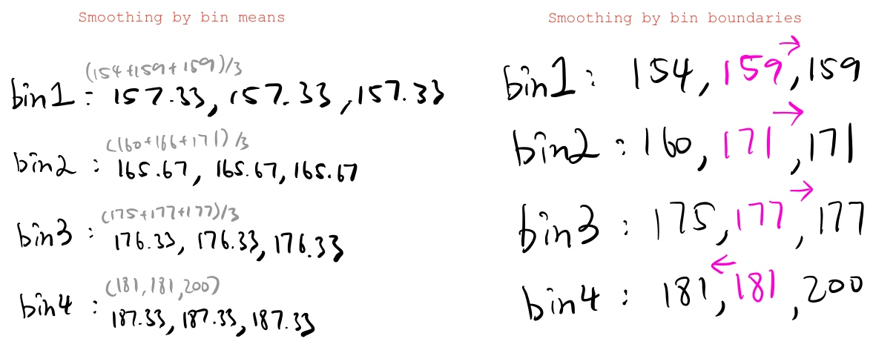
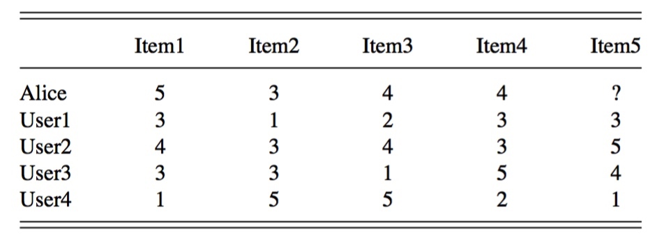

# COMPS382 Exam

| Attribute Types |  |
| :-: | :-: |
| Nominal (Discrete) Attribute | {black, blond, brown, grey, red, white, ...} |
| Numeric (Continuous) Attribute | {1,4,3,5,2,65,234,234,...} |
| Binary Attribute | {0,1} / {male, female} |
| Ordinal Attribute | {poor,good,excellent} |

## Types of DM techniques

### Supervised

> Class labels are available for training the DM algorithms

* [Classification](#classification)
* [Regression](#regression)

### Unsupervised
> No class labels are required
> Find patterns that are unobservable, or infeasible to obtain.

* [Clustering](#clustering)
* [Association Analysis](#association_analysis)

<h2 id="classification">Classification</h2>

> To predict a categorical target attribute (class label)

* **Examples**
    *  Decision Trees
        *  Zero-R
        *  1-R
        *  ID3
    *  k-NN
    *  Naïve Bayesian
    *  ANN

**Evaluation**: metrics derived from a confusion matrix

> * [COMPS382F_Exam_Specimen](https://drive.google.com/a/goorld.net/file/d/1xl6UiL2f3pG7z1Ofk2wuDszObf_gjxET/view?usp=drivesdk)
>     * Q5a (True or False)
>     * Q8 (ID3)
> * [COMPS382F_midterm_2016](https://drive.google.com/a/goorld.net/file/d/1ptJufsGrKfXszOVtZCDgFYQslCfT9dZt/view?usp=drivesdk) 
>     * Q1b (True or False)
>     * Q1d
>     * Q3a,d (Zero-R)
>     * Q3b,c,d (One-R)
>     * Q5
> * [exam_specimen_solution](https://drive.google.com/a/goorld.net/file/d/10zXXUFRy1HzbrZJHEVjtt2qAA8dPnml5/view?usp=drivesdk)
>     * Q1
>     * Q5a,d,e (True or False)
>     * Q8 (ID3)
> * [T02](https://drive.google.com/a/goorld.net/file/d/1yktYcyhYUWxMhelYck19dVeOEHsglE4E/view?usp=drivesdk)
>     * Q3
> * [T04](https://drive.google.com/a/goorld.net/file/d/1UE9gXIWlYjndFJwDfUOAHVzlbQ0lMLuB/view?usp=drivesdk)
>     * Q5 (kNN)
>     * Q6 (kNN)
> * [T05](https://drive.google.com/a/goorld.net/file/d/1edX7hTbxKMPoThyhrnCJJCfE0TuIFEUz/view?usp=drivesdk)
>     * Q1,2,3,4 (kNN)
>     * Q5 (Zero-R)
>     * Q6 (One-R)
> * [T06](https://drive.google.com/a/goorld.net/file/d/1OBef4UMl2kaUdG8e6m9wiUTD0-NXJiso/view?usp=drivesdk)
>     * Q1
>     * Q2 (ID3)
>     * Q3 (kNN)
>     * Q4 (Zero-R)
>     * Q5 (One-R)
>     * Q6 (ID3)
>     * Q7 (concept)
> * [T07](https://drive.google.com/a/goorld.net/file/d/11J9-ZDnEjVazQB6yVy0w2Dvz9NcjH5HD/view?usp=drivesdk)
>     * Q1 (pruned tree)
>     * Q2 (kNN)
> * [T08](https://drive.google.com/a/goorld.net/file/d/11KZr60jAJFj5GGeoKV9O9RSZrS9kVjWp/view?usp=drivesdk)
>     * Q1
>     * Q3
>     * Q6

#### Zero-R

**Describe:**
"Play Golf = Yes" is the Zero R model for the following dataset with an accuracy of 0.64 (9/14).

#### One-R

> Choose the rules with the smallest error rate

> Choose the rules with the smallest error rate.

#### ID3

> ID3在建構決策樹過程中，以資訊獲利(Information Gain)為準則，並選擇最大的資訊獲利值作為分類屬性。[[source](https://mropengate.blogspot.com/2015/06/ai-ch13-2-decision-tree.html)]

**Step 1**: Compute the following entropy values:
* Entropy(`Class label`)
* Entropy(`Class label`,`attribute 1`)
    * 

* Entropy(`Class label`,`attribute 2`)
* ...

**Step 2**: Compute **information gain** of each attribute
* Entropy(`Class label`) - Entropy(`Class label`,`attribute 1`)
* Entropy(`Class label`) - Entropy(`Class label`,`attribute 2`)
* ...

**Step 3**: Choose **max information gain** to find which root node should be use of the decision tree

<h2 id="regression">Regression</h2>

> To predict a numeric / continuous target attribute

**Example**: Linear Regression
* **Evaluation**: 
    * average square error
    * coefficient of determination ( R^2 )

> * [T01](https://drive.google.com/a/goorld.net/file/d/10jLAmI5Bo7_W4_OYl64unKi_2encys5l/view?usp=drivesdk)
>     * Q4
> * [T02](https://drive.google.com/a/goorld.net/file/d/1yktYcyhYUWxMhelYck19dVeOEHsglE4E/view?usp=drivesdk)
>     * Section 2
> * [T03](https://drive.google.com/a/goorld.net/file/d/1LyoR98zgtDFeJqAIm_YhdiECSMDYLcT9/view?usp=drivesdk)
>     * Q1 (find miss value)
> * [08_Case Study_Recommender Systems_Linear Regression](https://drive.google.com/a/goorld.net/file/d/1y8NWe8xB-J0Se810Byhqdi3zMnDOGxOB/view?usp=drivesdk)

-------
Linear Regression

Q: In your own words, describe the relationship between credit score and interest rate.

> Interest rate and credit score are inversely related.

Q: Describe the linear regression model?

> We can estimate (predict) interest rate based on individual's credit score using the formula below:
interest_rate = -0.000054 * credit_score + 0.099997

Q: Can you predict the interest rate for a new borrower (ID = 11) who has a credit score of 625?

> Predicted interest rate:
> = -0.000054 * 625 + 0.099997
> = 0.066247

<h2 id="clustering">Clustering</h2>

> To find meaningful groups in dataset

* **Examples**
    * k-Means & PAM (Partitioning)
    * AGNES (Hierarchical)
    * DBSCAN (Density-based)
    
* **Evaluation**
    * inter-class (group/cluster)
    * intra-class similarity
    * Davies-Bouldin Index
    
> * [09-10_clustering_examples](https://drive.google.com/a/goorld.net/file/d/1lUsWeJ8lrtRXkZryn4fzDCVAqh5fs0vX/view?usp=drivesdk)
> * [COMPS382F_Exam_Specimen](https://drive.google.com/a/goorld.net/file/d/1xl6UiL2f3pG7z1Ofk2wuDszObf_gjxET/view?usp=drivesdk)
>     * Q4 (concept)
>     * Q6b (k-means)
> * [exam_specimen_solution](https://drive.google.com/a/goorld.net/file/d/10zXXUFRy1HzbrZJHEVjtt2qAA8dPnml5/view?usp=drivesdk)
>     * Q1 (concept)
>     * Q4 (concept)
>     * Q6b (k-means)
> * [T02](https://drive.google.com/a/goorld.net/file/d/1yktYcyhYUWxMhelYck19dVeOEHsglE4E/view?usp=drivesdk)
>     * Q2
> * [T10](https://drive.google.com/a/goorld.net/file/d/1jCZJ3JiaByE6dwkknxycsPuia8excNtw/view?usp=drivesdk)
>     * All
> * [T11](https://drive.google.com/a/goorld.net/file/d/19dMF4X_JXaJXTP51PZfGMbIcraqXJsoj/view?usp=drivesdk)
>     * Q1 (AGNES)
>     * Q2 (k-Means)
>     * Q3 (DBSCAN)

<h2 id="association_analysis">Association Analysis</h2>

> To find relationships between data objects

**Examples**: Apriori & FP-Growth
* **Evaluation**
    * support (frequent k-itemsets)
    * confidence (association rules)

> * [COMPS382F_Exam_Specimen](https://drive.google.com/a/goorld.net/file/d/1xl6UiL2f3pG7z1Ofk2wuDszObf_gjxET/view?usp=drivesdk)
>     * Q3a (Apriori)
>     * Q3b (FP-Growth)
>     * Q7 (Apriori)
> * [T12](https://drive.google.com/a/goorld.net/file/d/1XYzNIM2BTosk5-N4R3kAcr8yCvwRfc9X/view?usp=drivesdk)
>     * Q1 (Apriori)
>     * Q2 (FP-Growth)

-----
##題型
### Find Missing value (Lab3) Q1

| Replacement Methods |   |
| :-: | :-: |
| Average | 加晒/總數(唔計missing) |
| Min | 最細 |
| Max | 最大 |
| Mode | 出現最多 |
| ./median | 中位數 |
| Linear Regression | 代入條式 |
----
### Find outliners
> outlier is a data point that differs significantly from other observations. [[source](https://en.m.wikipedia.org/wiki/Outlier)]

-------
### Binning
> 假設收集d數據一定會有錯，所以可以用Binning去`淡化`個整體錯誤

**Step 1.** 將堆數字排晒順序
**Step 2.** Partition into **equal-frequency** bins
    

**Step 3.** Smoothing `By bin means` **or** `By bin boundaries`

----
###Equal-width or Equal-depth??
> Convert the weight attribute to ordinal. Which binning method will you use (equal-width or equal-depth)?

----

### Normalization
####Min-Max normalization

> e.g: Let income range `$12,000 to $98,000` normalized to `[0.0, 1.0]` ([new_min, new_max]). Then `$73,600` is mapped to 

$$\frac {73600-12000} {98000-12000}\left( 1.0-0\right) +0=0.716$$

####z-score normalization

> μ: mean平均值, σ: standard deviation標準差(會比)

$$Z=\frac {x-\mu } {\sigma }$$

> e.g: Let x = 73,600, μ = 54,000, σ = 16,000. Then

$$\frac {73600-54000} {16000}=1.225$$

-----

###Stratified sampling 分層採樣

> * Big data era: too expensive (or even infeasible) to process the entire data set
> * Sampling: obtaining a small sample to represent the whole data set
> * Oversampling is also required in some scenarios, such as class imbalance problem
> * E.g., 100 HIV test results: 5 positive, 995 negative

-----
### Dissimilarity
> least dissimilar = 最少地方有差別
> 0 = same
> 1 = not same

#### Binary Attributes
> 1. Symmetric Binary Dissimilarity 
> 2. Asymmetric (無出現過e個既題目)

######Symmetric Binary Dissimilarity

> small distance mean least dissimilar

######Asymmetric Binary Dissimilarity

####Numeric Attributes

######Euclidean Distance
>Straight line between two data objects

######Manhattan Distance
>The distance in blocks between two data object

####Matrix for Attributes of Mixed Types

| Attributes |  |
| :-: | :-: |
| Numeric attribute ||
| Nominal/binary attribute | $$dist(i,j) = 0,if (xi == xj), else = 1 $$ |
| Ordinal attribute | Follow the discussed method for ordinal attribute (same as Numeric attribute) |

-------

###Confusion Matrix

| key performance metrics |  |
| :-: | :-: |
| **Accuracy** 精度 The percentage of test set | $$\frac{(TP + TN)} {All}$$ |
| **Error** 誤差| $$1-Accuracy$$ |
| **Sensitivity** 靈敏度 The true positive recognition rate | $$\frac{TP}{(TP+FN)}$$ |
| **Specificity** 特異性 The true negative recognition rate | $$\frac{TN}{(TN+FP)}$$ |
| **Precision** 精度 exactness – what % of tuples that the classifier labeled as positive are actually positive? | $$\frac{TP}{TP+FP}$$ |
| **Recall** 召回  completeness – what % of positive tuples did the classifier label as positive?| **same as Sensitivity** |

-----

###Pruned tree

> **assume small tree is better than big tree, if error rate is same**

Step
1. 由最底開始
2. error最多個個cut
    
3. loop step 2, 直到cut完error rate大過上一個，就用番上一個

-------

###Recommendation Systems
>Predict Alice’s rating of Item5 using the user-based and item-based nearest-neighbor recommendation techniques. The number of nearest neighbors is `two` (k=2).

####user-based

|  | Mean |
| :-: | :-: |
| $$sim(a,b)$$ | 題目會比埋你|
| $$\overline {r_{a}}$$ | Average rating of `a` |
| $$r_{b,p}$$ | item `p` of user `b`  |

####item-based

-------

###Clustering

**Step 1**:
**睇清楚用邊個計 update Cluster**
* k-means
    * 用平均數
* k-./medians
    * 中位數

**睇清楚用邊個距離**
* Manhattan
* Euclidean

**Step 2**:

Draw a table of each point distance

**Step 3**:

**Find Membership** and Show cluster center, cluster membership in each iteration.

**Step 4**:
**Update** Center base on Manhattan/Euclidean

**Step 5**:
Loop Step 3

-------
### Hierarchical Clustering

####AGNES (Agglomerative Nesting)
> [T11-Answer-Sheet](https://drive.google.com/a/goorld.net/file/d/1WNUQLBYY3PikbzuYzJBkGwX3qsusv35n/view?usp=drivesdk)

1. Initial: Every point is a cluster;
2. Find the closest pair of cluster; (draw distance table)
3. Merge those two clusters;
4. Repeat Step 2, 3 until there is only 1 cluster left;
5. draw a dendrogram to show the clustering results.

####DIANA(Divisive Analysis)

* **Reverse order** of AGNES; 
* Start from one cluster

**Advantage:**
* Very intuitive clustering result, may have multiple levels of clusters.

**Major weaknesses:**
* Can never undo what was done previously.
* Do not scale well -- e.g., finding the pair of closest clusters is slow, and it has to be done a lot of times

----

###Association Rules Mining

####Apriori

> `frequent k-itemsets` for the below dataset using the Apriori algorithm. 
> **Minimum support** count is 2.

####FP Growth

-------

###  Steps in a knowledge discovery process

1. Data Cleaning
    1. Clean the data by removing incorrect / inconsistent data 
2. Data Integration
    1. Integrates data from multiple sources which may contain useful data into one.
3. Data Selection
    1. Selects target data from the integrated data source that are relevant to the data mining exercises.
4. Data Transformation
    1. Transforms the data into a format suitable for specific data mining algorithms. transactionizes the data into market basket data before put them into association rule mining algorithms.
5. Data Mining
    1. After transforming the data, the data mining step discovers useful patterns of some special forms from the data according to the algorithm.
6. Knowledge Representation / Pattern interpretation
    1. Represents the data into interpretable way for user to gain knowledge from the patterns created by data mining algorithms.
7. Pattern Evaluation
    1. After locating the patterns, we may use different metrics to evaluate whether the patterns are useful or not.
8. Feedback
    1. According to the evaluation results, we may fine tune the data mining algorithms by using different parameters or may perform better data preparation for the KDD process.
    

-------
    
###three main types of data mining techniques
    
* Classification
    * Credit card application approval. 
    * Given information about the applicants, a classification model can be used to predict which applicants have high credit risks. This information can be used as reference in the approval process.
* Clustering
    * Customer segmentation. 
    * Put customers with similar buying habit or background into groups. Special promotional offers can be sent to the groups of customers who have buying potentials.
* Association rules mining
    * Affinity analysis
    * The transactions of a supermarket can be analyzed to find what items being bought together frequently. These items can be relocated to increase sales.