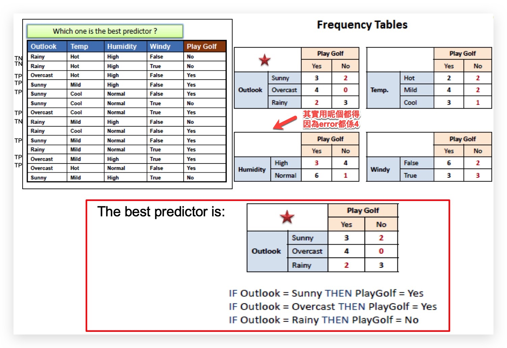

# COMPS382F

#### Two main categories of data mining tasks?
> Predictive and Descriptive.

### Normalization
> 例如有兩科分別係英文同中文，英文係50分滿分，我拎左20分，而中文係100分滿分，我拎左50分
> 係個表到會有20同50 ，但兩個數唔係代表緊一樣既價值
> 所以就要Normalization，英文會變到0.4(20/50)，而中文會變做0.5(50/100),咁先顯示到個正確既價值

### Min-Max normalization

## Binning
> 假設收集d數據一定會有錯，所以可以用Binning去`淡化`個整體錯誤

1. 將堆數字排晒順序
    1. e.g: `154, 159, 159, 160, 166, 171, 175, 177, 177, 181, 181, 200`
2. 有三種方式
    1. Partition into **equal-frequency** bins
        1. 
  1. Smoothing By bin means
      1. 
      
  2. Smoothing By bin boundaries
      1. 

## classification

### Zero-R

### One-R

> Choose the rules with the smallest error rate

-------
## Entropy
> 不確定性
> 0 =  確定
> 1 = 十分不確定

> It represents the entropy value if `Outlook` is used to partition the dataset.

### Information Gain

> At root node, all instances are included and hence the entropy should be quite `high`

## dissimilar

> 個數越細越似(least dissimilar)

### Contingency Table for Binary Attributes

> Who's `least dissimilar(最相似)` to Jack? All attributes in below are **symmetric** binary. Let values of **Y and P be 1** , and **N be 0**. Draw the contingency tables.

### Dissimilarity between Numeric Attributes

* Euclidean Distance (between data objects i and j)
    * 

* Manhattan Distance
    * 

### Dissimilarity Matrix for Attributes of Mixed Types
> Step 1: Convert all values of the data matrix to numeric

* Numeric attribute (f)
    * dist(i,j) = |xi – xj|/max(f) – min(f)
* Nominal/binary attribute
    * dist(i,j) = 0 if (xi == xj); 1 otherwise
* Ordinal attribute
    * eg. fair, good, excellent 
        * change to => `0`, `0.5`, `1`
        
> Step 2

> eg 

