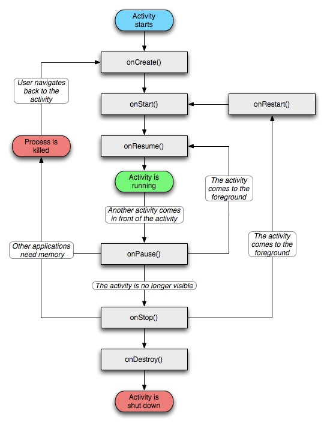
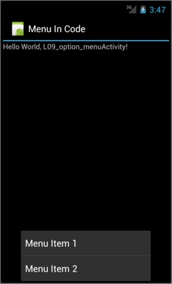
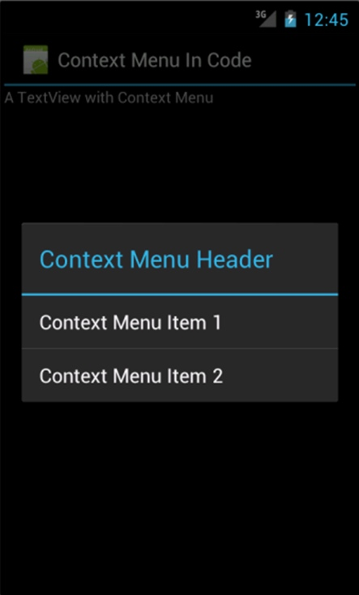
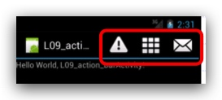

# COMPS413 Quiz 1
## Cheaper 1 基礎 Fundamentals
### Lifecycle

> 自己諗 淨係用來考試

**onCreate**
	Called when activity ready to start
**onStart**
	Called when activity already start
**onResume**
	Called when the activity come to' foreground, now ui will show in screen
**onPause**
	Called when other activity come to' foreground.
**onStop**
	Called when activity ui ready disappear  in screen
**onDestroy**
	Called before activity ui already disappear  in screen
	
### Process Termination

1. Critical priority 關鍵優先順序
    1. **Foreground process**
    2. **Visible process**
2. High priority 高優先順序
    1. **Service process**
    2. **Background process**
3. Low priority 低優先順序
    1. **Empty process**

## Cheaper 3 Event Handling

* LinearLayout
    * horizontal
    * vertical

* android:layout_width / height
    * match_parent
    * wrap_content
    
## Cheaper 5 Menu

* Option Menu
    * 

* Context Menus
    * 

* Action bar
    * 


## Cheaper 6 Threading

### extends Thread
    
```java
public class AThreadClass extends Thread { // 1. class extends Thread
  public void run() { // 2. override the run method
     // !!! cannot write UI code here
  }
}

AThreadClass aThread = new AThreadClass(); // 3. create Thread
aThread.start(); // 4. start a thread, step 2 run() will run after the thread started

```

### implements Runnable


```java
public class ARunnableClass implements Runnable { // 1. class implements Runnable

  public void run() { // 2. the task
    // !!! cannot write UI code here
  } 
} 

…
// 3. create a runnableClass
ARunnableClass aRunnable = new ARunnableClass(); Thread aThread = new 

// 4.  runnable not have start function, so we need create the thread to input runnable into thread to start
Thread aThread = new Thread(aRunnable);

// 5. start a thread, step 2 run() will run after the 
Thread(aRunnable); aThread.start(); 
```
## Update UI

* runOnUiThread (Runnable)

```java
runOnUiThread（new Runnable（）{ 
     void run（）{ 
         // UI Update Code
     } 
}）;
```
* post (Runnable)

```java
new Handler(handler.post(new Runnable() {
      @Override
      public void run() {
        // UI Update Code
      }
    });
```
* ~~post (View) notes無 可以無視~~
* AsyncTask


```java
public abstract class SimpleAsyncTask<Params, Progress, Result> {

    /**
     * 線程啓動之前執行
     */
    protected void onPreExecute() {
    }

    /**
     * 執行後台任務
     */
    protected abstract Result doInBackground(Params params){
    }

    /**
     * 執行進度，應該在Handler中調用
     */
    protected void onProgressUpdate(Progress progress) {
    }

    /**
     * 執行完畢
     */
    protected void onPostExecute(Result result) {
        // UI Update Code
    }

    /**
     * 結束線程執行
     */
    protected void onCancelled() {
    }
}
```
