# COMPS413F Exam
#Part 1
## Q1 

> same to Quiz 1 q1
> [Exam_Q1_Exercise](./media/15447948728552/Exam_Q1_Exercise.pdf)

- Android Version `____`(API level `___`), has the largest share of `___`%.
- To target for `___`% of more of Android devices, an application should be using Android Version `____`(API level `___`)
- This would be compatible with all `___`, `___`, and `___` devices, which together make up about `___`% of all devices.

### Lifecycle

> 自己諗 淨係用來考試

**onCreate**
	Called when activity ready to start
**onStart**
	Called when activity already start
**onResume**
	Called when the activity come to' foreground, now ui will show in screen
**onPause**
	Called when other activity come to' foreground.
**onStop**
	Called when activity ui ready disappear  in screen
**onDestroy**
	Called before activity ui already disappear  in screen
## Q2  Multithreading

> 文字 + 寫code

### Update UI

* runOnUiThread (Runnable)

```java
runOnUiThread（new Runnable（）{ 
     void run（）{ 
         // UI Update Code
     } 
}）;
```
* post (Runnable)

```java
new Handler(handler.post(new Runnable() {
      @Override
      public void run() {
        // UI Update Code
      }
    });

//Exam Specimen Q2
//呢個method 最後會調用Handler, 所以同上面其實係一樣
publie TextView textView; 
textView.post(new Runnable() {
    @Override
    public void run() {
        textView.setText("Update");
    }
})
```
* ~~post (View)~~ 應該唔洗理
* sendMessage(handler)


```java
private Handler handler = new ComputeHandler();
...
    @Override
    public void run() {
        Message msg = Message.obtain(handler, ComputeHandler.RESULT, total);        
        handler.sendMessage(msg);
    }
```

* AsyncTask

```java
public abstract class SimpleAsyncTask<Params, Progress, Result> {
    ...
    /**
     * 執行完畢
     */
    protected void onPostExecute(Result result) {
        // UI Update Code
    }
    ...
}
```

## Q3 Animation

> 文字題+睇code
> [Exam_Q3_Exercise](./media/15447948728552/Exam_Q3_Exercise.pdf)

> 可以program code / XML
> same as Quiz 2 animation

| alpha | scale | translate | rotate |
| --- | --- | --- | --- |
| 漸變透明度 | 漸變尺寸伸縮 | 畫面轉換位置移動 | 畫面轉移旋轉 |


> 轉貼：https://blog.csdn.net/harvic880925/article/details/39996643

1. 一開始個擺位
2. 一共要幾秒 The animation duration is xxx s
3. 將xml個解釋用文字寫出來

### alpha

```java
<alpha xmlns:android="http://schemas.android.com/apk/res/android"
    android:fromAlpha="1.0" // 動畫開始的透明度，从0.0 --1.0 ，0.0表示全透明，1.0表示完全不透明
    android:toAlpha="0.1" // 動畫結束時的透明度
    android:fillBefore="true" // 還原到開始動畫前的狀態>
</alpha>
```
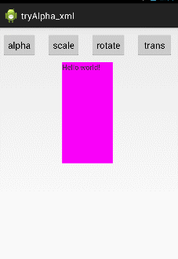


### scale


```java
<scale xmlns:android="http://schemas.android.com/apk/res/android"
    android:fromXScale="0.0" //起始的X方向上相對自身的縮放比例
    android:toXScale="1.4" // 結尾的X方向上相對自身的縮放比例  
    android:fromYScale="0.0" //起始的Y方向上相對自身的縮放比例
    android:toYScale="1.4" //結尾的Y方向上相對自身的縮放比例
    android:pivotX="50" //縮放起點X軸坐標 當為50時，表示在當前View的左上角，即原點處加上50px，做為起始縮放點；如果是50%，表示在當前控件的左上角加上自己寬度的50%做為起始點
    android:pivotY="50" //縮放起點Y軸坐標
/>
```

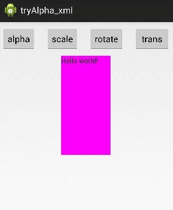

> android:pivotX="50%" 
> android:pivotY="50%"
 
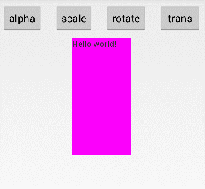

### translate

```java
<translate xmlns:android="http://schemas.android.com/apk/res/android"
    android:fromXDelta="0" //起始點X軸坐標
    android:toXDelta="-80" //結束點X軸坐標
    android:fromYDelta="0" //起始點Y軸從標
    android:toYDelta="-80" //結束點Y軸坐標
    >
</translate>
```
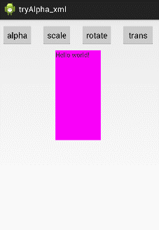

### rotate

```java
<rotate xmlns:android="http://schemas.android.com/apk/res/android"
    android:fromDegrees="0" //開始旋轉的角度位置
    android:toDegrees="650" //結束時旋轉到的角度位置
    android:pivotX="50%" //縮放起點X軸坐標
    android:pivotY="50%" //縮放起點Y軸坐標
    >
</rotate>
```


## Q4 Collision Detection

* Rectangular Collision Detection
* Distance-Based Collision Detection
* Pixel-Based Collision Detection


### Rectangular Collision Detection

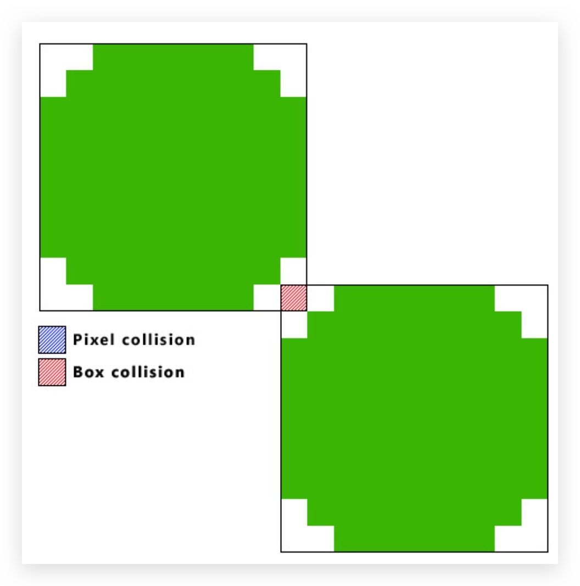


1. The bounding box of a sprite is the smallest rectangle that contains the visual of the sprite.

2. check whether the bounding boxes of two sprites overlap

3. if the two rectangles overlap `->` collision


**Good**    - simplicity and efficiency
**Bad** - Collision may be detected even when no visual part of the sprites collides

---


### Pixel-Based Collision Detection
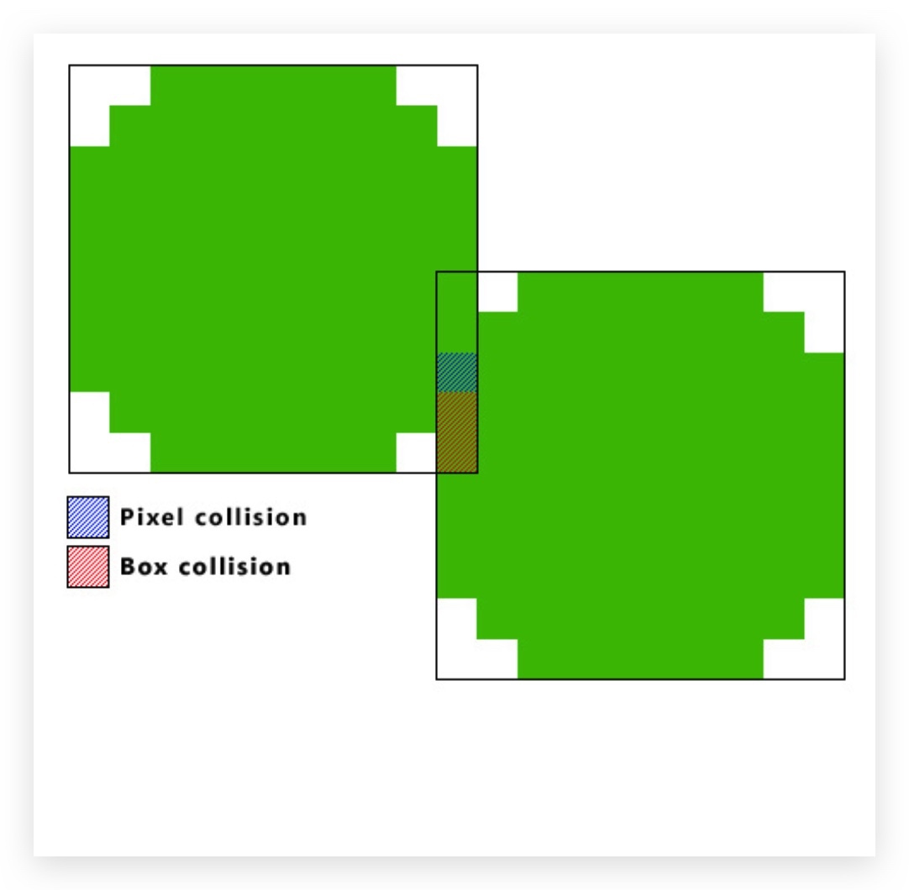


* In pixel-based collision detection, a collision is detected only when the non- transparent pixels of two sprites overlap.
* The transparent pixels in sprites are not regarded visual part of the sprites for the purpose of collision detection.

1. It first use rectangular collision detection to check if two objects’ bounding boxes are overlapped.
2. if not overlap `->` no collision
3. else `->` compared one by one for their transparency with overlap area
4. both pixels at the same position of the arrays are not transparent `->` collision

**Good** -  More like the real collision
**Bad** - Need more performance, slowly 

---


### Distance-Based Collision Detection

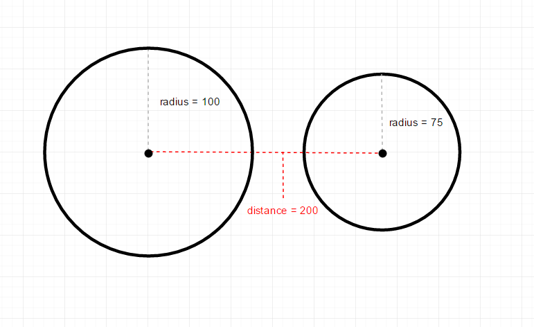

1. Distance-based collision detection works by considering the sizes of two bounding boxes and the distance between them.

2. A circle is derived from each bounding rectangle with the same centre, and a collision is assumed if the two circles overlap.

**Good** -  very suitable for sprites that are nearly circular and elliptic in shape.

**Bad** -  not work well for other shapes.

----
# Part 2
## Q5 
> XML -> 圖 (game)
> same as Quiz 1
> [Exam_Q5_Exercise](./media/15447948728552/Exam_Q5_Exercise.pdf)

## Q6
> XML -> 圖
> same as Quiz 2 
> [Exam_Q6_Exercise](./media/15447948728552/Exam_Q6_Exercise.pdf)

- CheckBoxPreference
    - 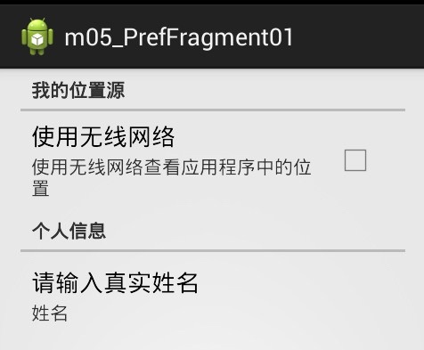

- EditTextPreference
    - 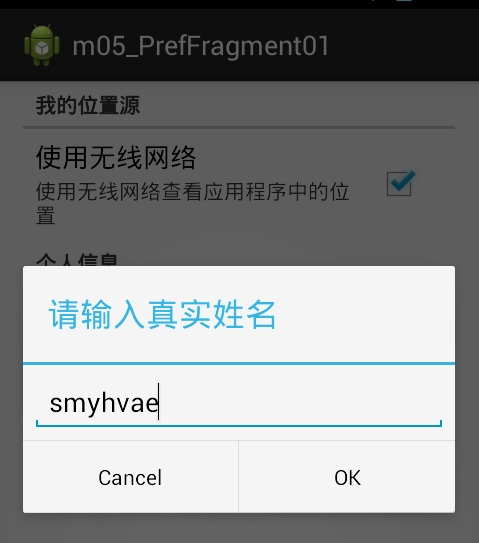

- ListPreference
    - 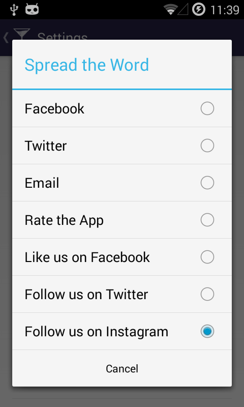


- MultiSelectListPreference
    - 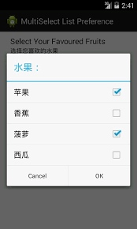


## Q7
> game loop 寫翻個game 邏輯
> same as Quiz 2
> [Exam_Q7_Exercise](./media/15447948728552/Exam_Q7_Exercise.pdf)

* Handle user input
    * ...
* Update game state
    * ...
* if xxx
    * ...


## Q8
> Optimization?
> Quiz 無見過既 

