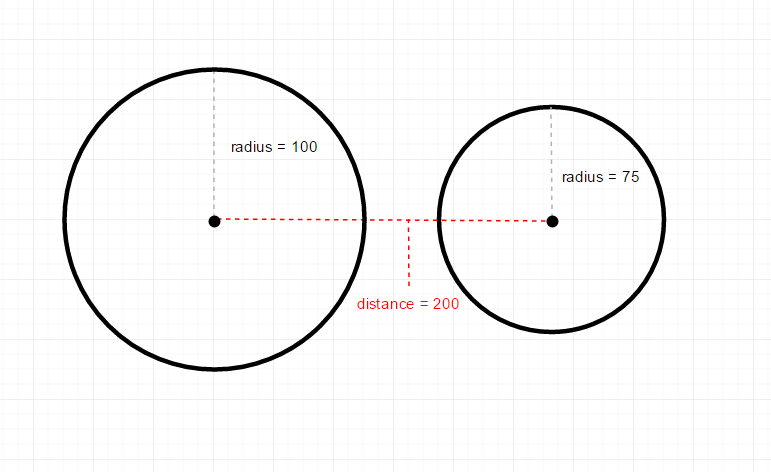

# COMPS413F – Quiz 2

## Question 1 - SQLite

> 參考：https://developer.android.com/reference/android/database/sqlite/SQLiteDatabase.html#delete(java.lang.String,%20java.lang.String,%20java.lang.String[])

```java
// This is 7 value query method, also have 8, 9 and 10.

public Cursor query (
            String table,   //表名稱
            String[] columns,   //列名稱數組
            String selection,   //條件子句，相當於where   舉例 "key1=? and key2=?"
            String[] selectionArgs, //條件語句的參數數組  舉例 new String[]{ "value1","value2"}
            String groupBy, //分組
            String having,  //分組條件
            String orderBy, //排序類
            )
```

```java
ContentValues contentValues = new ContentValues();
contentValues.put("name", "wing");
```

```java
public long insert (
            String table,
            String nullColumnHack,  //好似d例子都係null
            ContentValues contentValues
            )
```

```java
public int update (
            String table, 
            ContentValues contentValues, 
            String whereClause, //條件子句，相當於where   舉例 "key1=? and key2=?"
            String[] whereArgs  //條件語句的參數數組  舉例 new String[]{ "value1","value2"}
            )
```

```java
public int delete (
            String table,
            String whereClause, //條件子句，相當於where   舉例 "key1=? and key2=?"
            String[] whereArgs  //條件語句的參數數組  舉例 new String[]{ "value1","value2"}
            )
```

-------

## Question 2 - Optimization

* Rectangular Collision Detection
* Distance-Based Collision Detection
* Pixel-Based Collision Detection


### Rectangular Collision Detection


1. The bounding box of a sprite is the smallest rectangle that contains the visual of the sprite.

2. check whether the bounding boxes of two sprites overlap

3. if the two rectangles overlap `->` collision


**Good**    - simplicity and efficiency
**Bad** - Collision may be detected even when no visual part of the sprites collides

---


### Pixel-Based Collision Detection


* In pixel-based collision detection, a collision is detected only when the non- transparent pixels of two sprites overlap.
* The transparent pixels in sprites are not regarded visual part of the sprites for the purpose of collision detection.

1. It first use rectangular collision detection to check if two objects’ bounding boxes are overlapped.
2. if not overlap `->` no collision
3. else `->` compared one by one for their transparency with overlap area
4. both pixels at the same position of the arrays are not transparent `->` collision

**Good** -  More like the real collision
**Bad** - Need more performance, slowly 

---


### Distance-Based Collision Detection



1. Distance-based collision detection works by considering the sizes of two bounding boxes and the distance between them.

2. A circle is derived from each bounding rectangle with the same centre, and a collision is assumed if the two circles overlap.

**Good** -  very suitable for sprites that are nearly circular and elliptic in shape.

**Bad** -  not work well for other shapes.

----
## Q3


| alpha | scale | translate | rotate |
| --- | --- | --- | --- |
| 漸變透明度 | 漸變尺寸伸縮 | 畫面轉換位置移動 | 畫面轉移旋轉 |


AlphaAnimation(float fromAlpha, float toAlpha) 透明度

```java
AlphaAnimation (float fromAlpha, float toAlpha)
// 1:不透明
// 0:完全透明
//repeatCount : Defines how many times the animation should repeat. 
```
 
ScaleAnimation(float fromX, float toX, float fromY, float toY, float pivotX, float pivotY)

```xml
<!--原文：http://wiki.jikexueyuan.com/project/android-animation/1.html-->
<scale xmlns:android="http://schemas.android.com/apk/res/android"  
    android:fromXScale="0.0"  
    android:toXScale="1.4"  
    android:fromYScale="0.0"  
    android:toYScale="1.4"  
    android:pivotX="50"  
    android:pivotY="50"  
    android:duration="700" />

```
> 這個控件，寬度和高度都是從 0 放大到 1.4 倍，起始點坐標在控件左上角（坐標原點），向 x 軸正方向和 y 軸正方向都加上 50 像素； 根據 pivotX,pivotY 的意義，控件的左上角即為控件的坐標原點，這裡的起始點是在控件的原點的基礎上向 X 軸和 Y 軸各加上 50px，做為起始點，如下圖中圖二所示


----
## Q4

* Handle user input
    * ...
* Update game state
    * ...
* if xxx
    * ...


