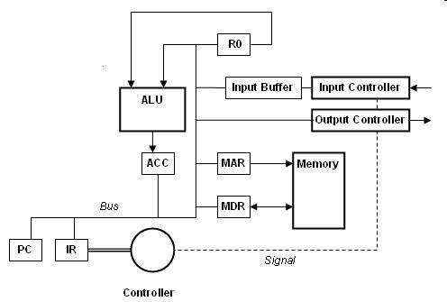

# Computer Architecture

## Binary Number Systems

| 正數 | 負數 |
| :-: | :-: |
| 0 | 1 |


### Binary Coded Decimal(BCD)


| $$ 472_{10} $$ |
| :-: |

| 4 | 7 | 2 |
| :-: | :-: | :-: |
| 0100 | 0111 | 0010 |


### 2s-Complement

$$A-B = A+(-B)$$


| Overflow 條件 |  |   | result |
| --- | :-: | :-: | :-: |
|  | **+** | **+** | - |
|  | **-** | **-** | + |

|  sign-magnitude  |  2's complement  |
| :-: | :-: |
|  -127 to 127  |  -128 to 127  |


### IEEE 754


| Normalized | De-normalized |
| :-: | :-: |
| $$ S(+/-)1.M*2^{E-127}$$ | $$ S(+/-)0.M*2^{0-126}$$ |

> 如果E=0 && M!=0就用De-normalized 


## Von Neumann Architecture and Bottleneck
> The program and data will be stored together in the Memory System

* Data not ready 
    - Instructions cannot be executed (example: LDA 77)
* The limited throughput between CPU and memory

## Little Man Computer /Memory 

 

Fetch Part 
1. PC -> MAR
2. M[MAR] -> MDR
3. MDR -> IR


|  雙數  | 單數   |
| :-: | :-: |
|  even  |  odd  |


## Components of CPU

* CPU or processor
* Bus
* Memory
* I/O

CPU Run LMC 速度

> Clock cycles / Clock rate  = Ans **ns**

Most effective to support parallel execution of instructions

* Add system bus

$$ MIPS = \frac{number\,of\,instructions}{seconds} $$

### Pipeline hazards


## Registers, Buses and the Main Memory.


```
Data Rate Per Lane = (transfer of X bit in Y ns)
Bus Throughput = Number of Lanes * Data Rate Per Lane
```

* Static RAM
    * Faster, but more expensive  
    * Used as registers in CPU or Cache memory  
* Dynamic RAM
    * Slower than SRAM because of refreshing time    
    * Used in main memory

## Methods of Improving Performance of Computers
* Adding an addition System Bus
* Increase Clock Rate
* Adding a CPU Cache


## Addressing Modes, E-LMC

| memory address | content |
| :-: | :-: |
| 10 | 99  |
| 20 | 10 |
| R5 | 10  |


| im./mediate | direct addressing | indirect addressing | register indirect | register index relative | register |
| :-: | :-: | :-: | :-: | :-: | :-: |
| LDA #20 | LDA 20 | LDA (20) | LDA (R5) | LDA R5+10 | LDA R5 |
| 20 | 10 | 99 | 99 | 10 | 10 |

### size of addressing space

$$ 2^{Operand\,bit} $$


## RISC and CISC Architectures


-------

## Hard disk drive

|  Average seek  |  Average rotational latency  |  Transfer time  |  Controller overhead  |
| :-: | :-: | :-: | :-: |
|    |  $$ (50\% * (\frac{1}{Rotational\,Speed})*60)s $$  |  $$ \frac{Bytes/sector}{Data\,transfer\,rate\,to/from\,host} $$  |    |


