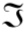

# Database

### Relational Algebra


| Selection (σ) | Projection (π) | | pR |
| :-: | :-: | :-: | :-: |
| SELECT * FROM TABLE WHERE Age > 18; | SELECT A,B FROM TABLE | 計算function | Rename |
| σ Age>18 (TABLE) | π A,B (TABLE) |  COUNT var  | pR(New name)| |


-------

### PHP


```php
$con = connectDB();
$id = $_POST['id'];
$sql = 'SELECT name FROM TABLE WHERE id=' + $id ;
if($statement = oci_parse($conn,$sql)){
    oci_excute($statement);
    while ($row = oci_fetch_assoc($statement)){
        echo $row['name'];
    }
}
```

-------

### SQL


```sql
Create domain `DemoName` As `type` check (`xxx`);
ALTER Table `tableName` ADD/DROP/MODIFY COLUMN `column_name` `type`;

```


