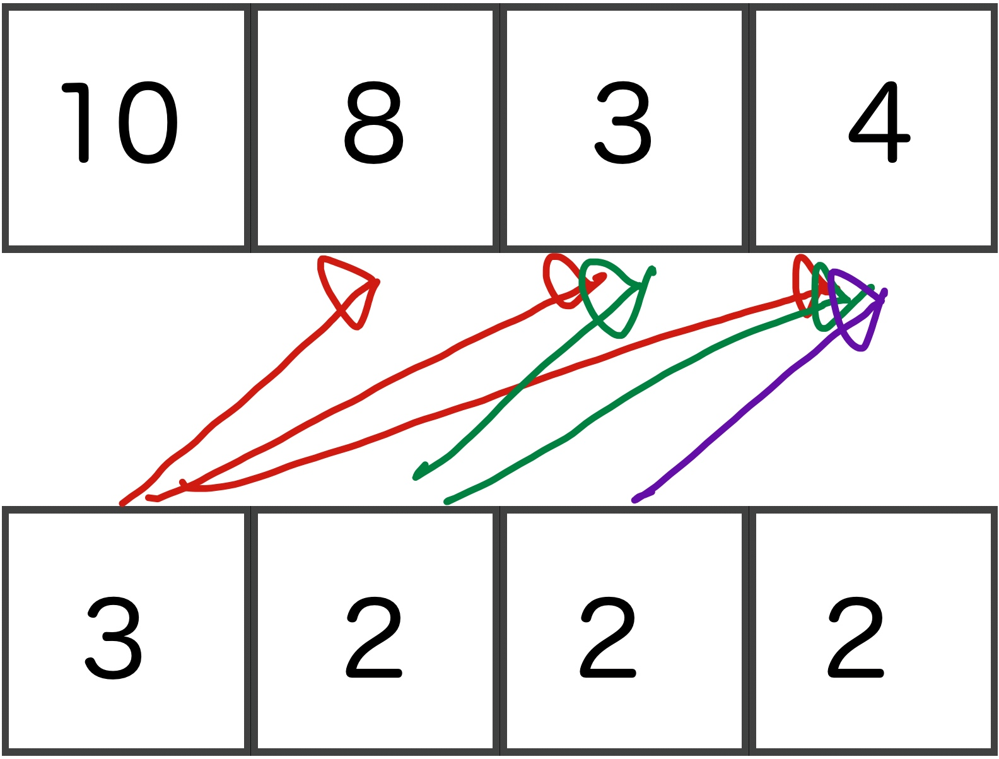
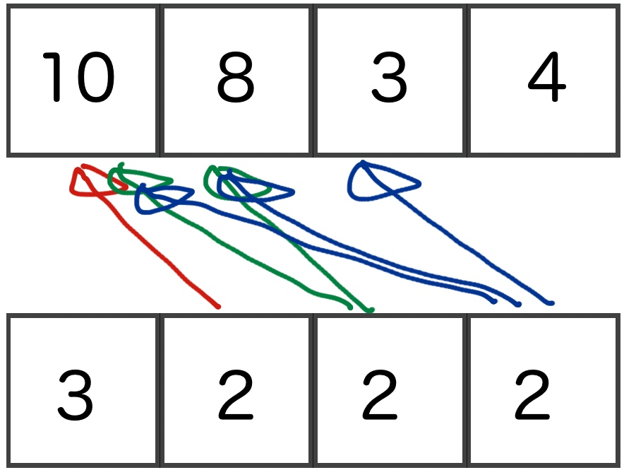

# Java

> 1. **Polymorphism** - Abstract class
> 2. **Inheritance** - Extends


* java is **Pass by value**
* 不會考 **Pass by result**


|  | Example |
| --- | --- |
| language design time | defined type |
| language implementation time | **e.g** set int range |
| compile time | defined variable / function |
| load time | static variable / function |
| run time | non-static variable / function |


-------

## Row-major order / Column-major order


```C
int a[10][8][3][4]
a[3][2][2][2]=3;
```

> Assume that a[0][0][0][0] is at the address of 30000.

**Offset**

**Row-major order**




> Offset = 3x8x3x4 + 2x3x4 + 2x4 +2


**Column-major order**



> Offset = 3 + 2x10 + 2x8x10 + 2x3x8x10


```
ans = 30000 + offset *3
```


