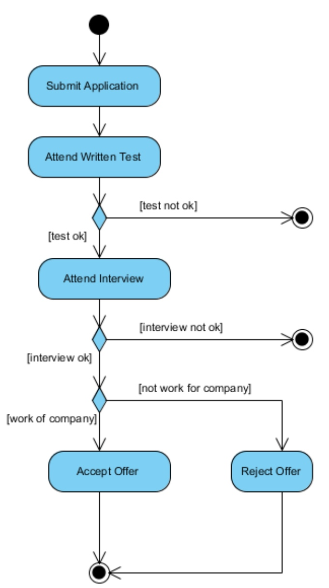
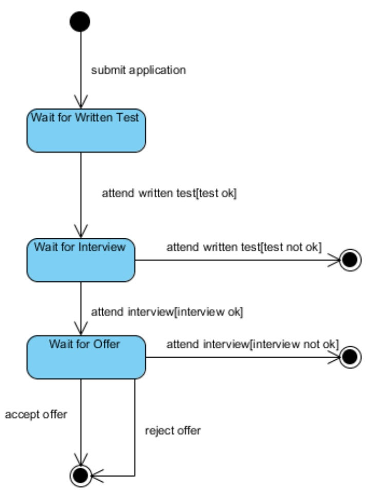
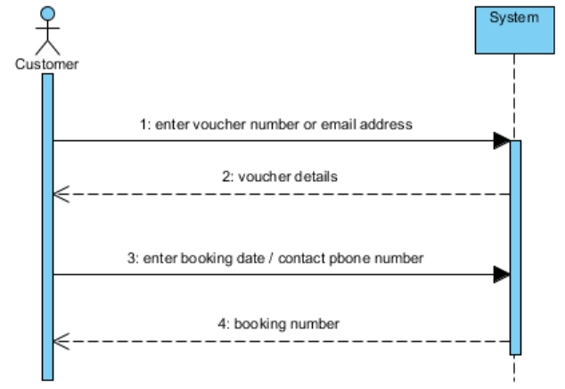
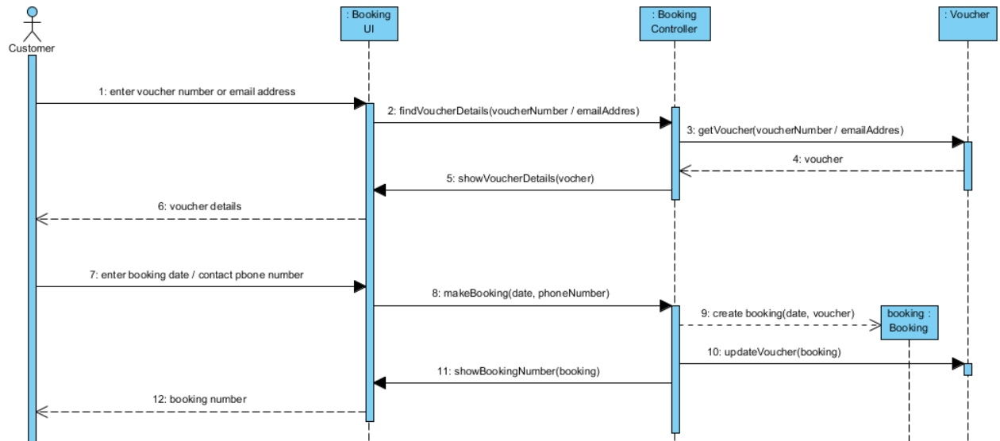
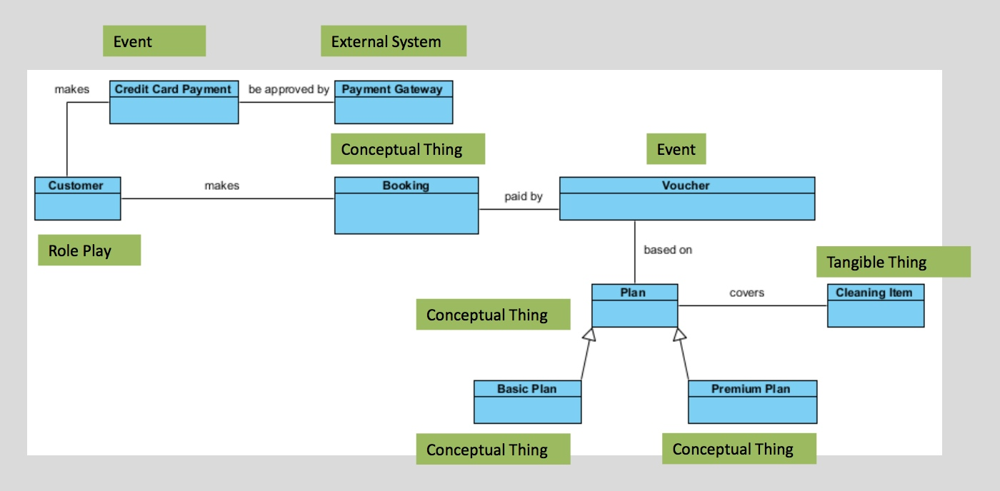
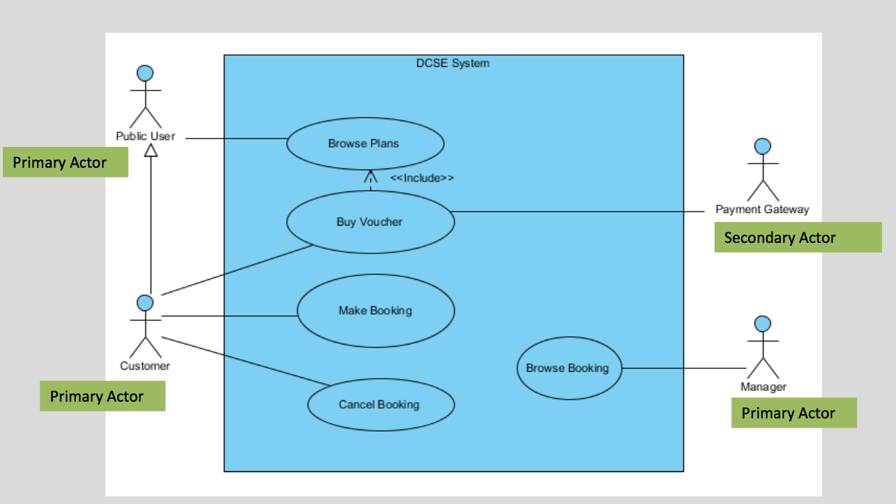

# OOT Exam Notes

```java
//記得要定義個ArrayList
ArrayList<Obj> arrayList = new ArrayList<Obj>();
...
public Enumeration getXXX(){
		return Collections.enumeration(arrayList);//e句要背
	}
```

#### double記得要小數點

```
//對
double num = 100.0;
//錯
double num = 100;
```

#### Class Reason

| Class | Reason |
| :-: | :-: |
| Customer | Role Play |
| Plan | Conceptual Thing |
| CreditCard | Conceptual Thing |
| Item | Tangible Thing |
| Booking | Event |
| PaymentGateway | External System / Role Play |

-------


## Diagram


| Activity Diagram | Status Diagram |
| --- | --- |
| | 

 
 
 
 


| System Sequence Diagram | 3-Tier Sequence Diagram |
| :-: | :-: |
| | |


| Class Diagram | Use Case Diagram |
| :-: | :-: |
| | 


