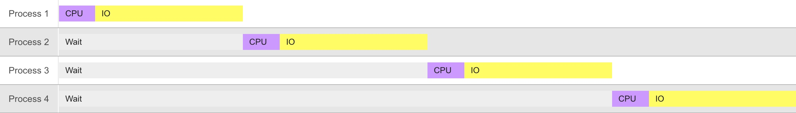
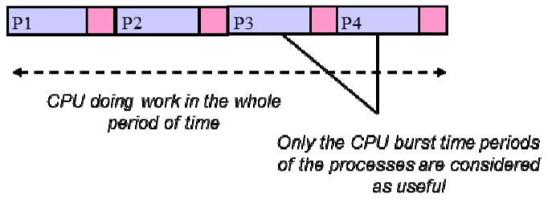
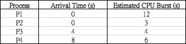
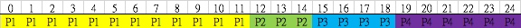
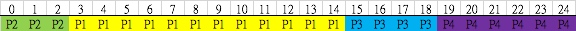
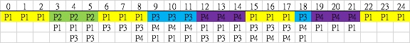
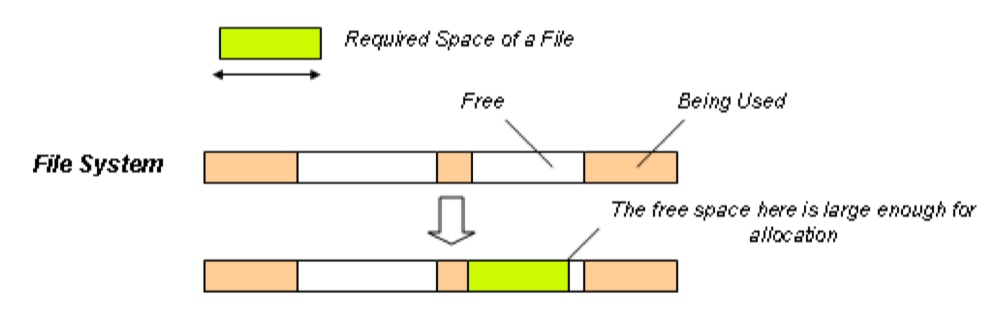
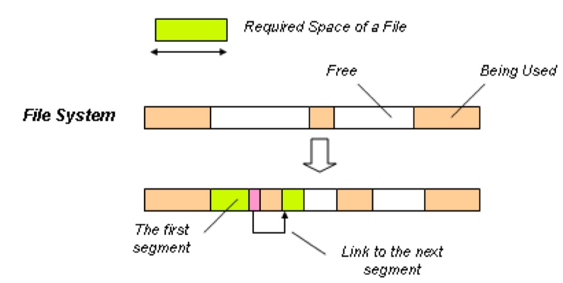
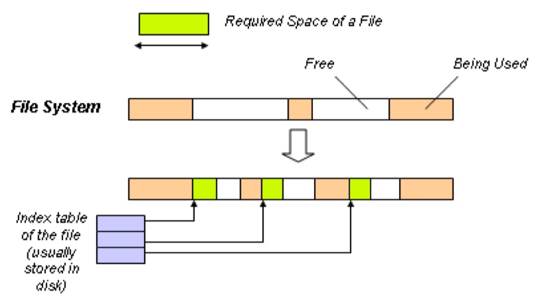

# Operating Systems

CPU-bound process - long CPU burst
I/O bound process - short CPU burst

## CPU Utilization 
### Single Programming

> States

1. New
2. Running
3. Waiting
4. Ready

> A set of **4 processes** is to be executed on a _single processor computer_ system. The operating system supports single programming. Each process has the following characteristics: **the turn-around time is 10 ms**, and **it spends 20% of the time in CPU bursts and 80% in IO bursts**.




Turnaround Time - 全部Process起點到終點既運作既時間，包括CPU, IO 
>**10*4 = 40ms**

CPU Utilization (CPU使用率) - time in CPU bursts and the rest in IO bursts
> 紫色個part **20%**

CPU Burst Time 

> 40ms x 20% = **8ms**

-------

### Multi-Programming

> A set of 3 processes is to be executed on a single processor computer system. The operating system supports multi programming. Each process has the following characteristics: the turn-around time is 12 ms, and it spends 3 ms of the time in CPU bursts and the rest in IO bursts.

> Calculate the overall Turnaround Time (in ms).

> **Assume that only one process can do IO operation at any one time (i.e. only one non-sharable IO device), and ignore overhead of OS operations**


Overall Turnaround Time 
> 1. 畫格仔數
> 2. CPU Burst Time (of the first process) + IO Burst Time (of all processes)

The CPU Utilization / The CPU Utilization Rate
> 1. Total CPU Burst Time(紫色)/ Overall Turnaround Time(見上)


-------

#### Context Switching

> The CPU burst time is the time CPU doing useful work.

The context switching time is `1 ms`
4 processes each `10 ms` CPU burst time


```
          total = (10+1 *4)
 CPU burst time = 10*4
CPU Utilization = CPU burst time / total
                = 40/44
                = 0.909 
                = ~91%
```


-------


## CPU Scheduling

> Revision Q9



* FCFS (順序落一個一個)


* SJF `non-preemptive` (CPU Burst少個個先)


* RR(TQ=3 一開始順序,每3格一個loop, 去翻最底排隊)



|  | 完成位置 `-` AT | TT `-` CPU Burst | 第一格有反應的位置 `-` AT |
| :-: | :-: | :-: | :-: |
|  | turnaround time | wait time | response time |
| FCFS ||||
| SJF | |||
| RR | |||


-------


## Bankers' Algorithm

> 其中一種防止Deadlock既算法

Available Vector可以理解成`淨番既資源`,而其他資源已經分配晒入下面（Allocation）

**Available Vector: [ 0  0  2  ]**

| Process | Allocation | Max | Need(`Max - Allocation`) |
| :-: | :-: | :-: | :-: |
| P1 | 1 0 0 | 1 1 0 | **0 1 0** |
| P2 | 0 2 0 | 1 2 0 | **1 0 0** |
| P3 | 1 0 0 | 1 2 0 | **0 2 0** |
| P4 | 0 1 0 | 0 1 2 | **0 0 2** |

###### Step 

1. 用 `Available Vector` 搵可以滿足的 `Need`
2. 將已滿足 `Process的Allocation` 加到 `Available Vector` -> **return to Step 1**


|  | Available Vector |
| :-: | :-: |
| P4 is completed | 0 0 2 + 0 1 0 = **0 1 2** |
| P1 is completed | 0 1 2 + 1 0 0 = **1 1 2** |
| P2 is completed | 1 1 2 + 0 2 0 = **1 3 2** |
| P3 is completed | 1 3 2 + 1 0 0 = **2 3 2** |

因為可以滿足全部Process, 所以 **Safe**


#### 延伸題目 1.
> Suppose that P4 requests for resources [ 0  0  1  ]. Should the request be granted?

姐係將P4 `Need` 個位 變成 0  0  1, **其他位置要相應改變**
Available Vector : **Step 3.** ~~[ 0 0 2 ]~~ -> **0 0 1**

| Process | Allocation | Max | Need(`Max - Allocation`) |
| :-: | :-: | :-: | :-: |
| P1 | 1 0 0 | 1 1 0 | **0 1 0** |
| P2 | 0 2 0 | 1 2 0 | **1 0 0** |
| P3 | 1 0 0 | 1 2 0 | **0 2 0** |
| P4 | Step 2. ~~0 1 0~~ -> **0 1 1** | 0 1 2 | Step 1. ~~0 0 2~~ -> **0 0 1**|

P4 (0 1 2) -> P1 (1 1 2)-> P2 (1 3 2) -> P3 (2 3 2)
> safe, because it can complete all process in a **certain** order, so the request can granted

#### 延伸題目 2.
> Revision Q15
Consider the above state of system resource allocation again. If a request from Process P2 arrives for (0 4 2 0), should this request be granted im./mediately? Explain the answer.
 
姐係P2 Allocation 個數加 `0 4 2 0`, **其他位置要相應改變**


-------

## Memory Management

* Internal Fragmentation -> 好似停車場咁，劃固定位置
* External Fragmentation -> 分成好多小既分區，根據容量大小加入不同的分區


### Effective memory access time (EMAT) 
執行內存操作所花費的平均時間

> 全部**EMAT**都要係命中 `+` 不命中

#### Translation look-aside buffer (TLB)

1. 命中 -> (TLB access time `+` memory access time) `*` 命中率
2. 不命中 -> TLB access time `+` memory access time `*` 2 `(一次 access page table 一次 access physical memory)`

>   EMAT = 命中 `+` 不命中

#### Page-fault

> Assuming that the memory access time is **100** nanoseconds, and the page-fault service time is **25** milliseconds. 
> The page fault rate is **one in a thousand**. Evaluate the effective memory access time.

* Page fault not occurred : (1 - 1/1000) * (100ns + 100ns)
* Page fault occurred : (1/1000) * (25000000ms + 100ns + 100ns)

> EMAT = Page fault not occurred + Page fault occurred

-------

#### Paging

**需要用**
1. Logical address
2. Page size
3. Page table

> The size of logical address space = **Page size** `x` **Page table entry** 好似唔會用到

**Step:**

1.  **Page ID** = logical address `÷` Page size *(取整數)*
2.  **Offset** = logical address `%` Page size *(餘數)*
3.  在Page table找 *Page ID* 對應的 **Frame ID**
4.  **Frame ID** `*` **Page size** `+` **Offset**

> 如果Step 3找不到沒有 **Page ID** 的話 -> `A physical address binding exception occurred.`

### Allocates

> 1. 要留意題目講咩方向 `low to high` or `high to low`
> 2. 如果中間有part放唔入skip做下一個，唔會成題Error

* First-fit -> 由頭or尾開始搵，一遇到個**足夠大**既就用 -> Stop
* Best-fit  -> 由頭到尾scan一次，用個**最岩**既
* Worst-fit -> 由頭到尾scan一次，用個**最大**既 (好處係可以留個更大既位)

### Segment

**需要用**

1. Physical addresses
2. Segment table ( Segment ID **|** Base Address **|** Limit )

> eg. (0, 150) -> **(Segment ID, Offset)**
> 

**Step:**

1.  用 Segment ID 搵對應的 **Base Address**
2.  Check if Offset `>` Limit -> **Error**
3.  **Physical address** = Base Address `+` Offset

-------
#### Page Replacement Algorithm 分頁替換演算法

* **Optimal (OPT)** -> 滿左個時望後面 **最後用**個個就換, 有多就換多左個d
* **FIFO** -> 第一個入既先走,之後到第二個 
* **Least Frequently Used (LFU)** -> 用得最少既走, 計到用個格之前
* **Least Recently Used (LRU)** -> 上一格擺入去，再上一格都擺入去，淨翻個個換

-------

## IO

device driver : implement logic IO controller  and converts IO logical code into device code

##### I/O calls

1. Synchronous - easy to programming
2. Asynchronous - efficient execution, because no need to wait 

### File Space Management


* **Contiguous Allocation**




* **Linked Allocation**




* **Indexed Allocation**




### Disk Scheduling

**需要**

1. head track (**起點**)
2. 方向


|  | 步驟 |
| :-: | :-- |
| **FCFS** | 順序做 |
| **SSTF** | 距離短既做先 |
| **SCAN** | 起點 > ... > 99 > ... > 最細 (low to high) |
| **C-SCAN** | 起點 > ... > 99 > 0 > ... (low to high) |
| **LOOK** | 起點 > ... > 最大 > ... > 最細 (low to high) |
| **C-LOOK** | 起點 > ...> 最大 > 最細 > ... (low to high) |


