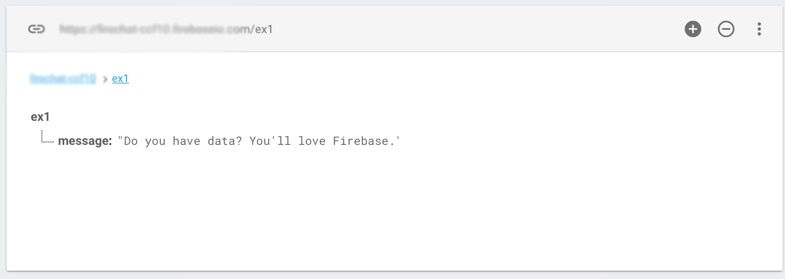
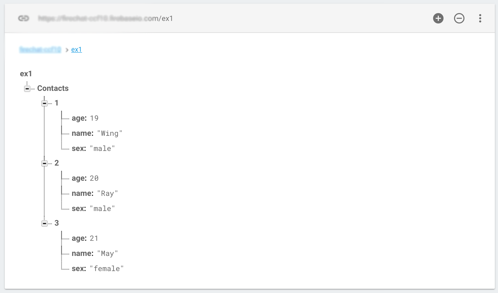

# Firebase 連接資料庫 寫入資料
[Firebase Setup 教學](http://litotom.com/2016/09/27/android-studio-2-2-Firebase/)

### 連接資料庫

```java
        //必須完成Firebase Setup後才能使用
        //取得Firebase連結
        FirebaseDatabase database = FirebaseDatabase.getInstance();
        //Firebase入面邊個目錄
        DatabaseReference myRef = database.getReference("contacts");
```
或者可以指定Link

```java
DatabaseReference myRef = FirebaseDatabase.getInstance()
                .getReferenceFromUrl("https://<your-app>.Firebaseio.com/contacts");
```

> Firebase數據庫會自動將您傳遞到Database Reference.setValue()的Java對象轉換為JSON，並且可以使用DataSnapshot.getValue()將JSON讀入Java對象。

<br/>
## Write Data to Firebase
現在嘗試把`Do you have data? You'll love Firebase.`放入/ex1/message/

```java
//連接資料庫
DatabaseReference myRef = FirebaseDatabase.getInstance()
                .getReferenceFromUrl("https://<your-app>.Firebaseio.com/ex1");
                
//如果本身沒有 "message" 目錄，會自動生成
myRef.child("message").setValue("Do you have data? You'll love Firebase.");
```
效果圖：



-------

### setValue()
> 儲存資料至所定路徑，會更新節點內的所有資料。例如：messages/Contacts/

首先建立ContactsInfo.class，並利用來進行對Firebase的存取

```java
public class ContactsInfo {

    private  String name;
    private  String sex;
    private  long   age;
    
    public ContactsInfo() {
    }

    public ContactsInfo(String name, String sex, long age){
        this.age = age;
        this.name = name;
        this.sex = sex;
    }

    public String getName(){
        return this.name=name;
    }
    public String getSex(){
        return this.sex=sex;
    }
    public long getAge(){
        return this.age=age;
    }
}
```
現在嘗試將以下資料透過ContactsInfo.class放入Firebase中

| Name| Sex |Age|
| :-:| :-: | :-:|
| Wing| male | 19 |
| Ray | male | 20 |
| May | female |21 |


```java
        //連接資料庫
        FirebaseDatabase database = FirebaseDatabase.getInstance();
        //目錄 /ex1
        DatabaseReference ContactsRef = database.getReference("ex1");
        //將資料放入ContactsInfo
        ContactsInfo contact1 = new ContactsInfo("Wing","male",19);
        ContactsInfo contact2 = new ContactsInfo("Ray","male",20);
        ContactsInfo contact3 = new ContactsInfo("May","female",21);
        
        //將contact1放人子目錄 /ex1/1
        ContactsRef.child("Contacts").child("1").setValue(contact1);
         //將contact1放人子目錄 /ex1/2
        ContactsRef.child("Contacts").child("2").setValue(contact2);
         //將contact1放人子目錄 /ex1/3
        ContactsRef.child("Contacts").child("3").setValue(contact3);
```
效果圖：



