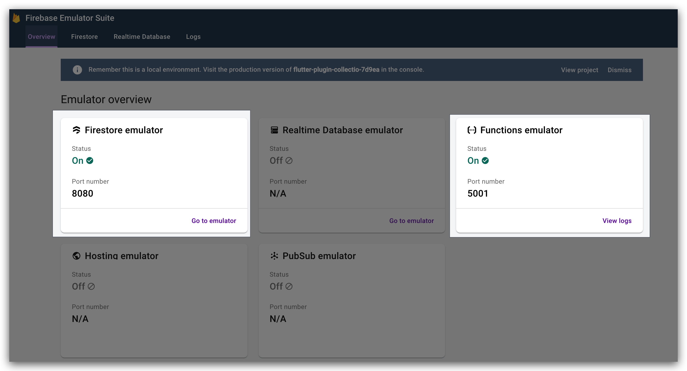
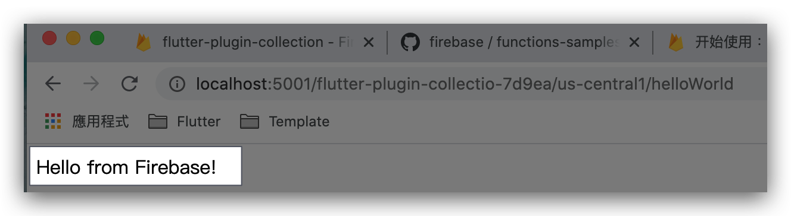
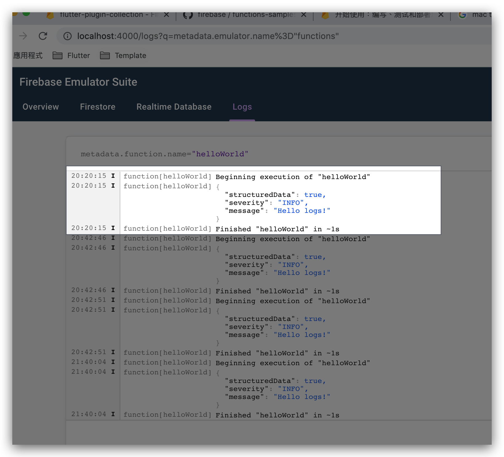
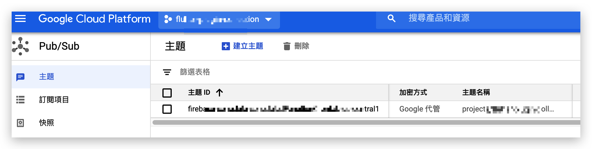
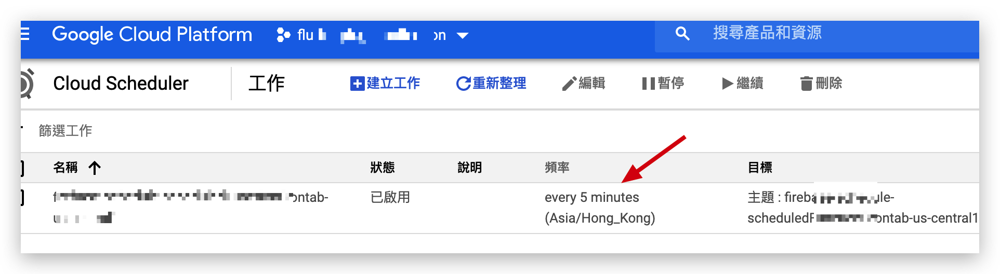
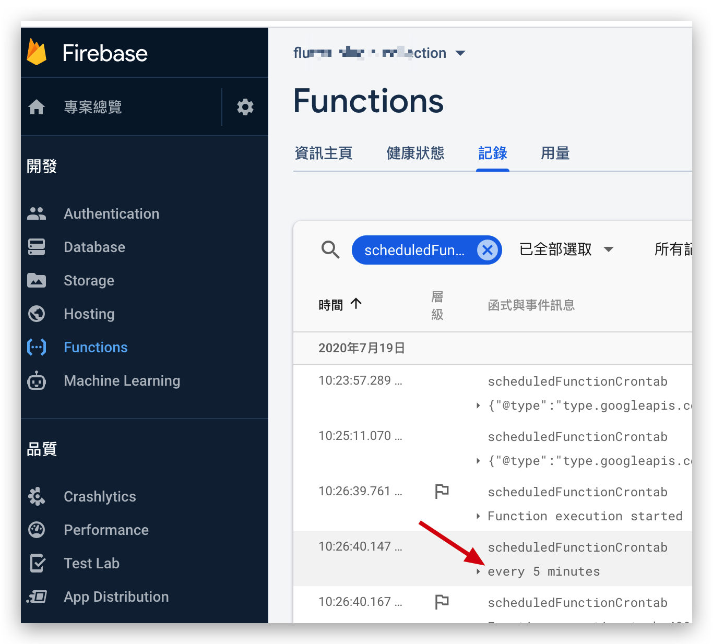

# [New] Firebase Function

> Firebas Function 近年更新了很多，所以再記錄一下
>
> 建議先看看為什麼要用Firebase Function  [Cloud Functions 有哪些用途？](https://firebase.google.com/docs/functions/use-cases)


首先要安裝`firebase-tools` 和初始化

> **注意**: 選擇`Firestore`是因為在`Emulators` 測試`Functions`時可以使用`onCreate`等功能

```shell
npm install -g firebase-tools

firebase login
firebase init

? Which Firebase CLI features do you want to set up for this folder? Press Space to select features, then Enter to confirm your choices.
 ◯ Database: Deploy Firebase Realtime Database Rules
 ◉ Firestore: Deploy rules and create indexes for Firestore
 ◉ Functions: Configure and deploy Cloud Functions
 ◯ Hosting: Configure and deploy Firebase Hosting sites
 ◯ Storage: Deploy Cloud Storage security rules
❯◉ Emulators: Set up local emulators for Firebase features

? What file should be used for Firestore Rules? firestore.rules

Firestore indexes allow you to perform complex queries while
maintaining performance that scales with the size of the result
set. You can keep index definitions in your project directory
and publish them with firebase deploy.

? What file should be used for Firestore indexes? firestore.indexes.json

=== Functions Setup

A functions directory will be created in your project with a Node.js
package pre-configured. Functions can be deployed with firebase deploy.

? What language would you like to use to write Cloud Functions? JavaScript
? Do you want to use ESLint to catch probable bugs and enforce style? Yes
✔  Wrote functions/package.json
✔  Wrote functions/.eslintrc.json
✔  Wrote functions/index.js
✔  Wrote functions/.gitignore
? Do you want to install dependencies with npm now? Yes

> protobufjs@6.10.1 postinstall /Volumes/ASUS_External/Wallet/functions/node_modules/protobufjs
> node scripts/postinstall

npm notice created a lockfile as package-lock.json. You should commit this file.
added 361 packages from 267 contributors and audited 361 packages in 6.732s

31 packages are looking for funding
  run `npm fund` for details

found 0 vulnerabilities


=== Emulators Setup
? Which Firebase emulators do you want to set up? Press Space to select emulators, then Enter to confirm your choices. Functions, Firestore
i  Port for functions already configured: 5001
i  Port for firestore already configured: 8080
i  Emulator UI already enabled with port: (automatic)
? Would you like to download the emulators now? Yes

i  Writing configuration info to firebase.json...
i  Writing project information to .firebaserc...

✔  Firebase initialization complete!
```

會生成以下檔案

```she
myproject
 +- .firebaserc    # 隱藏的文件可幫助您在不同文件之間快速切換
 |                 # projects with `firebase use`
 |
 +- firebase.json  # 描述項目的屬性
 |
 +- functions/     # 包含所有function代碼的目錄
      |
      +- .eslintrc.json  # Optional file containing rules for JavaScript linting.
      |
      +- package.json  # 描述您的Cloud Functions代碼的npm軟件包文件
      |
      +- index.js      # Cloud Functions代碼的主要源文件
      |
      +- node_modules/ # 安裝依賴項
```


---

## 實戰

> main.dart

```js
const functions = require('firebase-functions');

// // Create and Deploy Your First Cloud Functions
// // https://firebase.google.com/docs/functions/write-firebase-functions
//
exports.helloWorld = functions.https.onRequest((request, response) => {
  functions.logger.info("Hello logs!", {structuredData: true});
  response.send("Hello from Firebase!");
});
```


啟動`emulators`

```shell
firebase emulators:start

i  emulators: Starting emulators: functions, firestore
⚠  functions: The following emulators are not running, calls to these services from the Functions emulator will affect production: database, hosting, pubsub
✔  functions: Using node@10 from host.
i  firestore: Firestore Emulator logging to firestore-debug.log
i  ui: Emulator UI logging to ui-debug.log
i  functions: Watching "/Volumes/ASUS_External/Wallet/firebase/functions" for Cloud Functions...
✔  functions[helloWorld]: http function initialized (http://localhost:5001/project-name/us-central1/helloWorld).

┌───────────────────────────────────────────────────────────────────────┐
│ ✔  All emulators ready! View status and logs at http://localhost:4000 │
└───────────────────────────────────────────────────────────────────────┘

┌───────────┬────────────────┬─────────────────────────────────┐
│ Emulator  │ Host:Port      │ View in Emulator UI             │
├───────────┼────────────────┼─────────────────────────────────┤
│ Functions │ localhost:5001 │ http://localhost:4000/functions │
├───────────┼────────────────┼─────────────────────────────────┤
│ Firestore │ localhost:8080 │ http://localhost:4000/firestore │
└───────────┴────────────────┴─────────────────────────────────┘
  Other reserved ports: 4400, 4500

Issues? Report them at https://github.com/firebase/firebase-tools/issues and attach the *-debug.log files.
```

> http://localhost:4000/
>
> 因為我們一開始啟用了以下項目，所以可以看到已打開
>
> ◉ Firestore: Deploy rules and create indexes for Firestore
> ◉ Functions: Configure and deploy Cloud Functions




> http://localhost:5001/project-name/us-central1/helloWorld



可以在Web UI 看到console

> http://localhost:4000/logs



---

### 定時任務


> https://firebase.google.com/docs/functions/schedule-functions
>
> 好像不能在*本地*試，看不到效果

```js
exports.scheduledFunctionCrontab = functions.pubsub.schedule('every 5 minutes')
    .timeZone('Asia/Hong_Kong') // Users can choose timezone - default is America/Los_Angeles
    .onRun((context) => {
        console.log('every 5 minutes');
        return null;
    });
```

```shell
firebase deploy --only functions

=== Deploying to 'xxx'...

i  deploying functions
Running command: npm --prefix "$RESOURCE_DIR" run lint

> functions@ lint /Volumes/ASUS_External/Wallet/firebase/functions
> eslint .

✔  functions: Finished running predeploy script.
i  functions: ensuring required API cloudfunctions.googleapis.com is enabled...
i  functions: ensuring required API cloudbuild.googleapis.com is enabled...
✔  functions: required API cloudbuild.googleapis.com is enabled
✔  functions: required API cloudfunctions.googleapis.com is enabled
i  functions: preparing functions directory for uploading...
i  functions: packaged functions (41.02 KB) for uploading
✔  functions: functions folder uploaded successfully
i  functions: creating Node.js 10 function helloWorld(us-central1)...
i  functions: creating Node.js 10 function scheduledFunctionCrontab(us-central1)...
i  scheduler: ensuring required API cloudscheduler.googleapis.com is enabled...
i  pubsub: ensuring required API pubsub.googleapis.com is enabled...
✔  scheduler: required API cloudscheduler.googleapis.com is enabled
✔  pubsub: required API pubsub.googleapis.com is enabled
✔  functions: created scheduler job firebase-schedule-scheduledFunctionCrontab-us-central1


✔  functions[helloWorld(us-central1)]: Successful create operation.
Function URL (helloWorld): https://xxx/helloWorld
✔  functions[scheduledFunctionCrontab(us-central1)]: Successful create operation.

✔  Deploy complete!
```

可以看到firebase自動開啟了`pubsub.googleapis.com`和 `cloudscheduler.googleapis.com`, 並生成了`scheduler job`






在firebase 的console 可以看到Log

