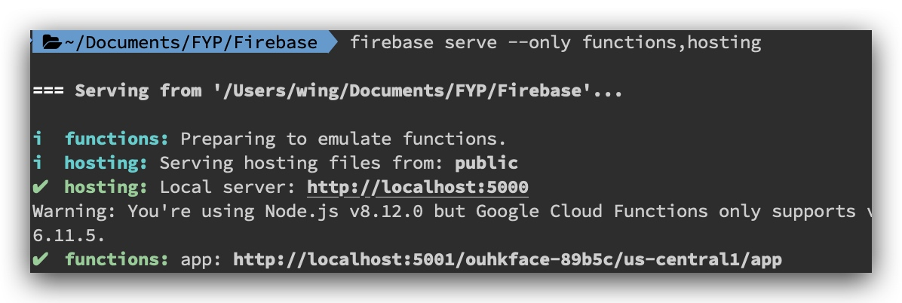
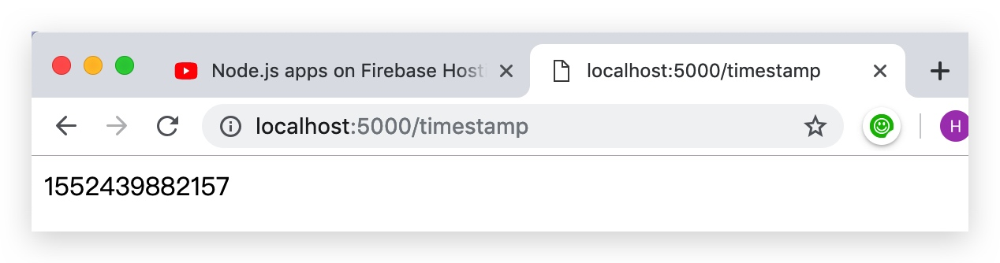
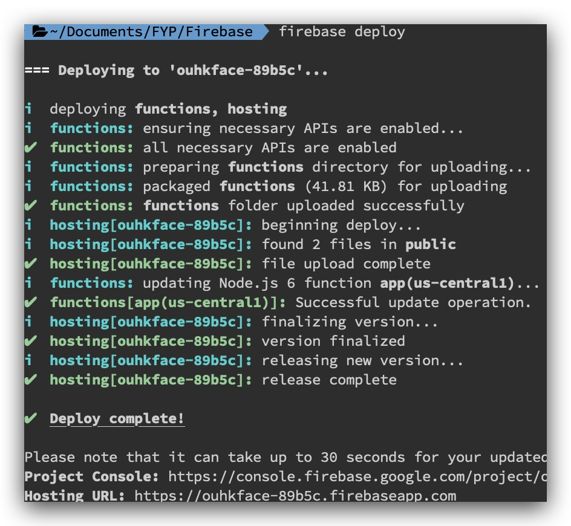
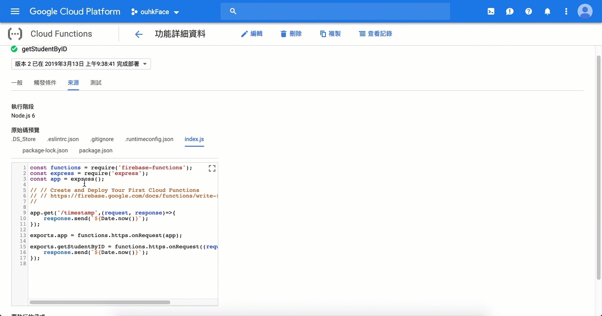

# [Old] Firebase Functions

> 跟住做:[Node.js apps on Firebase Hosting Crash Course - Firecasts](https://www.youtube.com/watch?v=LOeioOKUKI8)


```

firebase login
firebase init
> Functions
...
? What language would you like to use to write Cloud Functions? JavaScript
? Do you want to use ESLint to catch probable bugs and enforce style? Yes
? Do you want to install dependencies with npm now? Yes
? What do you want to use as your public directory? public
? Configure as a single-page app (rewrite all urls to /index.html)? No

cd functions
npm install express --save
```


```Bash
├── firebase.json
└── functions
    ├── node_modules
    │   └── ...
    ├── index.js
    ├── package-lock.json
    └── package.json
```


```js
//index.js
const functions = require('firebase-functions');
const express = require('express');
const app = express();

// // Create and Deploy Your First Cloud Functions
// // https://firebase.google.com/docs/functions/write-firebase-functions
//

app.get('/timestamp',(request, response)=>{
    response.send(`${Date.now()}`);
});

exports.app = functions.https.onRequest(app);
```


### Access realtime database
> https://firebase.google.com/docs/database/admin/retrieve-data#section-reading-once


```javascript
...
const admin = require('firebase-admin');
admin.initializeApp(functions.config().firebase);

...

exports.getEmployeesByid = functions.https.onRequest((request, response) =>{
    var ref = admin.database().ref('employees')
    const id = request.query.id;
    ref.orderByChild("id").equalTo(id).on("value", (snapshot) => {
            response.send(snapshot.val());
    }, (errorObject) => {
            response.send("The read failed: " + errorObject.code);
    });
});

```


```
//規則
{
  "rules": {
    "employees":{
      ".indexOn": ["id"]
    },
    ".read": true,
    ".write": true
  }
}
```


### local run一次
```
firebase serve --only functions,hosting
```



### Upload to cloud


```
firebase deploy
```


### 下載番d code

https://console.cloud.google.com/home/dashboard

