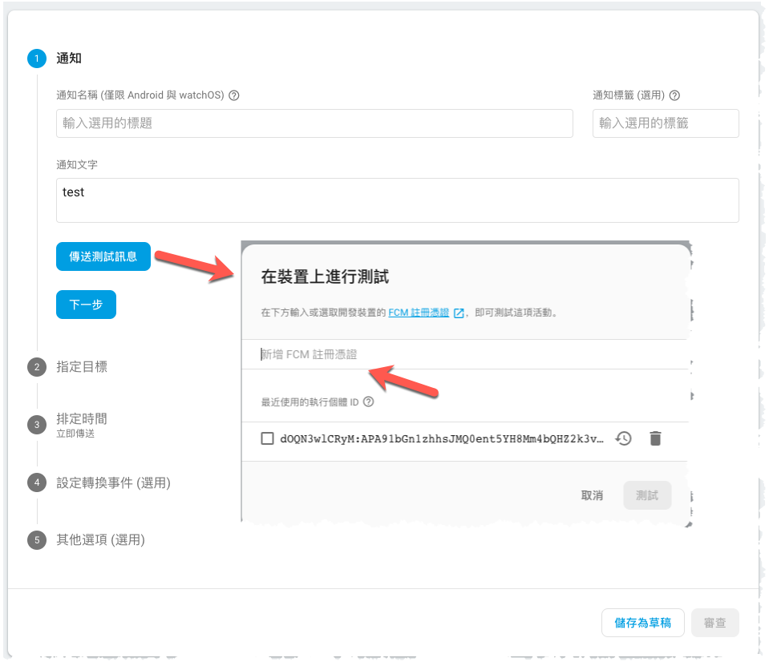

# Push Notification - Cloud Messaging

> 主要參考:https://medium.com/@mikru168/ios-google-notification-firebase-cloud-message-c2849117be08
> 現在只記錄一些要注意的部份

-------
##Flow


-------

> **3.** 從 key chain 匯出 .certSigningRequest (CSR) 檔案

.cer(憑證檔) [參考](https://medium.com/@mikru168/ios-app%E4%B8%8A%E6%9E%B6%E6%B5%81%E7%A8%8B%E5%9C%96%E6%96%87%E6%95%99%E5%AD%B8-724636ddc78b)
憑證檔的用意是要告訴 Apple 說這台電腦是開發者在使用的，若在本機沒有安裝是無法打包 App 上架的。另外憑證是會到期的，一年後必須重新安裝，到期日即為從註冊成為開發者後開始算一年。


-------
## 取得 DeviceToken
> 通常是給後台人員利用各種語言來推播時用的 Token，在實務上通常在收到該 **Token 會將它送到後台並且和帳號綁定在一起**，以利後續針對單一帳號推播使用。以上是被動的接收 Token。而有些時侯我們得必須主動的去跟 Firebase 要 Devie Token 的，語法如下


```swift
InstanceID.instanceID().instanceID { (result, error) in
    if let error = error {
        print("Error fetching remote instance ID: \(error)")
    } else if let result = result {
        print("Remote instance ID token: \(result.token)")
    }
}
```


-------

## 測試單一裝置
### Firebase console
1. 首先要拎個`DeviceToken`
2. 輸入`DeviceToken`


### Postman(REST API)

> 旧版 HTTP 服务器协议: https://firebase.google.com/docs/cloud-messaging/http-server-ref

伺服器金鑰: 


```
//POST:
https://fcm.googleapis.com/fcm/send

//Headers
Content-Type:   application/json
Authorization:  key=伺服器金鑰
```


```json
//body
{
    "registration_ids": [
        DeviceToken1,
        DeviceToken2
    ],
    "notification": {
        "title": "Title",
        "body": "Body"
    }
}
```


-------
