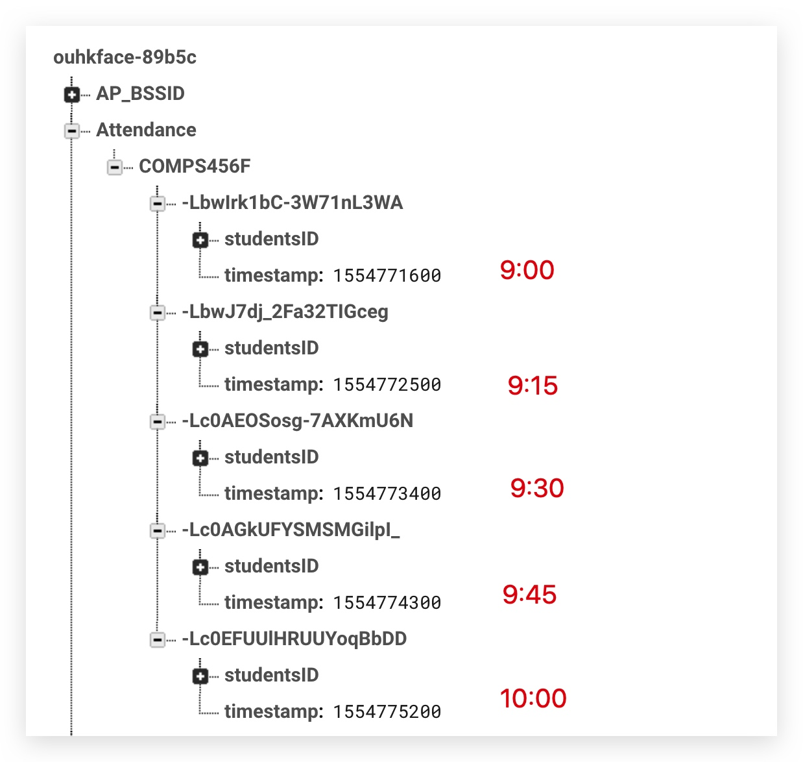

# REST 高級查詢




```json
<!--設定rules-->
{
  "rules": {
      "Attendance":{
        "$classID":{
          ".indexOn": ["timestamp"]
        }
      },
    ".read": true,
    ".write": true
  }
}
```


```js
//09/04/2019 9:30 = 1554773400
//get : https://ouhkface-89b5c.firebaseio.com/Attendance/COMPS456F.json?orderBy="timestamp"&startAt=1554773400
//搵09/04/2019 9:30之後既紀錄
{
    "-Lc0AEOSosg-7AXKmU6N": {
        "studentsID": [
            "11960538",
            "11919935"
        ],
        "timestamp": 1554773400  <- 9:30
    },
    "-Lc0AGkUFYSMSMGilpI_": {
        "studentsID": [
            "11960538",
            "11919935"
        ],
        "timestamp": 1554774300 <-  09:45
    },
    "-Lc0EFUUlHRUUYoqBbDD": {
        "studentsID": [
            "11960538",
            "11919935"
        ],
        "timestamp": 1554775200 <- 10:00
    }
}
//
```