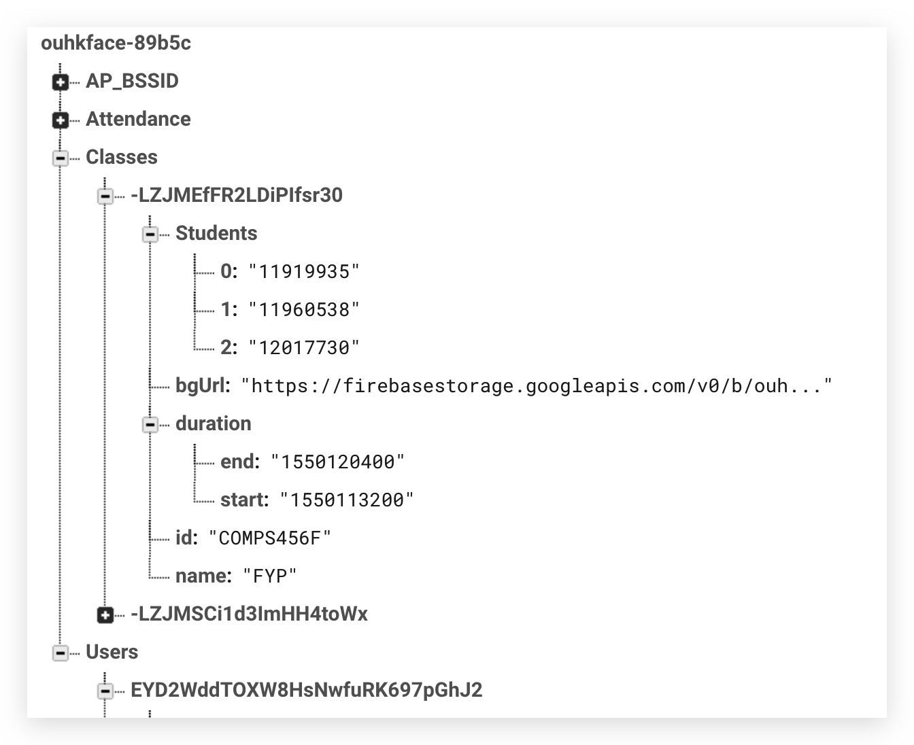
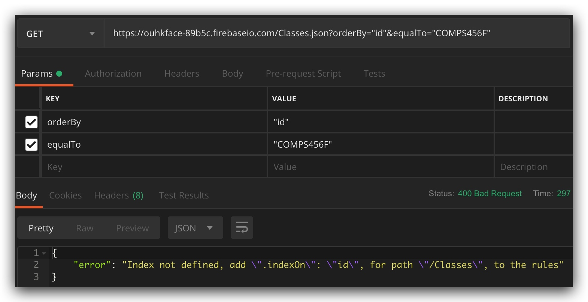
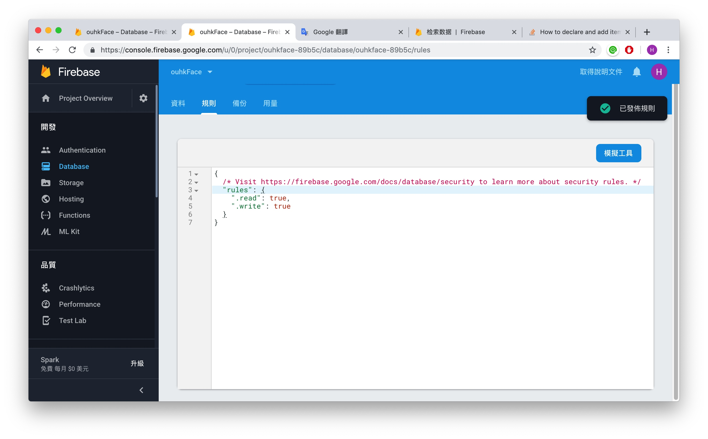

# Rule index




> 我想用id搵番個class




> 原本



```json
{
  /* Visit https://firebase.google.com/docs/database/security to learn more about security rules. */
  "rules": {
    "Classes":{
      ".indexOn": ["id"]
    },
    ".read": true,
    ".write": true
  }
}
```