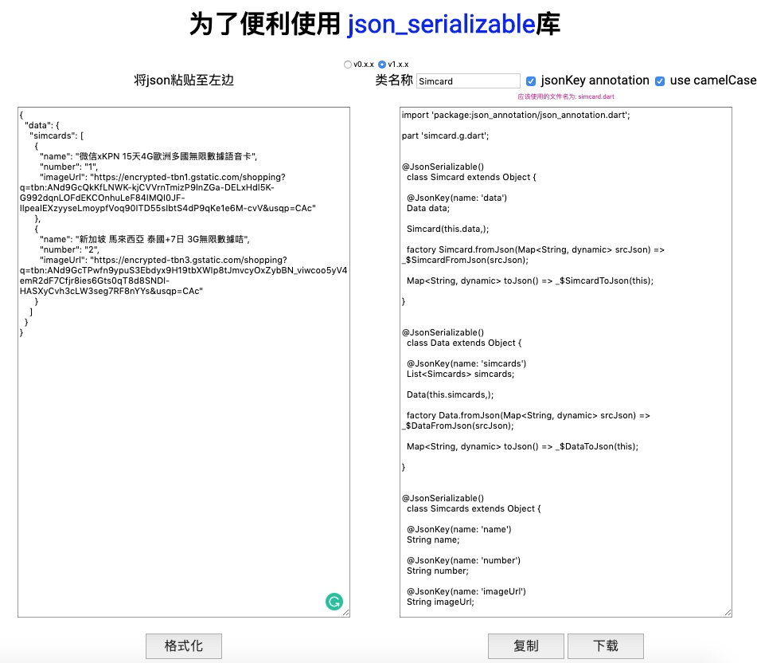

# Flutter - json_serializable

> 官方教學: https://flutter.dev/docs/development/data-and-backend/json#serializing-json-using-code-generation-libraries
> 
> https://iter01.com/426983.html

#####pubspec.yaml
```
dependencies:
  # Your other regular dependencies here
  json_annotation: ^2.0.0

dev_dependencies:
  # Your other dev_dependencies here
  build_runner: ^1.0.0
  json_serializable: ^2.0.0
```

可以利用 [CaiJingLong/json2dart](https://caijinglong.github.io/json2dart/index_ch.html),把json 自動轉換成json_serializable使用的檔案


將檔案放在/libs/model
```
flutter pub run build_runner build
```

