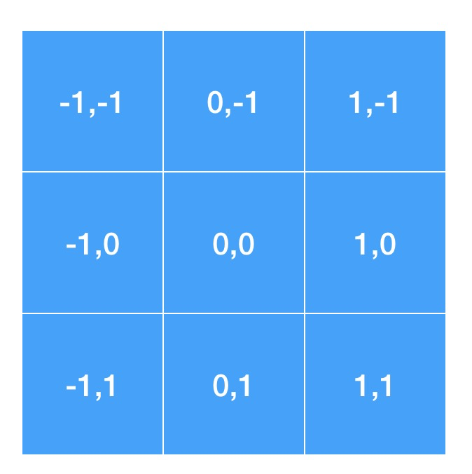

# Flutter animation 動畫


```dart
Animation<double> animation;
```

以下兩種寫法是一樣

```dart
var begin = Offset(0.0, 1.0);
var end = Offset.zero;
var curve = Curves.ease; // 原本預設是使用Curves.ease

var tween = Tween(begin: begin, end: end).chain(CurveTween(curve: curve));

animation.drive(tween);
```

```dart
Tween<Offset>(
	begin: const Offset(0, 1.0),
  end: Offset.zero,
).animate(
   CurvedAnimation(
     parent: animation,
     curve: Curves.ease,
   ),
)
```


> 定位
>
> 
>
> 