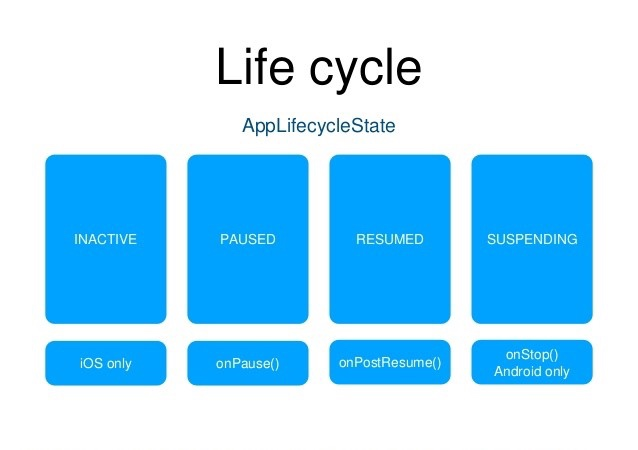

# Flutter onResume get Clipboard

> 場景，想每當返回apps時拎Clipboard data

## Step

1. Flutter App Lifecycle
2. Clipboard

### 1. Flutter App Lifecycle

> https://medium.com/pharos-production/flutter-app-lifecycle-4b0ab4a4211a
> https://www.yuque.com/xytech/flutter/wc6tnw


#### Use WidgetsBindingObserver listen lifecycle changing


```dart
class MyApp extends StatelessWidget {
  @override
  Widget build(BuildContext context) {
    return MaterialApp(
      title: 'Flutter Demo',
      theme: ThemeData(
        primarySwatch: Colors.blue,
      ),
      home: MyHomePage(),
    );
  }
}

class MyHomePage extends StatefulWidget {
  @override
  _MyHomePageState createState() => _MyHomePageState();
}

class _MyHomePageState extends State<MyHomePage> with WidgetsBindingObserver {
  @override
  void initState() {
    WidgetsBinding.instance.addObserver(this);
    super.initState();
  }

  @override
  void dispose() {
    WidgetsBinding.instance.removeObserver(this);
    super.dispose();
  }
  
  @override
  void didChangeAppLifecycleState(AppLifecycleState state) {
    print('state = $state');
    
    //https://stackoverflow.com/a/53208862/5588637
    //String state_name = state().split('.').last;
  }

  @override
  Widget build(BuildContext context) {
    return Scaffold(
      appBar: AppBar(
        title: Text('Flutter Tutorial Lifecycle'),
      ),
      body: Center(),
    );
  }
}
```

##### Foreground> Background> Foreground

```
flutter: AppLifecycleState.inactive
flutter: AppLifecycleState.paused
flutter: AppLifecycleState.inactive
flutter: AppLifecycleState.resumed
```


---

### 2. Clipboard

> https://stackoverflow.com/a/54357447/5588637


```dart
  Future _getClipboard(String state) async {
    ClipboardData data = await Clipboard.getData('text/plain');
    print(data.text);
  }
```


-------

> When `didChangeAppLifecycleState` is `resumed` get Clipboard data

