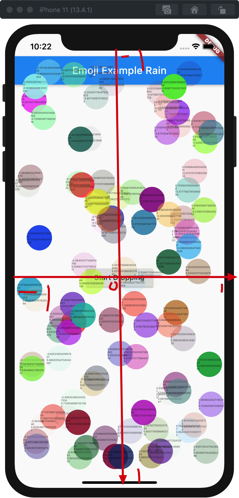
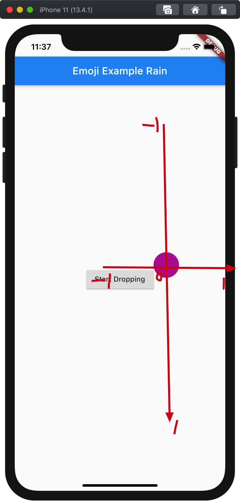

# Flutter 紅包雨

最近公司要做紅包雨的效果，同事在網上找到個[示範](https://stackoverflow.com/a/60907062/5588637)，記錄一下學習Animation的過程。

效果圖: 

> 


```dart
class Homer extends StatelessWidget {
  @override
  Widget build(BuildContext context) {
    return Scaffold(
      body: View(
        numberOfItems: 100,
      ),
    );
  }
}

class Item {
  static final random = Random();
  double _size;
  Color _color;

  Alignment _alignment;

  Item() {
    _color = Color.fromARGB(random.nextInt(255), random.nextInt(255),
        random.nextInt(255), random.nextInt(255));
    _alignment =
        Alignment(random.nextDouble() * 2 - 1, random.nextDouble() * 2 - 1);
    _size = random.nextDouble() * 40 + 1;
  }
}

class View extends StatefulWidget {
  final int numberOfItems;

  const View({Key key, this.numberOfItems}) : super(key: key);

  @override
  _ViewState createState() => _ViewState();
}

class _ViewState extends State<View> with SingleTickerProviderStateMixin {
  var items = <Item>[];
  var started = false;

  AnimationController animationController;

  @override
  Widget build(BuildContext context) {
    return Scaffold(
      body: SafeArea(
        child: Stack(
          children: <Widget>[
            Scaffold(
              appBar: AppBar(
                title: Text("Emoji Example Rain"),
              ),
              body: Center(
                child: RaisedButton(
                  child: Text("Start Dropping"),
                  onPressed: makeItems,
                ),
              ),
            ),
            ...buildItems()
          ],
        ),
      ),
    );
  }

  List<Widget> buildItems() {
    return items.map((item) {
      var tween = Tween<Offset>(
              begin: Offset(0, Random().nextDouble() * -1 - 1),
              end: Offset(Random().nextDouble() * 0.5, 2))
          .chain(CurveTween(curve: Curves.linear));
      return SlideTransition(
        position: animationController.drive(tween),
        child: AnimatedAlign(
          alignment: item._alignment,
          duration: Duration(seconds: 10),
          child: AnimatedContainer(
            duration: Duration(seconds: 10),
            width: item._size,
            height: item._size,
            decoration:
                BoxDecoration(color: item._color, shape: BoxShape.circle),
          ),
        ),
      );
    }).toList();
  }

  @override
  void initState() {
    super.initState();
    animationController =
        AnimationController(vsync: this, duration: Duration(seconds: 10));
  }

  void makeItems() {
    setState(() {
      items.clear();
      for (int i = 0; i < widget.numberOfItems; i++) {
        items.add(Item());
      }
    });
    animationController.reset();
    animationController.forward();
  }
}
```

 因為在這個示範中沒有動態改變`item._alignment`和`item._size`, `AnimatedContainer`和`AnimatedAlign`可以使用`Container`和`Align`,

```dart
return SlideTransition(
  position: animationController.drive(tween),
  child: Align( //changed
    alignment: item._alignment,
    child: Container( //changed
      width: item._size,
      height: item._size,
      decoration:
      BoxDecoration(color: item._color, shape: BoxShape.circle),
    ),
  ),
);
```

嘗試不要`SlideTransition`，看看每個item的alignment位置

```dart
return Align(
        alignment: item._alignment,
        child: Container(
          width: 50, // changed, 統一尺寸
          height: 50, // changed
          decoration:
              BoxDecoration(color: item._color, shape: BoxShape.circle),
          child: Column(
            mainAxisAlignment: MainAxisAlignment.center,
            children: <Widget>[
              Text(item._alignment.x.toString(), style: TextStyle(fontSize: 5)),
              Text(item._alignment.y.toString(), style: TextStyle(fontSize: 5)),
            ],
          ),
        ),
      );
```

可見，每個item 一開始已經分配在全屏不同的位置(alignment)




做個小實驗，設定item的位置時`(0,0)` , 並由`(0,0)` 移動到`(1,0)`

```dart
var tween = Tween<Offset>(begin: Offset(0, 0), end: Offset(1, 0)).chain(
  CurveTween(curve: Curves.linear),
);

return SlideTransition(
  position: animationController.drive(tween),
  child: Align(
    alignment: Alignment(0, 0),
    child: Container(
      width: 50,
      height: 50,
      decoration:
      BoxDecoration(color: item._color, shape: BoxShape.circle),
    ),
  ),
);
```

可以看到item 由中間向左平移


如果我將item由`(0,-1)` 移動到`(0,0)`, item位置同樣是`(0,0)`, 應該會是這樣

> item位置是定位的基準


如果item位置同樣是`(0.5,0)`, 定位的十字會是這樣



待續...