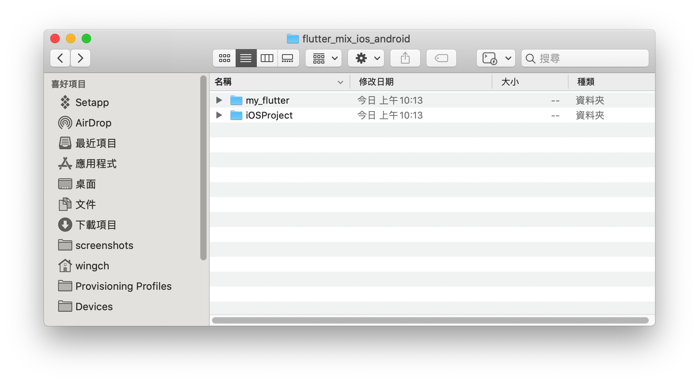
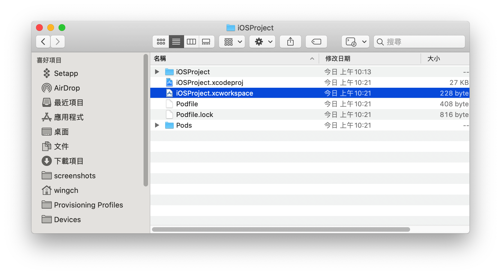

# Flutter 集成iOS, Android

## 官方方法

> [將 Flutter module 集成到 iOS 項目](https://flutter.cn/docs/development/add-to-app/ios/project-setup)

建立一个 Flutter module, 個人喜好使用swift 好似唔得????????

```bash
flutter create --template module -i swift -a kotlin my_flutter
```

建立一個iOS Project, 都是swift的 , 放在同一層



初始化CocoaPods, 會生成`Podfile`

```bash
cd iOSProject
pod init
ls

Podfile              iOSProject           iOSProject.xcodeproj
```


根據[官網教學](https://flutter.cn/docs/development/add-to-app/ios/project-setup#option-a---embed-with-cocoapods-and-the-flutter-sdk)

```
flutter_application_path = '../my_flutter'
load File.join(flutter_application_path, '.ios', 'Flutter', 'podhelper.rb')

target 'iOSProject' do
  # Comment the next line if you don't want to use dynamic frameworks
  use_frameworks!

  # Pods for iOSProject
  install_all_flutter_pods(flutter_application_path)

end
```

```bash
pod install

Analyzing dependencies
Downloading dependencies
Installing Flutter (1.0.0)
Installing FlutterPluginRegistrant (0.0.1)
Installing my_flutter (0.0.1)
Generating Pods project
Integrating client project
...
```

打開iOS Project, 嘗試run



...

