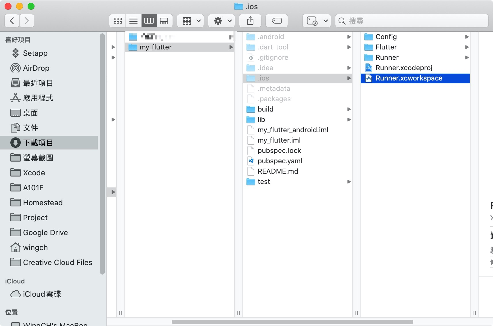
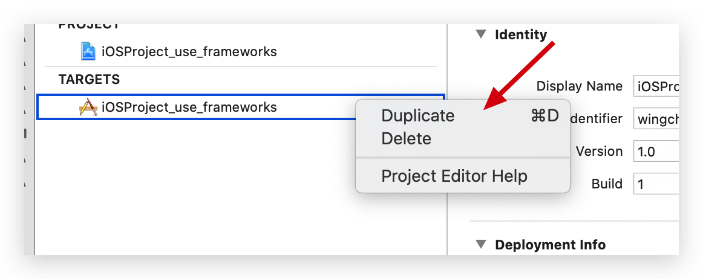
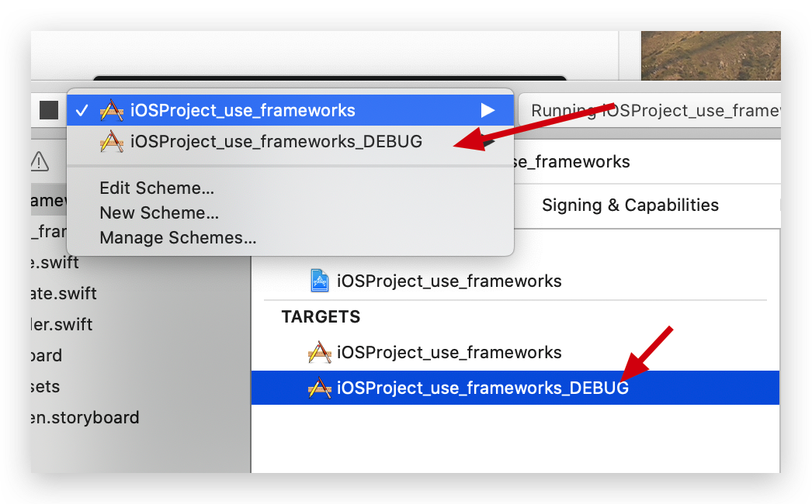
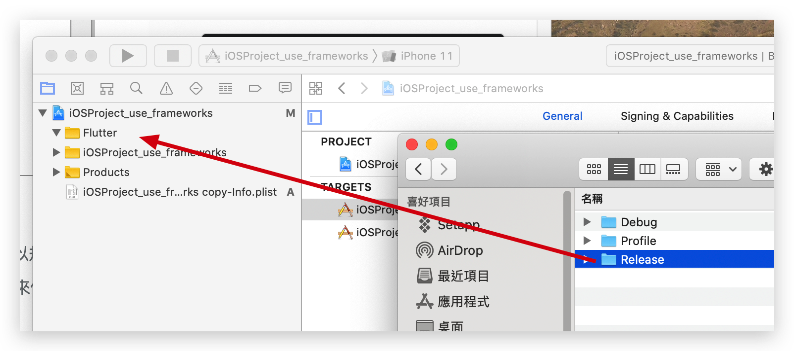
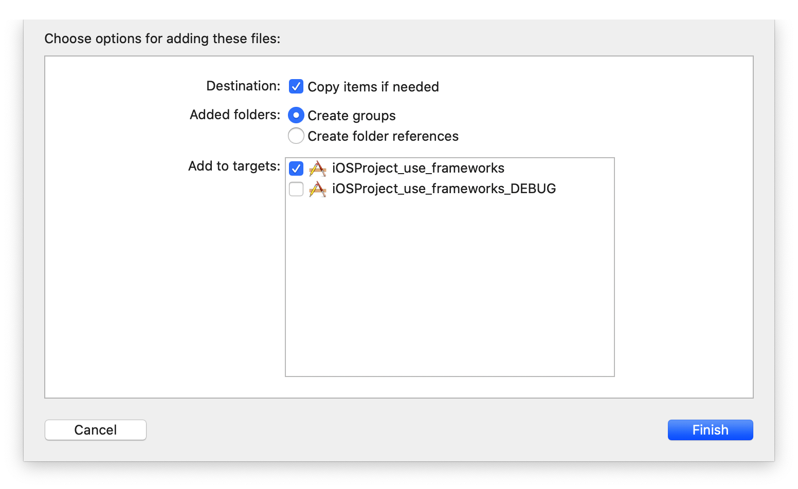
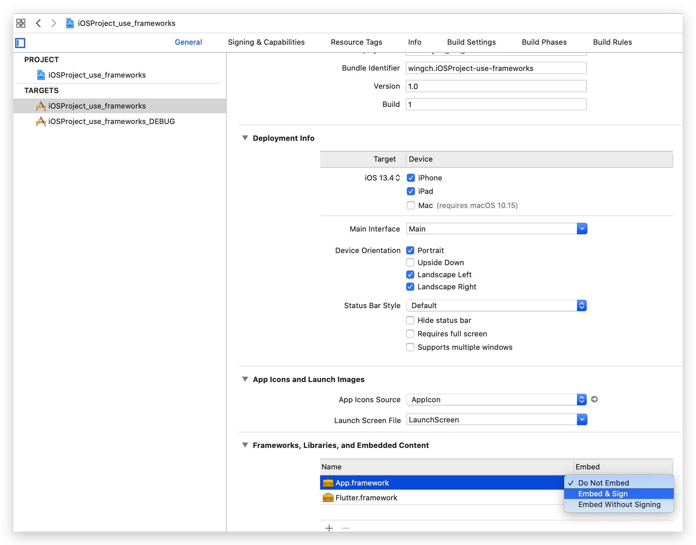
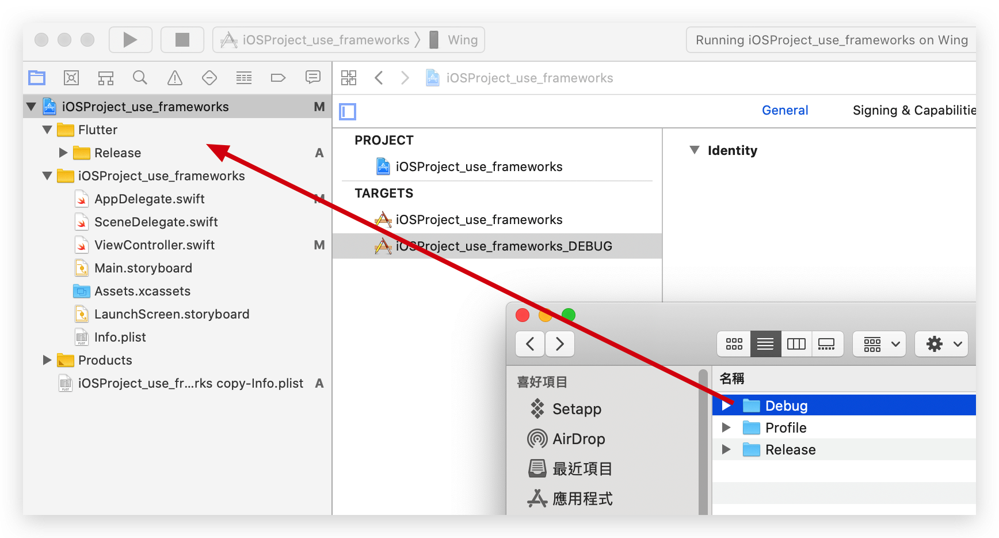
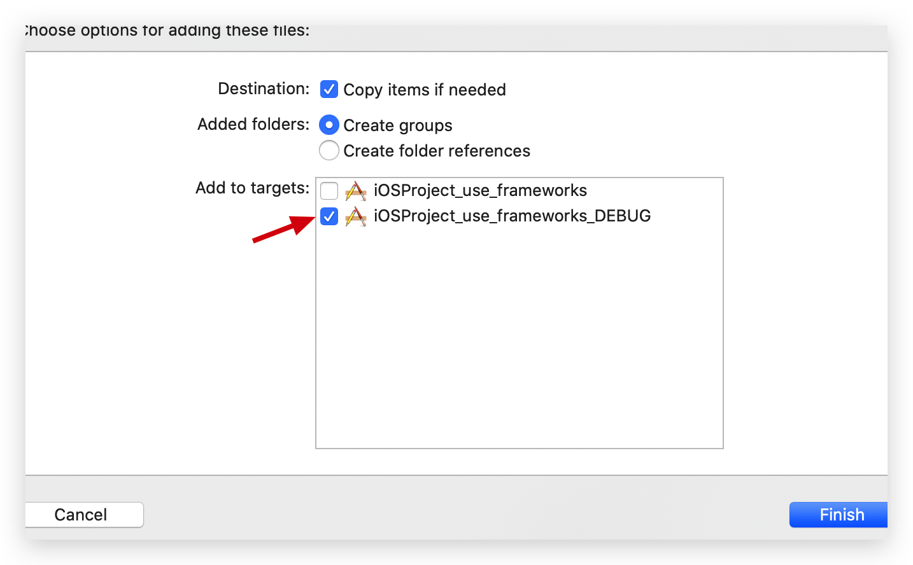
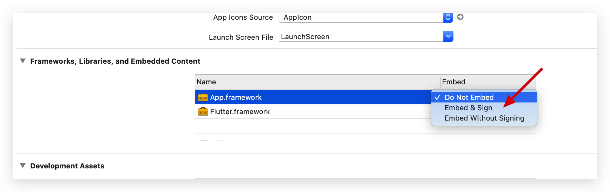

# Flutter 集成iOS, Android

## 官方方法

> [將 Flutter module 集成到 iOS 項目](https://flutter.cn/docs/development/add-to-app/ios/project-setup)

首先我們需要兩樣元素

1. Flutter module
2. iOS Project
3. Android Project (之後再研究)


## 1.  Flutter module

建立一个 Flutter module

> 不支援swift? https://github.com/flutter/flutter/issues/53091

```bash
flutter create --template module my_flutter
```

需要先安裝依賴
```
cd my_flutter
flutter pub get 
```

打開**my_flutter**的iOS Project, 嘗試run 看看是否正常


正常應該可以看到**Flutter端**的Counter example


## 2.  iOS Project

建立一個iOS Project, 放在同一層


**有三種方法如下:** (只需用其中一款)

## 2.1 使用 CocoaPods 和 Flutter SDK 集成

初始化CocoaPods, 會生成`Podfile`

```bash
cd iOSProject
pod init
ls

Podfile              iOSProject           iOSProject.xcodeproj
```

根據[官網教學](https://flutter.cn/docs/development/add-to-app/ios/project-setup#option-a---embed-with-cocoapods-and-the-flutter-sdk)

```
flutter_application_path = '../my_flutter'
load File.join(flutter_application_path, '.ios', 'Flutter', 'podhelper.rb')

target 'iOSProject' do
  # Comment the next line if you don't want to use dynamic frameworks
  use_frameworks!

  # Pods for iOSProject
  install_all_flutter_pods(flutter_application_path)

end
```

```bash
pod install

Analyzing dependencies
Downloading dependencies
Installing Flutter (1.0.0)
Installing FlutterPluginRegistrant (0.0.1)
Installing my_flutter (0.0.1)
Generating Pods project
Integrating client project
...
```

打開iOS Project, 嘗試run 看看是否正常


iOS端一開始正常是空白的


## 2.2 在 Xcode 中集成 frameworks

```shell
flutter build ios-framework

some/path/MyApp/
└── Flutter/
    ├── Debug/
    │   ├── Flutter.framework
    │   ├── App.framework
    │   ├── FlutterPluginRegistrant.framework (only if you have plugins with iOS platform code)
    │   └── example_plugin.framework (each plugin is a separate framework)
    ├── Profile/
    │   ├── Flutter.framework
    │   ├── App.framework
    │   ├── FlutterPluginRegistrant.framework
    │   └── example_plugin.framework
    └── Release/
        ├── Flutter.framework
        ├── App.framework
        ├── FlutterPluginRegistrant.framework
        └── example_plugin.framework
```


會生成三組framework, 分別是 `Debug`  `Profile` `Release`

因為framework 原本分開了`Profile` 和 `Release`，有兩個解決方式

1. 將`Profile` 和 `Release` 合併成一個framework
2. 在Xcode 有兩個config setting

現在嘗試用第二種方式

> 參考: https://www.appcoda.com.tw/using-xcode-targets/



設定成同名




`iOSProject_use_frameworks` 使用 `Release`

`iOSProject_use_frameworks_DEBUG` 使用 `Profile`


### Release setup

拉入去



選擇targets `iOSProject_use_frameworks`



設定 `Embed & Sign`



### Profile setup

拉入去







> 上述步驟已完成[官方教學 选项 B - 在 Xcode 中集成 frameworks](https://flutter.cn/docs/development/add-to-app/ios/project-setup#option-b---embed-frameworks-in-xcode ), 链接到框架 和 内嵌框架 等設定.

---

## 在原生App[添加一个 Flutter 页面](https://flutter.cn/docs/development/add-to-app/ios/add-flutter-screen)

> 根據[官方教學](https://flutter.cn/docs/development/add-to-app/ios/add-flutter-screen?tab=vc-swift-tab#create-a-flutterengine), 修改`AppDelegate.swift`
>
> 將`class AppDelegate: UIResponder, UIApplicationDelegate`換成`FlutterAppDelegate`, 
>
> 其實可以不換，參考[官方sample](https://github.com/flutter/samples/blob/master/add_to_app/ios_fullscreen/IOSFullScreen/AppDelegate.swift).
>
> 好神奇地[官方教學](https://flutter.cn/docs/development/add-to-app/ios/add-flutter-screen?tab=vc-swift-tab#create-a-flutterengine)同官方[sample](https://github.com/flutter/samples/blob/master/add_to_app/ios_fullscreen/IOSFullScreen/AppDelegate.swift)係不一致... 

```swift
import UIKit
import Flutter
// 如果在flutter module無用plugin可忽略
//import FlutterPluginRegistrant

@UIApplicationMain
class AppDelegate: FlutterAppDelegate { // More on the FlutterAppDelegate.
  lazy var flutterEngine = FlutterEngine(name: "my flutter engine")

  override func application(_ application: UIApplication, didFinishLaunchingWithOptions launchOptions: [UIApplication.LaunchOptionsKey: Any]?) -> Bool {
    // Runs the default Dart entrypoint with a default Flutter route.
    flutterEngine.run();
    //如果在flutter module無用plugin可忽略
    // GeneratedPluginRegistrant.register(with: self.flutterEngine);
    return super.application(application, didFinishLaunchingWithOptions: launchOptions);
  }
}
```

以上是讓flutter端在一開始是預熱(preload), 保持之後能更快使用

官方説明:

> Dart VM 启动后永远不会关闭
>
> `FlutterEngine` 充当 Dart VM 和 Flutter 运行时的主机； `FlutterViewController` 依附于 `FlutterEngine`，给 Flutter 传递 UIKit 的输入事件，并展示被 `FlutterEngine` 渲染的每一帧画面。
>
> `FlutterEngine` 的寿命可能与 `FlutterViewController` 相同，也可能超过 `FlutterViewController`。
>
> 通常建议为您的应用预热一个“长寿”的 `FlutterEngine` 是因为:
>
> - 当展示 `FlutterViewController` 时，第一帧画面将会更快展现；
> - 你的 Flutter 和 Dart 状态将比一个`FlutterViewController` 存活更久；
> - 在展示 UI 前，你的应用和 plugins 可以与 Flutter 和 Dart 逻辑交互。

接下來修改`ViewController.swift`

```swift
import UIKit
import Flutter

class ViewController: UIViewController {

    override func viewDidLoad() {
        super.viewDidLoad()
          // Make a button to call the showFlutter function when pressed.
          let button = UIButton(type:UIButton.ButtonType.custom)
          button.addTarget(self, action: #selector(showFlutter), for: .touchUpInside)
          button.setTitle("Show Flutter!", for: UIControl.State.normal)
          button.frame = CGRect(x: 80.0, y: 210.0, width: 160.0, height: 40.0)
          button.backgroundColor = UIColor.blue
          self.view.addSubview(button)
        }

        @objc func showFlutter() {
          let flutterEngine = (UIApplication.shared.delegate as! AppDelegate).flutterEngine
          let flutterViewController =
              FlutterViewController(engine: flutterEngine, nibName: nil, bundle: nil)
          present(flutterViewController, animated: true, completion: nil)
        }

}
```

效果: 在iOS端調用出flutter端


### 交互

> 參考官方sample
>
> flutter端: [samples/add_to_app/flutter_module](https://github.com/flutter/samples/tree/master/add_to_app/flutter_module)
>
> iOS端: [samples/add_to_app/IOSFullScreen](https://github.com/flutter/samples/tree/master/add_to_app/ios_fullscreen/IOSFullScreen)

效果: 在iOS端和flutter端數據互通


