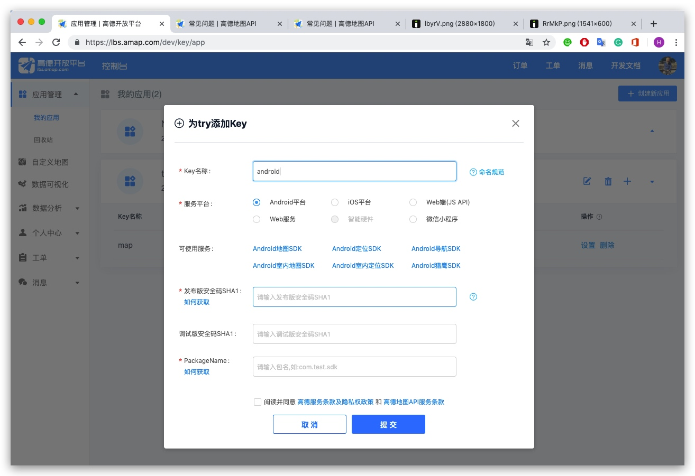
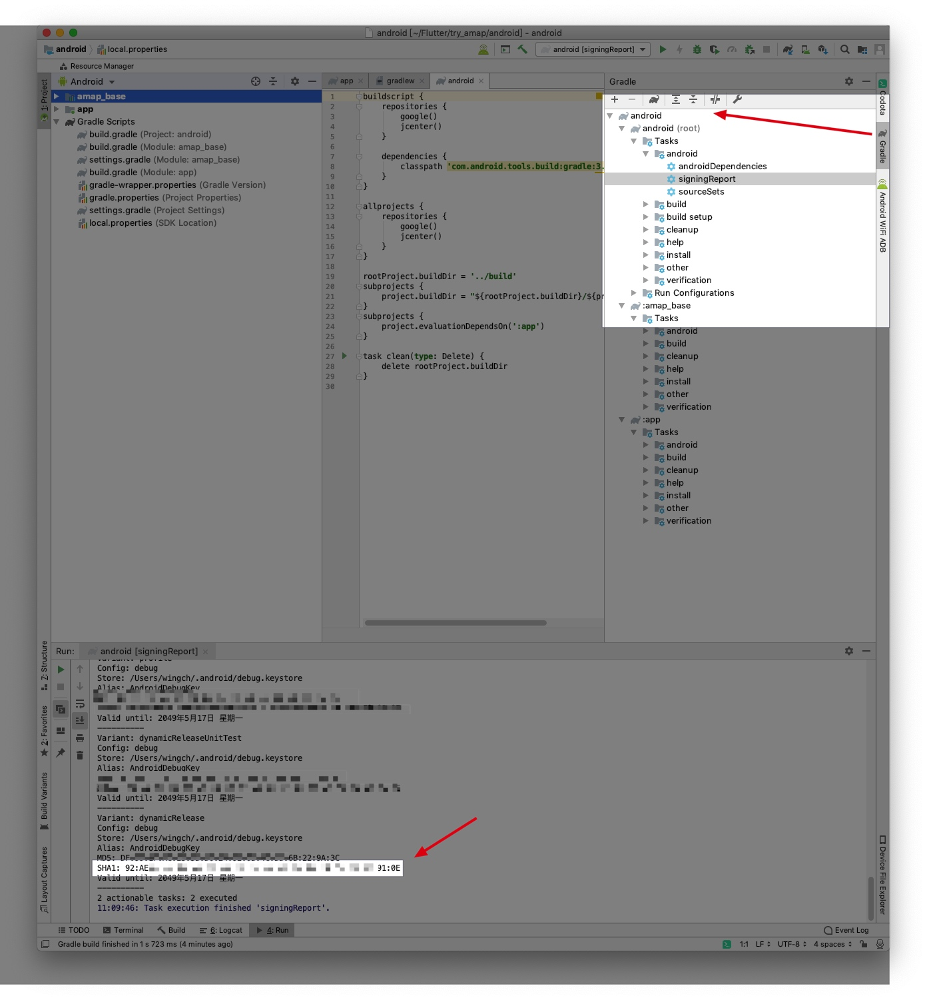
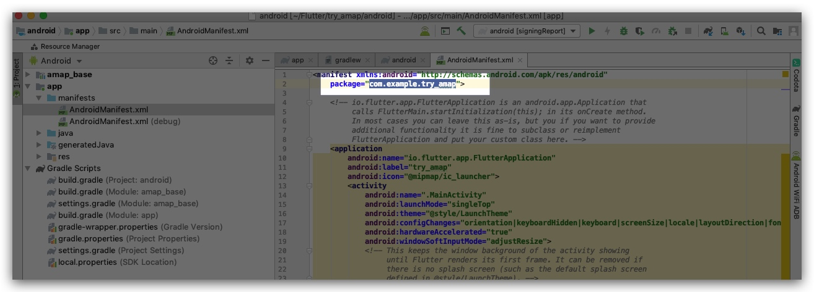
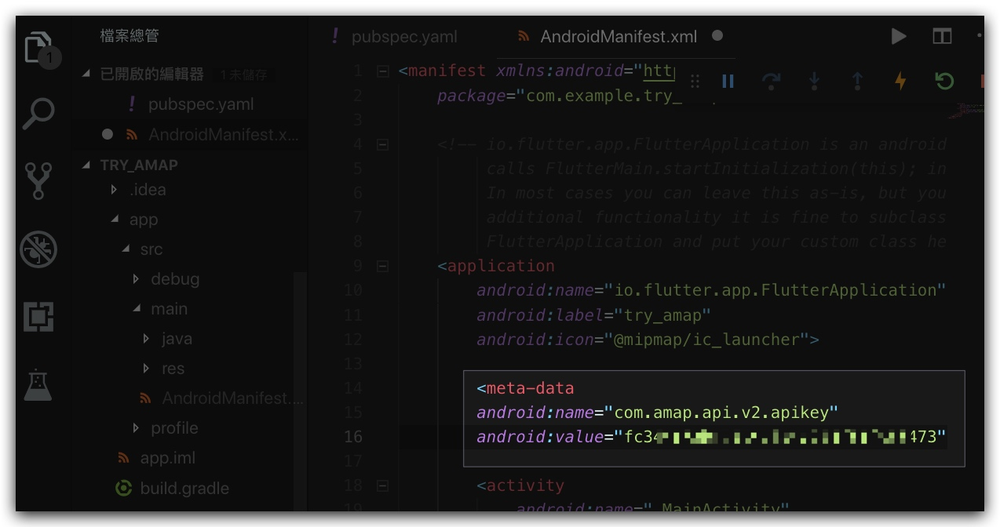
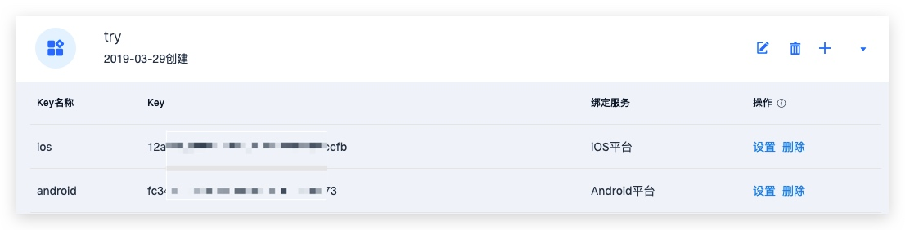
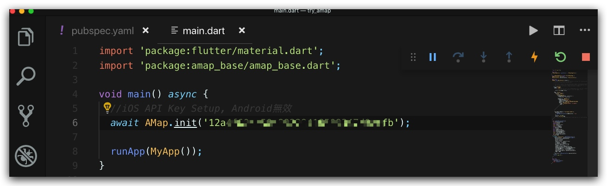

# Flutter 高德地圖

## 申請api key

### Android

首先在高德API網站申請api key

在 Android Studio 打開`FlutterProject/android`, 找码**SHA1**

**PackageName**: 

在 `/android/app/src/main/AndroidManifest.xml`，增加剛剛生成的API Key

###IOS

同上申請多個IOS的API Key

API Key 可以定義在main(iOS only)

>iOS端的UiKitView目前还只是preview状态, 默认是不支持的, 需要手动打开开关, 在info.plist文件中新增一行io.flutter.embedded_views_preview为true. 参考iOS view embedding support has landed on master

##### 授權問題
> https://github.com/OpenFlutter/amap_base_flutter/issues/158#issuecomment-510039870