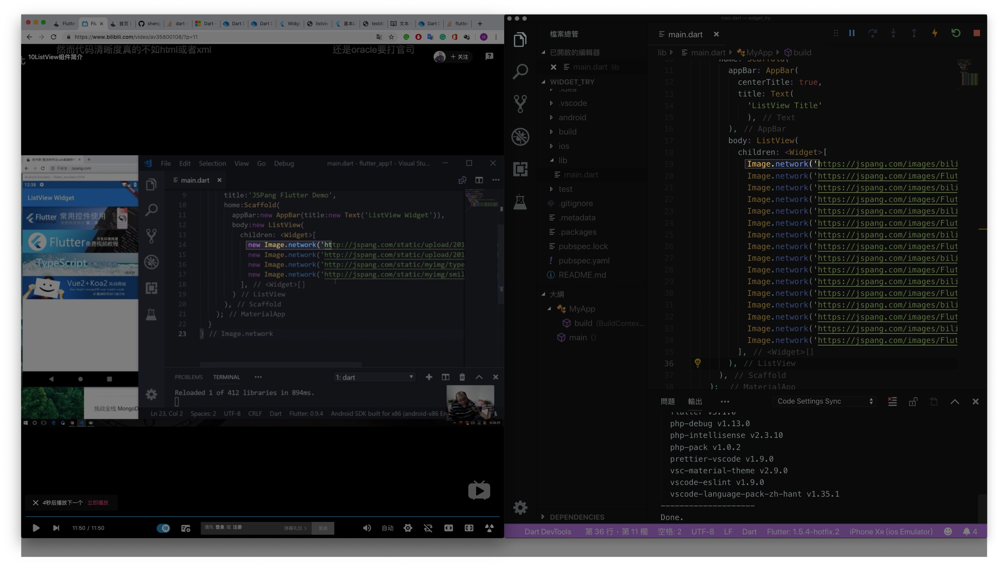
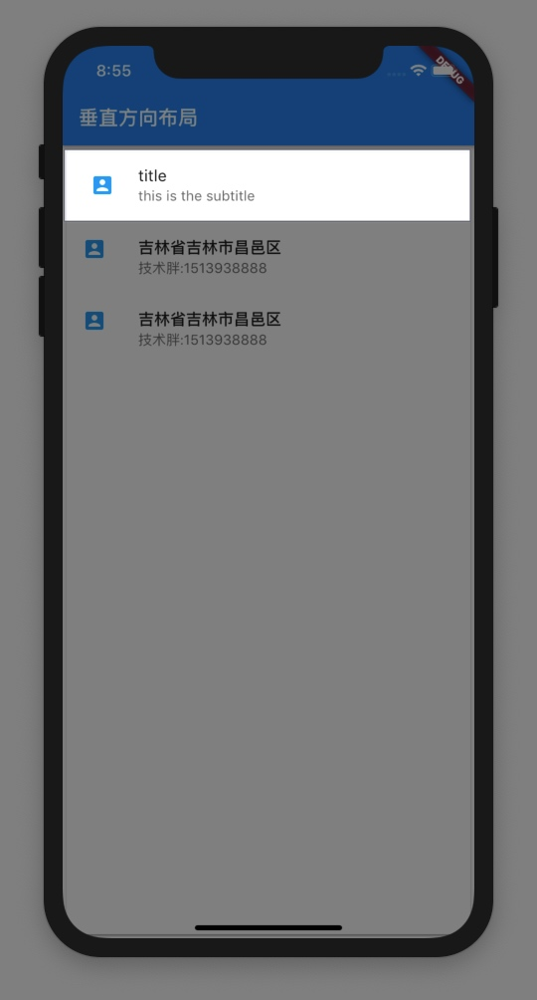
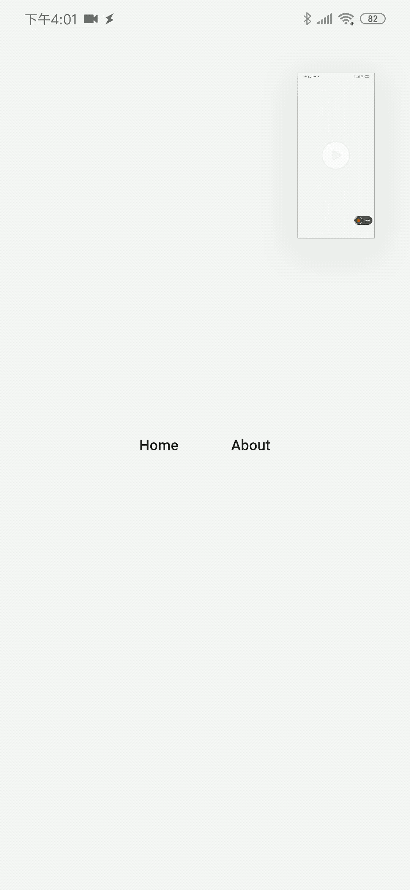
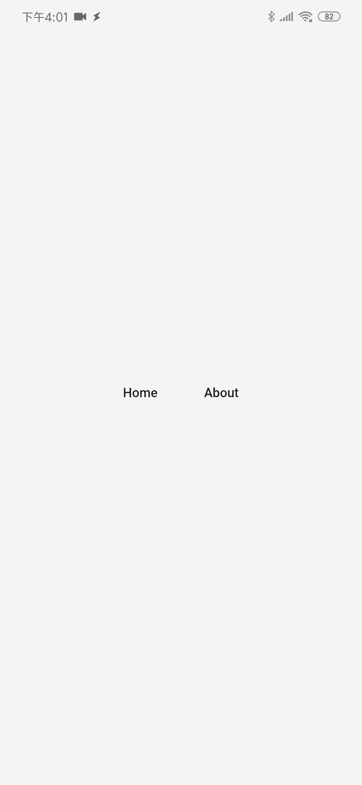
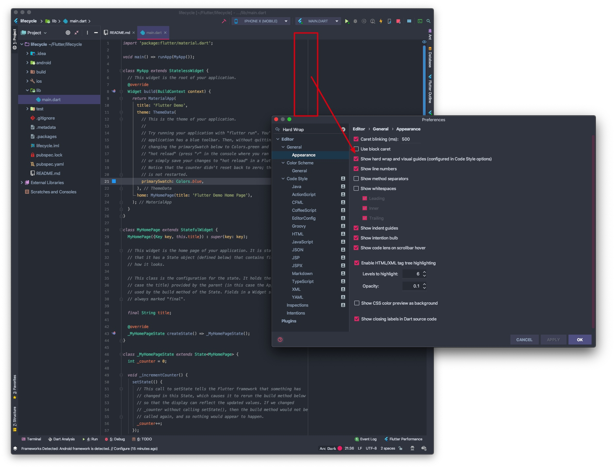

# Flutter筆記

> 參考: [組件庫](https://flutterchina.club/widgets/)

StatefulWidget: 可變
StatelessWidget:    不可變

-------
### `new`, 在dart 2 可以不用
> https://stackoverflow.com/questions/50091389/do-you-need-to-use-the-new-keyword-in-dart



-------
### ListTile leading icon 垂直置中

>https://github.com/flutter/flutter/issues/28685#issuecomment-478130992


```dart
ListTile(
  leading: Container(
    width: 40, // can be whatever value you want
    alignment: Alignment.center,
    child: Icon(Icons.account_box, color: Colors.lightBlue),
  ),
  title: Text('title'),
  subtitle: Text('this is the subtitle'),
)
```



-------
| MaterialPageRoute | CupertinoPageRoute |
| :-: | :-: |
| Android Style (上下消失) | iOS Style (滑動) |
|||
|  |  |


-------




