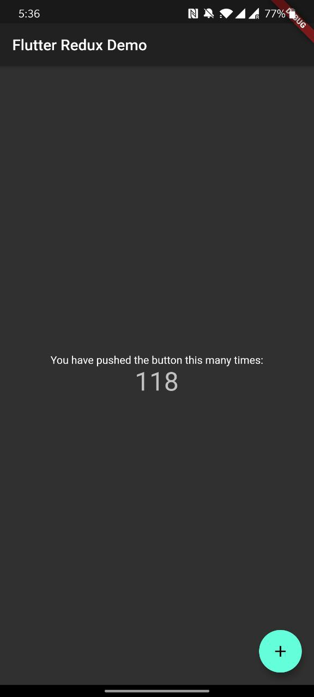
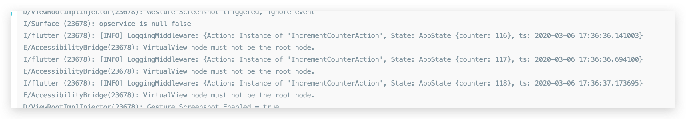

# Redux logging

最基本的redux counter:

```dart
class AppState {
  final int counter;

  AppState({this.counter = 0});

  AppState copyWith({int counter}) =>
      AppState(counter: counter ?? this.counter);
}

class Action {}

class IncrementCounterAction extends Action {}

AppState reducer(AppState state, dynamic action) {
  if (action is IncrementCounterAction) {
    // Increment
    return state.copyWith(counter: state.counter + 1);
  }

  return state;
}

void main() {
  // Create your store as a final variable in the main function or inside a
  // State object. This works better with Hot Reload than creating it directly
  // in the `build` function.
  final store = Store<AppState>(
    reducer,
    initialState: AppState(),
    middleware: [],
  );

  runApp(FlutterReduxApp(
    title: 'Flutter Redux Demo',
    store: store,
  ));
}

class FlutterReduxApp extends StatelessWidget {
  final Store<AppState> store;
  final String title;

  FlutterReduxApp({Key key, this.store, this.title}) : super(key: key);

  @override
  Widget build(BuildContext context) {
    // The StoreProvider should wrap your MaterialApp or WidgetsApp. This will
    // ensure all routes have access to the store.
    return StoreProvider<AppState>(
      // Pass the store to the StoreProvider. Any ancestor `StoreConnector`
      // Widgets will find and use this value as the `Store`.
      store: store,
      child: MaterialApp(
        theme: ThemeData.dark(),
        title: title,
        home: Scaffold(
          appBar: AppBar(
            title: Text(title),
          ),
          body: Center(
            child: Column(
              mainAxisAlignment: MainAxisAlignment.center,
              children: [
                Text(
                  'You have pushed the button this many times:',
                ),
                StoreConnector<AppState, String>(
                  converter: (store) => store.state.counter.toString(),
                  builder: (context, count) {
                    return Text(
                      count,
                      style: Theme.of(context).textTheme.display1,
                    );
                  },
                )
              ],
            ),
          ),
          floatingActionButton: StoreConnector<AppState, VoidCallback>(
            converter: (store) {
              // Return a `VoidCallback`, which is a fancy name for a function
              // with no parameters. It only dispatches an Increment action.
              return () => store.dispatch(IncrementCounterAction());
            },
            builder: (context, callback) {
              return FloatingActionButton(
                // Attach the `callback` to the `onPressed` attribute
                onPressed: callback,
                tooltip: 'asdasdasd',
                child: Icon(Icons.add),
              );
            },
          ),
        ),
      ),
    );
  }
}
```

import [redux_logging](https://github.com/brianegan/redux_logging)

```yaml
dependencies:
  flutter:
    sdk: flutter

  # The following adds the Cupertino Icons font to your application.
  # Use with the CupertinoIcons class for iOS style icons.
  cupertino_icons: ^0.1.2
  flutter_redux: ^0.6.0
  redux: ^4.0.0

  redux_logging: ^0.4.0 // Add
```

加入`toString()`， 方便一陣打印

```dart
class AppState {
  final int counter;

  AppState({this.counter = 0});

  AppState copyWith({int counter}) =>
      AppState(counter: counter ?? this.counter);

  
  @override
  String toString() {											//Add
    return 'AppState ${this.toJson()}';		//Add
  }
}

...
  
void main() {
  // Create your store as a final variable in the main function or inside a
  // State object. This works better with Hot Reload than creating it directly
  // in the `build` function.
  final store = Store<AppState>(
    reducer,
    initialState: AppState(),
    middleware: [LoggingMiddleware.printer()],	//Add
  );

  runApp(FlutterReduxApp(
    title: 'Flutter Redux Demo',
    store: store,
  ));
}
```


## Demo





