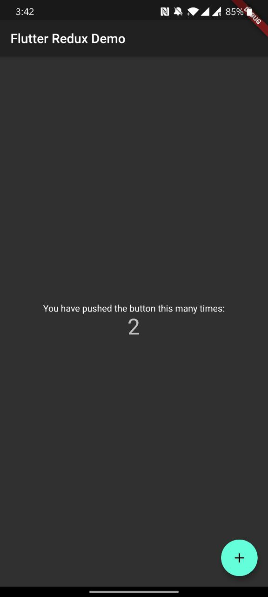

最基本的redux counter: 

```dart
class AppState {
  final int counter;

  AppState({this.counter = 0});

  AppState copyWith({int counter}) =>
      AppState(counter: counter ?? this.counter);
}

class Action {}

class IncrementCounterAction extends Action {}

AppState reducer(AppState state, dynamic action) {
  if (action is IncrementCounterAction) {
    // Increment
    return state.copyWith(counter: state.counter + 1);
  }

  return state;
}

void main() {
  // Create your store as a final variable in the main function or inside a
  // State object. This works better with Hot Reload than creating it directly
  // in the `build` function.
  final store = Store<AppState>(
    reducer,
    initialState: AppState(),
    middleware: [],
  );

  runApp(FlutterReduxApp(
    title: 'Flutter Redux Demo',
    store: store,
  ));
}

class FlutterReduxApp extends StatelessWidget {
  final Store<AppState> store;
  final String title;

  FlutterReduxApp({Key key, this.store, this.title}) : super(key: key);

  @override
  Widget build(BuildContext context) {
    // The StoreProvider should wrap your MaterialApp or WidgetsApp. This will
    // ensure all routes have access to the store.
    return StoreProvider<AppState>(
      // Pass the store to the StoreProvider. Any ancestor `StoreConnector`
      // Widgets will find and use this value as the `Store`.
      store: store,
      child: MaterialApp(
        theme: ThemeData.dark(),
        title: title,
        home: Scaffold(
          appBar: AppBar(
            title: Text(title),
          ),
          body: Center(
            child: Column(
              mainAxisAlignment: MainAxisAlignment.center,
              children: [
                Text(
                  'You have pushed the button this many times:',
                ),
                StoreConnector<AppState, String>(
                  converter: (store) => store.state.counter.toString(),
                  builder: (context, count) {
                    return Text(
                      count,
                      style: Theme.of(context).textTheme.display1,
                    );
                  },
                )
              ],
            ),
          ),
          floatingActionButton: StoreConnector<AppState, VoidCallback>(
            converter: (store) {
              // Return a `VoidCallback`, which is a fancy name for a function
              // with no parameters. It only dispatches an Increment action.
              return () => store.dispatch(IncrementCounterAction());
            },
            builder: (context, callback) {
              return FloatingActionButton(
                // Attach the `callback` to the `onPressed` attribute
                onPressed: callback,
                tooltip: 'asdasdasd',
                child: Icon(Icons.add),
              );
            },
          ),
        ),
      ),
    );
  }
}
```




這個Apps 的AppState只有一個

```dart
final int counter;
```

現嘗試使用[redux_persist](https://github.com/Cretezy/redux_persist)`將state 轉換成`json，最後以file的形式儲存在本地.

先加入`redux_persist`和`redux_persist_flutter`

```yaml
  ...
  dependencies:
  flutter:
    sdk: flutter
  
  redux_persist: ^0.8.3					//Add
  redux_persist_flutter: ^0.8.2 //Add
  ...
```


由於是以`json`的方式儲存，所以要將`AppState`轉換成json

```dart
class AppState {
  final int counter;

  AppState({this.counter = 0});

  AppState copyWith({int counter}) =>
      AppState(counter: counter ?? this.counter);
      
  //Add
  static AppState fromJson(dynamic json) =>
    AppState(counter: json != null ? json["counter"] as int : 0);
	//Add
  dynamic toJson() => {'counter': counter};
}
```

>  在官方教學中的[example](https://github.com/Cretezy/redux_persist/blob/master/packages/redux_persist_flutter/example/redux_persist_flutter_example.dart) 沒有做第一次的null處理
>
> [FIX: Throw an exception on first startup.](https://github.com/Cretezy/redux_persist/pull/38)


最後在`main()`使用

```dart
import 'package:redux_persist/redux_persist.dart';
import 'package:redux_persist_flutter/redux_persist_flutter.dart';

void main() async { // modify to async
  
  // since main() is async, https://stackoverflow.com/a/57775690/5588637
  WidgetsFlutterBinding.ensureInitialized();

  // Create Persistor
  final persistor = Persistor<AppState>(
    storage: FlutterStorage(),
    serializer: JsonSerializer<AppState>(AppState.fromJson),
  );

  // Load initial state
  final initialState = await persistor.load();

  final store = Store<AppState>(
    reducer,
    initialState: initialState ?? AppState(),
    // Add Persistor Middleware to handle load and save data
    middleware: [persistor.createMiddleware()],
  );

  runApp(FlutterReduxApp(
    title: 'Flutter Redux Demo',
    store: store,
  ));
}
```


每一次`State`有變動時，會在`Middleware`層轉換成`json`後儲存在本地file中, 重新開apps時會先在file中load data去`State`，如果沒有的話才按正常步驟進行。


參考Path:

|                       Android Path                       |                           iOS Path                           |
| :------------------------------------------------------: | :----------------------------------------------------------: |
| /data/data/`Application ID`/app_flutter/persist_app.json | /Users/`{username}`/Library/Developer/CoreSimulator/Devices/`Devices Identifier`/Data/Application/`Application Identifier`/Documents/persist_app.json |

```json
//persist_app.json
{
	"counter":20
}
```


> 預設是使用`documentFile`，可以選擇用`sharedPreferences`
>
> 更多用法可以查看 [redux_persist](https://pub.dev/packages/redux_persist) 和 [redux_persist_flutter](https://pub.dartlang.org/packages/redux_persist_flutter)
>
> [Source code](https://github.com/WingCH/try_redux_persist)

