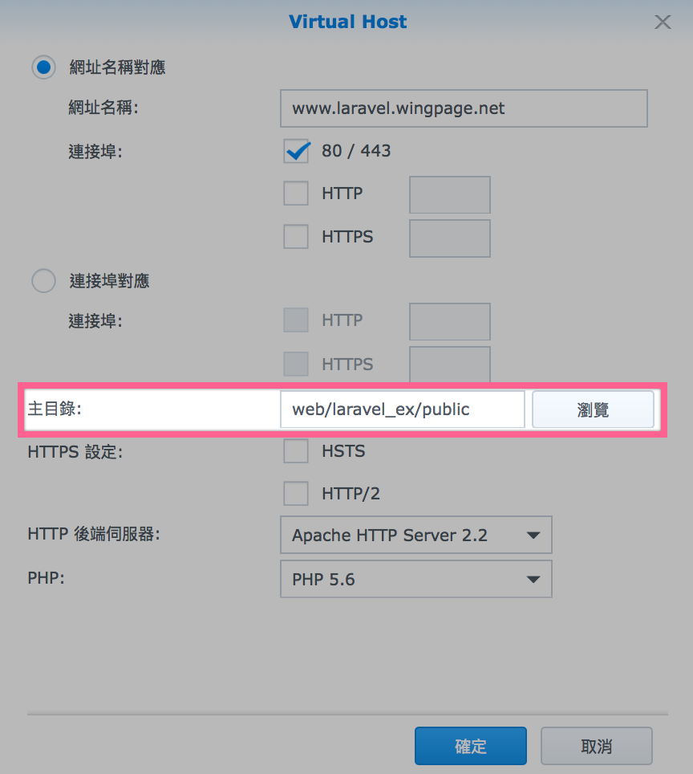
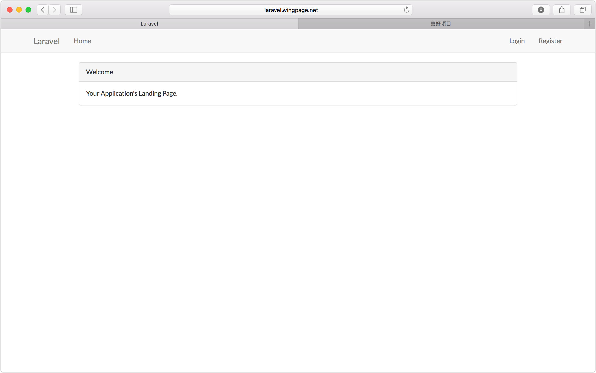
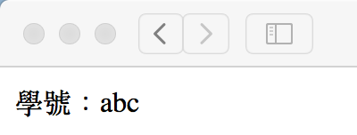
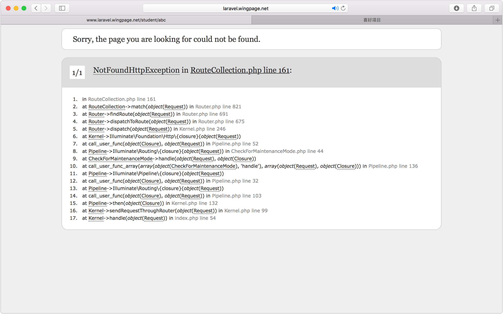
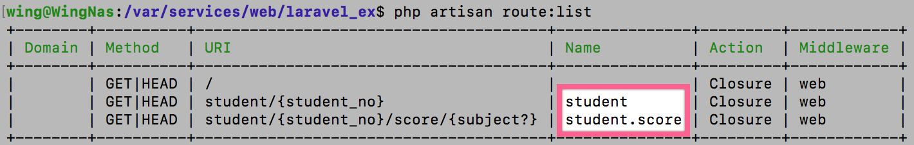

# 1 - Laravel 5.2 Router

> 參考：Larvel 5 實務專題範例教學

一開始設定`http://www.laravel.wingpage.net/`指向/public/



-------

### 路由系統

> 全部link都會經過app/Http/routes.php進行處理再分配去不同的檔案

```php
//http://www.laravel.wingpage.net/
Route::get('/', function () { //另外有Route::post
    return view('welcome'); // link to -> resources/views/welcome.blade.php
});
```



```php
//http://www.laravel.wingpage.net/student/abc
Route::get('student/{student_no}',function($student_no){
	return "學號：".$student_no;
});

```



##### 條件處理
```php
Route::get('student/{student_no}',function($student_no){
	return "學號：".$student_no;
})->where(['student_no'=>'s[0-9]{10}']);//條件 正則表達式 Regex
//http://www.laravel.wingpage.net/student/s1234567890
//學號：s1234567890
```


```php
//另一種寫法
Route::pattern('student_no','s[0-9]{10}');//條件 正則表達式 Regex
Route::get('student/{student_no}',function($student_no){
	return "學號：".$student_no;
});
```
> 不符合條件 : http://www.laravel.wingpage.net/student/abc



```php
Route::get('student/{student_no}/score/{subject?}',function($student_no, $subject = null){
	//如果無輸入subject 顯示 "所有科目"
	return "學號：".$student_no. "的".((is_null($subject))?" 所有科目":$subject). "成績";
})->where(['subject'=>'(chinese|english|math)']);//if subject有輸入只可以是chinese or english or math

//http://www.laravel.wingpage.net/student/s1124/score/english
//學號：s1124的english成績
//http://www.laravel.wingpage.net/student/s1124/score
//學號：s1124的所 有科目成績
//http://www.laravel.wingpage.net/student/s1124/score/abc
//不符合條件 -> error

```
> 這樣寫會令`{student_no}`的條件失效


##### 群組

> 將同樣是"student"開頭的Group埋一齊
> 同時可共用`{student_no}`的條件

```php
Route::pattern('student_no', 's[0-9]{10}'); //條件 正則表達式 Regex
Route::group(['prefix' => 'student'], function () {
    //student/{student_no}
    Route::get('{student_no}', function ($student_no) {
        return "學號：" . $student_no;
    });
    //student/{student_no}/score/{subject?}
    Route::get('{student_no}/score/{subject?}', function ($student_no, $subject = null) {
        //如果無輸入subject 顯示"所有科目"
        return "學號：" . $student_no . "的" . ((is_null($subject)) ? " 所有科目" : $subject) . "成績";
    })->where(['subject' => '(chinese|english|math)']);
});
```

#### 路由命名
> 可讀性更高


```php
Route::pattern('student_no', 's[0-9]{10}'); //條件 正則表達式 Regex
Route::group(['prefix' => 'student'], function () {

    Route::get('{student_no}', [
        'as'   => 'student',//命名 “看圖” 但仲未知有咩用...
        'uses' => function ($student_no) {//可以指向Controllers
            return "學號：" . $student_no;
        },
    ]);

    Route::get('{student_no}/score/{subject?}', [
        'as'   => 'student.score',
        'uses' => function ($student_no, $subject = null) {
            //如果無輸入subject 顯示"所有科目"
            return "學號：" . $student_no . "的" . ((is_null($subject)) ? " 所有科目" : $subject) . "成績";
        },
    ])->where(['subject' => '(chinese|english|math)']);

});
```
> `php artisan route:list` 查看routes列表




