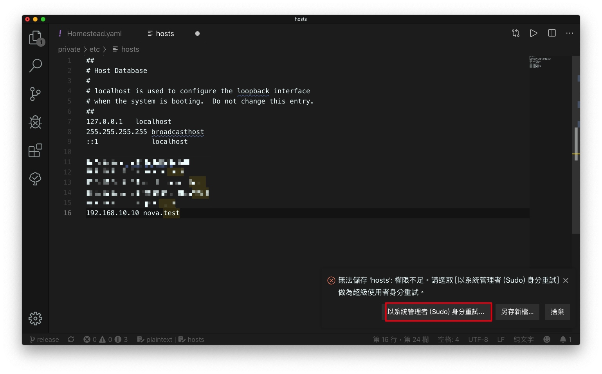
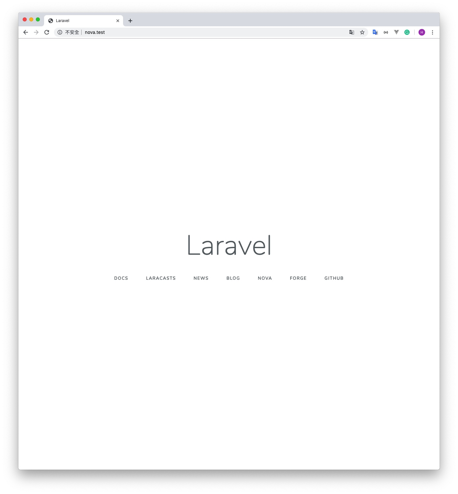
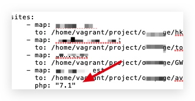
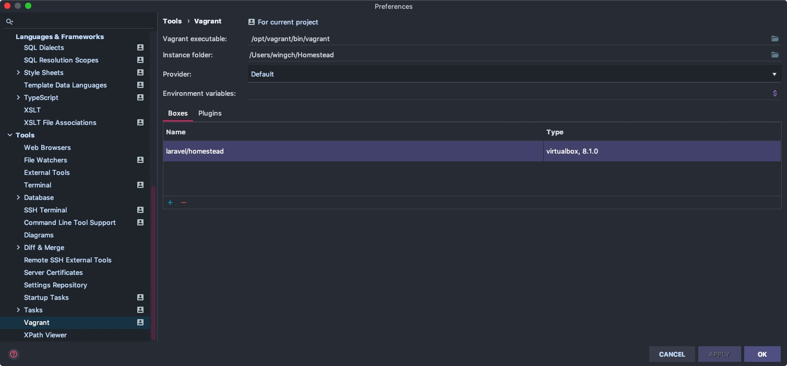
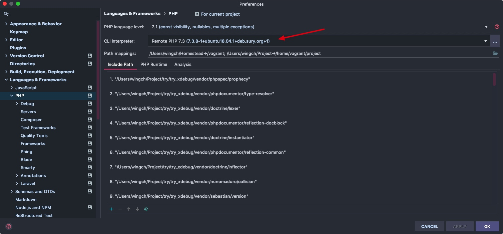
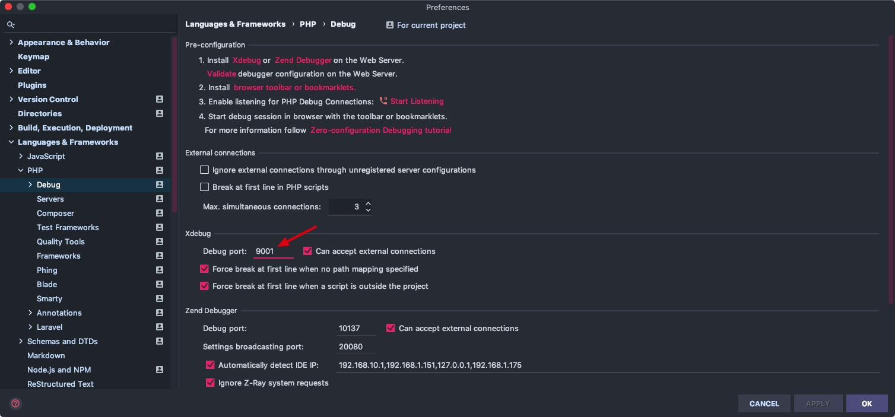
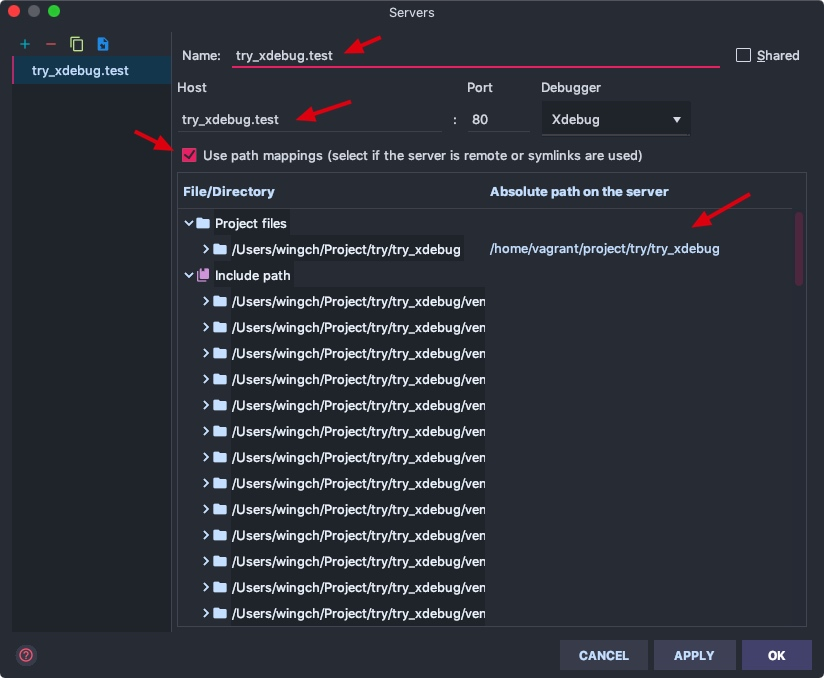
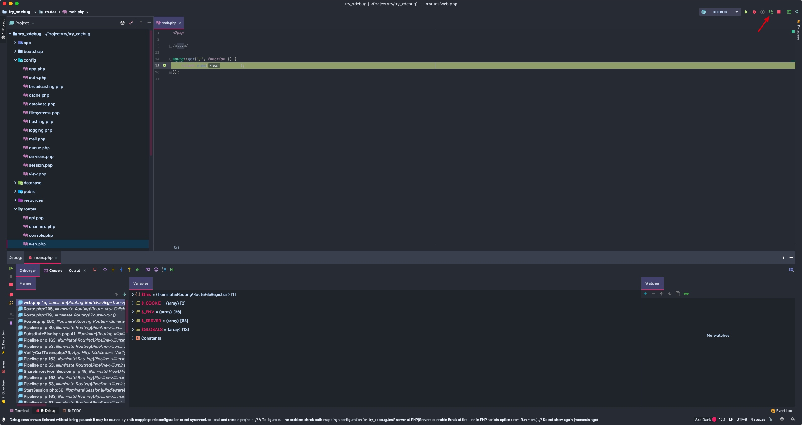

# 10 - Homestead開始Laravel Project

> 首先跟[官方教學](https://laravel.com/docs/5.8/homestead)嘗試，以下係我自己一次開新Project的過程

我已安裝好homestead等工具

> 這次我是local生成Laravel Project後 再在VM綁定
> 掉轉做也可以，參考：https://ithelp.ithome.com.tw/articles/10193858?sc=rss.qu

這次把Project放在`/Users/wingch/Project/try`

```shell
cd /Users/wingch/Project/try

#建立一個名為nova的Laravel Project
composer create-project --prefer-dist laravel/laravel nova
```

接著在`/Homestead/Homestead.yaml`加上剛剛的Project

```yaml
---
ip: "192.168.10.10"
memory: 2048
cpus: 2
provider: virtualbox

authorize: ~/.ssh/id_rsa.pub

keys:
    - ~/.ssh/id_rsa

folders:
    - map: ~/Project
      to: /home/vagrant/project

sites:
    - map: nova.test
      to: /home/vagrant/project/try/nova/public
    
databases:
    - hkuga
    - mail-queue
    - tonghai-cms
    - gwh
    - nova
    - try
```

同時也在`/private/etc/hosts`加一項紀錄，方便之後可以使用` nova.test`作為網址調試

```shell
192.168.10.10 nova.test
```





現在已設定好了，可以進入homestead

```shell
cd /Users/wingch/Homestead

#更新Homestead.yaml的設定
vagrant reload --provision

#進入虛擬機
vagrant up & vagrant ssh

cd project/try/nova/
composer install

# 生成APP_KEY到.env
php artisan key:generate
```

在瀏覽器輸入`http://nova.test/`



> 現在我們可以在本地的`/Users/wingch/Project/try/nova` 編程，homestead（虛擬機）的`project/try/nova/`會同步，然後在虛擬機中運行Laravel Project.


-------

## Xdebug

> 首先跟住這個教學setup `xdebug.ini`
> https://learnku.com/articles/17564
> 💡: 要跟翻yaml 既php version, 我自己預設7.3, 呢到7.1
> 


`xdebug.ini`參考:

```
zend_extension=xdebug.so
xdebug.remote_enable = 1
xdebug.remote_connect_back = 1
xdebug.remote_autostart=1
xdebug.remote_port = 9001
xdebug.remote_host=10.0.2.2
```

接下來跟圖: 







