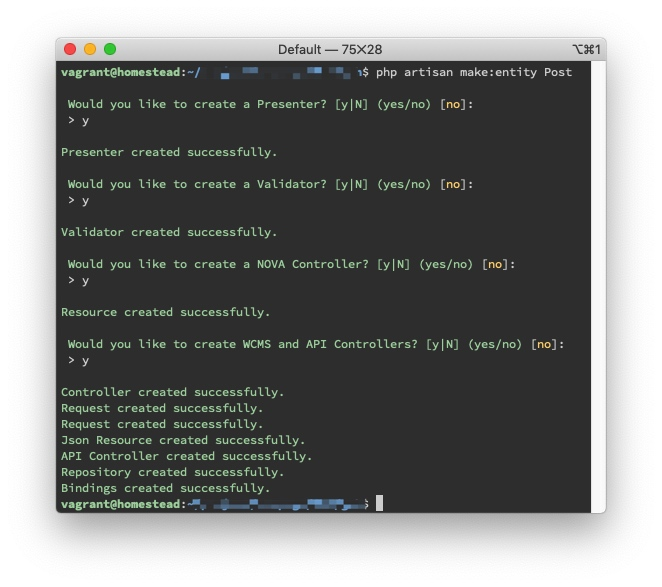
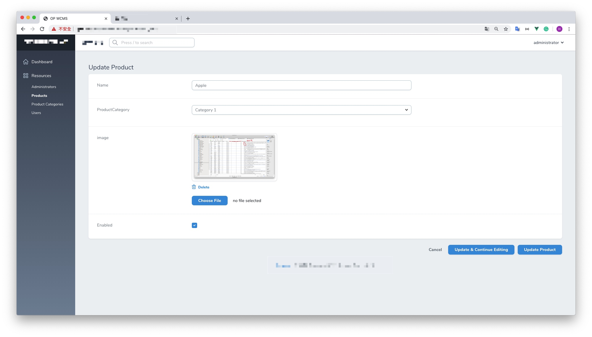
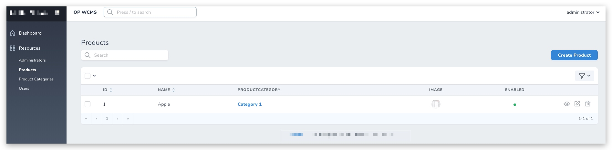

# 10 - Laravel 5.8 Nova

> [Nova](https://nova.laravel.com/) 是由 Laravel 官方團隊開發的後台管理面板

這裡使用了[andersao/l5-repository](https://github.com/andersao/l5-repository), 但不是Nova的重點！

透過`artisan`生成l5-repository Model
```shell
php artisan make:entity News
```

全部選`y`

一共生成了

* `app/Contracts/PostRepository.php`
* `app/Entities/Post.php`
* `app/Http/Controllers/API/PostsController.php`
* `app/Http/Controllers/WCMS/PostsController.php`
* `app/Http/Requests/PostCreateRequest.php`
* `app/Http/Requests/PostUpdateRequest.php`
* `app/Http/Resources/PostCollection.php`
* `app/Nova/Post.php`
    * **主要是在這個file**
* `app/Presenters/PostPresenter.php`
    * [Laravel框架中如何使用 Presenter 模式?](https://juejin.im/post/5b2e11c9e51d45588a7dc1a4)
* `app/Providers/RepositoryServiceProvider.php` 
    * 在boot( )加了一行
* `app/Repositories/PostRepositoryEloquent.php`
* `app/Validators/PostValidator.php`
* `database/migrations/2019_08_19_180303_create_posts_table.php`


**app/Nova/Post.php**
```php
public function fields(Request $request)
{
    return [
        ID::make()->sortable(),
        Text::make('Name', 'name')
            ->sortable()
            ->rules('required', 'max:255'),
        BelongsTo::make('ProductCategory'),
        Image::make('image')->disk('public'),
        Boolean::make('Enabled'),
    ];
}
```

> 坑: 不能任何column名不可以有任何大寫!!! 會讀唔到，但又唔會出error...
> 例如`image` 唔可以 `imagePath`





> 未完...
