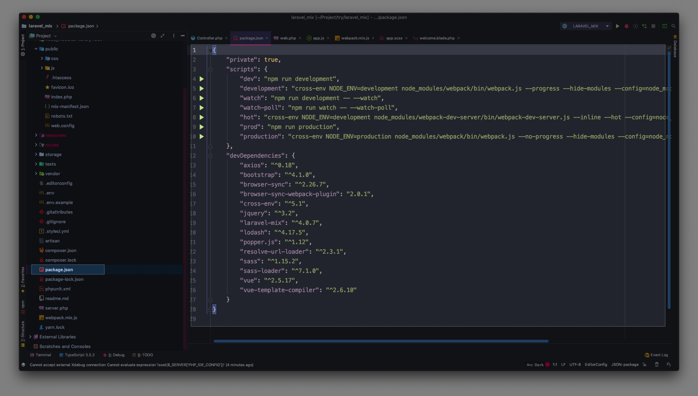
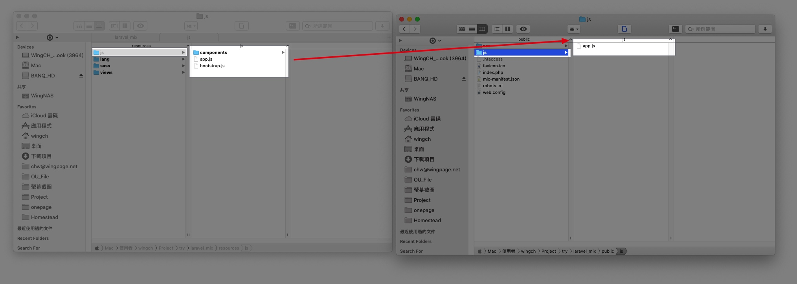
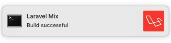
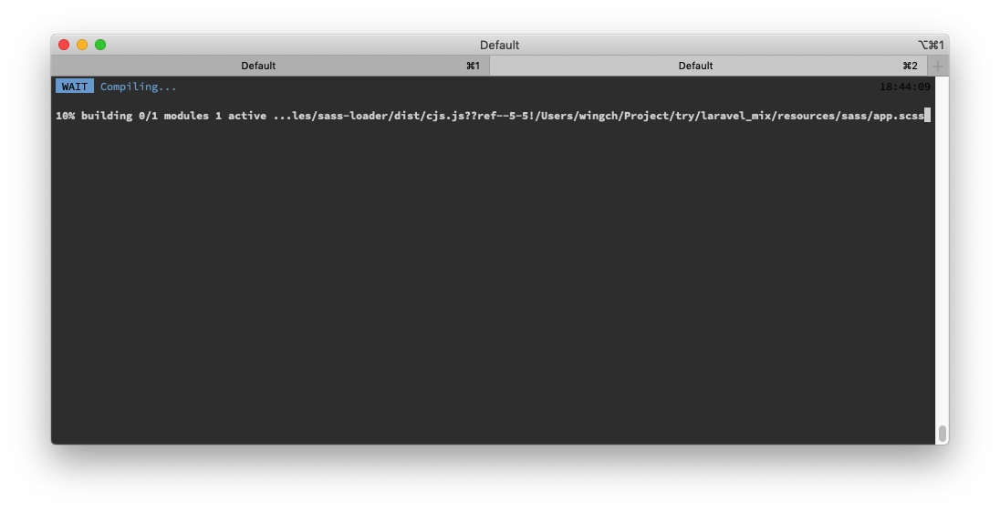
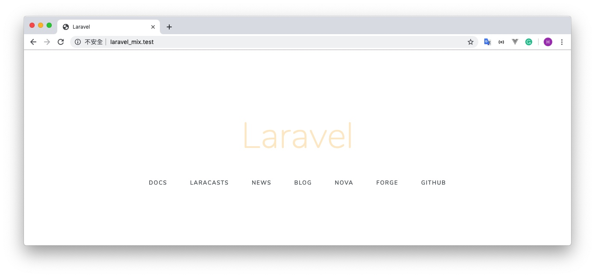
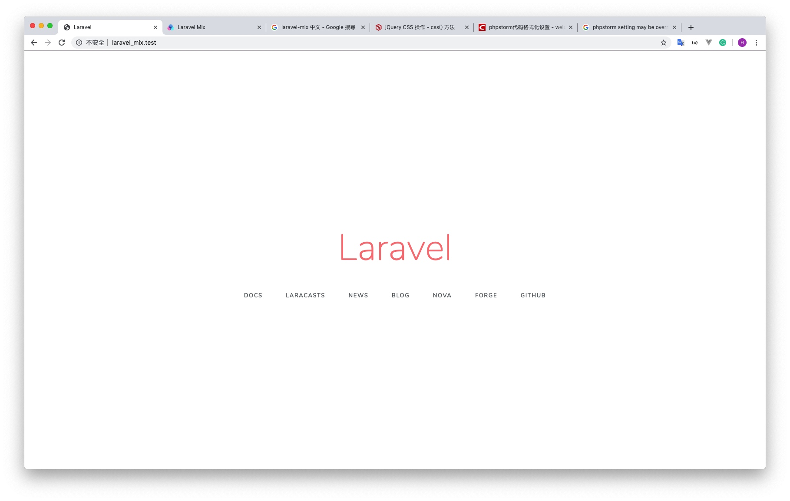
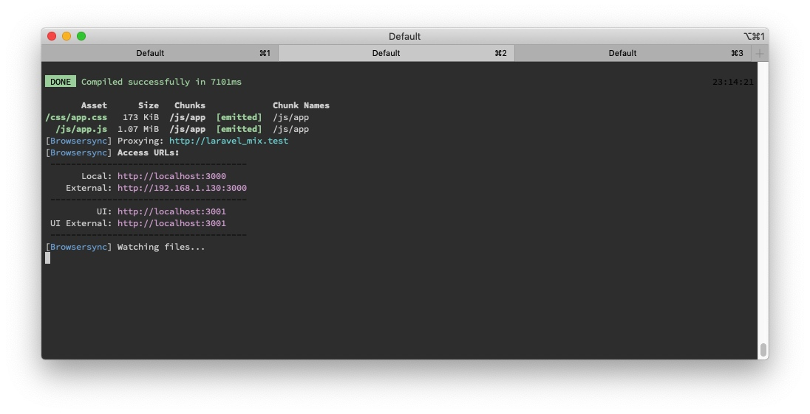

# 12 - Laravel Mix

> https://laravel-mix.com/
> 
# Setup
> https://docs.laravel-dojo.com/laravel/5.5/mix
> 我的理解：
> Laravel Mix可以讓Laravel在Server side用到node.js既功能(例如vue.js)再輸出到client side, 原生已經用緊Webpack

建立一個新Projecr - `laravel_mix`

```shell
composer create-project --prefer-dist laravel/laravel laravel_mix

cd laravel_mix/
```

Laravel Projct 已內置`Larvel mix`




像node.js project一樣，先安裝Package

```shell
npm instrall
```

**webpack.mix.js**

```js
const mix = require('laravel-mix');

/*
 |--------------------------------------------------------------------------
 | Mix Asset Management
 |--------------------------------------------------------------------------
 |
 | Mix provides a clean, fluent API for defining some Webpack build steps
 | for your Laravel application. By default, we are compiling the Sass
 | file for the application as well as bundling up all the JS files.
 |
 */

// 將resources/js/app.js全部檔案打包到 public/js, css也是
mix.js('resources/js/app.js', 'public/js')
    .sass('resources/sass/app.scss', 'public/css');
```




監控資源, keep check住上述檔案的變化，如果有更改的話馬上重新打包
```shell
npm run watch
```
打包完會有通知



-------

## Test - CSS

現在嘗試更改css, 全部js和css的更改都在`resources`進行，`pubile`是用來放打包好的檔案的

`resources/sass/app.scss`

```css
// Fonts
@import url('https://fonts.googleapis.com/css?family=Nunito');

// Variables
@import 'variables';

// Bootstrap
@import '~bootstrap/scss/bootstrap';


// 加入以下
.title {
    color: blanchedalmond;
}
```

因為已經運行了`npm run watch`, terminal監控到有更改會自動打包

打包完會有通知


重新載入後會看到變化


-------

## Test - JS

現在測試安裝一個第三方Package

```shell
npm install randomcolor --save
```

在`resources/js/app.js`加入
```js
require('randomcolor');
window.randomColor = require('randomcolor');
```

現在可以在view 使用 `randomcolor` Package

**resources/views/welcome.blade.php**

```html
...
<body>
...
<script>
    $(document).ready(function() {
        // `title`設定成隨機顏色
        $(".title").css("color",randomColor());
    });
</script>
</body>
...
```



-------

## browserSync

> https://www.browsersync.io/
> 當有更改時，自動刷新

```js
const mix = require('laravel-mix');

mix.js('resources/js/app.js', 'public/js')
    .sass('resources/sass/app.scss', 'public/css');

//填寫當前Project的Domain
mix.browserSync('http://laravel_mix.test/');
```


```shell
npm run watch
```
browserSync會Proxying `http://laravel_mix.test/`, 並咉射到`http://localhost:3000`


現在當`watch`到有更新，打包後會自動更新**所有**`http://localhost:3000`的Client.
