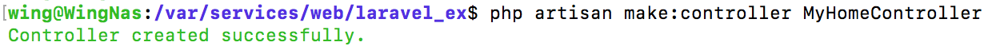
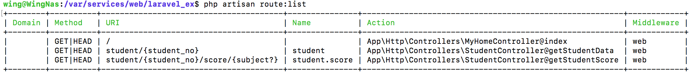

# 2 - Laravel 5.2 Controller

> 參考：Larvel 5 實務專題範例教學

生成Controller

```
php artisan make:controller MyHomeController //to app/Http/Controllers
```




```php
//MyHomeController.php
<?php

namespace App\Http\Controllers;

use Illuminate\Http\Request;

use App\Http\Requests;

class MyHomeController extends Controller
{
    //
}
```
加入一個index的方法，讓用家可以透過Controller call view


```php
public function index(){
    return view('welcome'); // link to -> resources/views/welcome.blade.php
}
```

回到routes.php 把負責`/`的改成以下:

```php
Route::get('/', 'MyHomeController@index');
```

-------

##### 接著將前一篇的`Student`轉成用Controller寫

生成StudentController

```
php artisan make:controller StudentController
```

在**StudentController**加入`getStudentData` `getStudentScore`

```php
public function getStudentData($student_no){
    return "學號：" . $student_no;
}

public function getStudentScore($student_no, $subject = null){
    return "學號：" . $student_no . "的" . ((is_null($subject)) ? " 所有科目" : $subject) . "成績";
}
```

修改router 將處理部份交給Controller

```php
Route::group(['prefix' => 'student'], function () {

    Route::get('{student_no}', [
        'as'   => 'student',
        'uses' => 'StudentController@getStudentData',//處理部份交給Controller
    ]);

    Route::get('{student_no}/score/{subject?}', [
        'as'   => 'student.score',
        'uses' => 'StudentController@getStudentScore',//處理部份交給Controller
    ])->where(['subject' => '(chinese|english|math)']);

});
```

> `php artisan route:list` 查看routes列表 可以清楚看到對應的Controller




