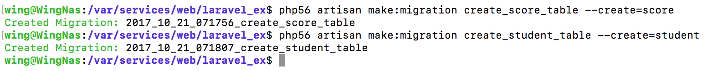
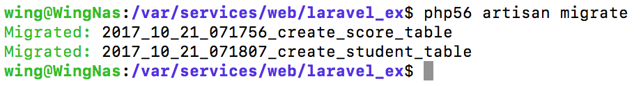

# 4 - Laravel 5.2 Database

> 參考：Larvel 5 實務專題範例教學

**Table : student**

| 欄位名稱 | 型態 | 屬性 | 空值 | 預設值 | 額外資訊 | 描述 |
| :-: | :-: | :-: | :-: | :-: | :-: | :-: |
| id | int | UNSIGNED | 否 |  | AUTO_INCREMENT | 編號 |
| user_id | int | UNSIGNED | 否 |  |  |  |
| no | varchar |  | 否 |  | 唯一鍵 | 學號 |
| tel | varchar |  | 否 |  |  | 電話 |
| created_at | timestamp |  | 是 | NULL |  | 建立時間 |
| updated_at | timestamp |  | 是 | NULL |  | 更新時間 |

**Table : score**

| 欄位名稱 | 型態 | 屬性 | 空值 | 預設值 | 額外資訊 | 描述 |
| :-: | :-: | :-: | :-: | :-: | :-: | :-: |
| id | int | UNSIGNED | 否 |  | AUTO_INCREMENT | 編號 |
| student_id | int | UNSIGNED | 否 |  |  | 學生編號 |
| chinese | int | UNSIGNED | 否 |  |   | 中文 |
| english | int | UNSIGNED | 否 |  |  | 英文 |
| math | int | UNSIGNED | 否 |   |  | 數學 |
| total | int | UNSIGNED | 否  |   |  | 總分 |
| created_at | timestamp |  | 是 | NULL |  | 建立時間 |
| updated_at | timestamp |  | 是 | NULL |  | 更新時間 |

> UNSIGNED -> 不要負數

-------

#### 產生**migration**檔案
migration是用來生成table的檔案

```shell
php56 artisan make:migration create_student_table --create=student
php56 artisan make:migration create_score_table --create=score
```


> if [ErrorException] ... failed to open stream: No such   file or directory
> run `composer dump-autoload`
> [參考](https://laravel.io/forum/09-04-2014-after-deleting-migrations-file-manually-receive-errorexception-failed-to-open-stream-no-such-file-or-directory)


-------


> app/database/migrations/2017_10_21_071807_create_student_table.php

```php
public function up(){
    Schema::create('student', function (Blueprint $table) {
        $table->increments('id');//遞增的ID（主鍵）
        //$table->unsignedInteger('user_id');
        $table->integer('user_id')->unsigned();
        $table->string('no')->uniqid();
        $table->string('tel');
        $table->timestamps();
    });
}
```
> app/database/migrations/2017_10_21_071807_create_student_table.php

```php
public function up(){
    Schema::create('score', function (Blueprint $table) {
        $table->increments('id');
        $table->integer('student_id')->unsigned();
        $table->integer('chinese')->unsigned();
        $table->integer('english')->unsigned();
        $table->integer('math')->unsigned();
        $table->integer('total')->unsigned();
        $table->timestamps();
    });
}
```


up()    `php56 artisan migrate`
down()  `php56 artisan migrate:rollback`

更新 `php56 artisan migrate:refresh` 會del晒全部資料！！！score



>如果遇到file被無視的情況 **暫時移除**預設個兩個file[2014_xxx.php] 之後就可以用到 如上圖 原因未明...

>Class 'xxx' not found   
>composer dump-autoload


-------


如果之後想加多項columns (`ALTER TABLE`)

```php
php artisan make:migration add_backgroundImage__to_rooms_table --table=rooms
```
php artisan make:migration add_votes_to_users_table --table=users


```php
public function up()
{
    Schema::table('tableName', function (Blueprint $table) {
        $table->string('new column');
    });
}
```
-------


#### Eloquent model
Eloquent是用來對database進行操作


```php
php artisan make:model Score    //app/Score.php
php artisan make:model Student  //app/Student.php
```

> app/Score.php


```php
...
use \App\Student as StudentEloquent;

class Score extends Model
{
    protected $table = 'score';

    public function student(){
    	return $this->belongsTo(StudentEloquent::class); 
        //預設外鍵(fk) 'tableName'_id => score.student_id

        //效果 => table:score.student_id(fk) 搵 -> table:student.id(pk)
        //https://laravel.tw/docs/5.1/eloquent-relationships
    }

    //call function個陣 xxxxxx() -> Laravel會detect function name -> scope-xxxxx 
    public function scopeOrderByTotal($query){
    	return $query->orderBy('score.total','DESC');
    }

    public function scopeOrderBySubject($query){
    	return $query->orderBy('score.chinese','DESC')->orderBy('score.english','DESC')->orderBy('score.math','DESC');
    }
}
```

> app/Student.php

```php
...
use \App\Score as ScoreEloquent;
use \App\User as UserEloquent;

class Student extends Model
{
    protected $table = 'student';

    public function user(){
        return $this->belongsTo(UserEloquent::class); 
        //student.user_id <=> user.id
    }

    public function score(){
        return $this->hasOne(ScoreEloquent::class);
        //student.id <=> score.student_id
    }
}scopeOrderByTotal
```

> app/User.php


```php
...
    public function student(){
        return $this->hasOne(StudentEloquent::class);
        //user.id <=> student.user_id
    }
```

#### Eloquent 資料撈取

>app/Http/Controller/BoardController


```php
class BoardController extends Controller
{

	public function getIndex(){
		return View::make('board',['scores'=>ScoreEloquent::with('student')->orderByTotal()->orderBySubject()->get()]);
		//效果 拎學生成績同資料 -> 排序 (總分 -> 中文 -> 英文 -> 數學)
		
		//1. student():score
		//2. orderByTotal() -> scopeOrderByTotal()
		//3. orderBySubject() -> scopeOrderBySubject()
		//scope https://9iphp.com/web/laravel/5-laravel-eloquent-tips-tricks.html


	}
	//ScoreEloquent::with('student')
	//Score.phpx -> student()

    public function getName(){
    	return Route::currentRouteAction();
    	//display : App\Http\Controllers\BoardController@getName
    }


}
```
>app/Http/Controller/StudentController

```php

use \App\Student as StudentEloquent;

    public function getStudentData($student_no){
        $student = StudentEloquent::where('no', $student_no)->firstOrFail();
        //student.no = $student_no ? get first data : error
        return View::make('student', [
            'student' => $student,
            'user'    => $student->user, //call Student:user()
            'score'   => $student->score, //call Student:score()
            'subject' => null,
        ]);

    }

    public function getStudentScore($student_no, $subject = null){
        $student = Student::where('no', $student_no)->firstOrFail();
        return View::make('student', [
            'student' => $student,
            'user'    => $student->user,
            'score'   => $student->score,
            'subject' => $subject,
        ]);
    }
```


-------

#### Factory
> 生成大量虛擬資料

本身已預設有`database/factories/ModelFactory.php`
> 負責設定生成的規則

```php
$factory->define(App\User::class, function (Faker\Generator $faker) {
    return [
        'name' => $faker->name,
        'email' => $faker->safeEmail,
        'password' => bcrypt(str_random(10)),
        'remember_token' => str_random(10),
    ];
});

$factory->define(App\Student::class,function(Faker\Generator $faker){
	return [
		'user_id' => function(){
			return factory(App\User::class)->create()->id;
		},
		'no' => $faker->regexify('s[0-9]{10}'),
		'tel' => $faker->phoneNumber()
	];
});

$factory->define(App\Score::class,function(Faker\Generator $faker){
	return [
		'student_id' => function(){
			return factory(App\Student::class)->create()->id;
		},
		'chinese' => $faker->numberBetween(0,100),
		'english' => $faker->numberBetween(0,100),
		'math' => $faker->numberBetween(0,100)
	];
});
```

Seeder負責執行factory 
生成 : `php artisan make:seeder TestTableSeeder`

> database/seeds/TestTableSeeder.php


```php
...
use App\Score as Score;

class TestTableSeeder extends Seeder
{
    /**
     * Run the database seeds.
     *
     * @return void
     */
    public function run(){
        //生成20個
        $scores = factory(Score::class,20)->create()->each(function($score){
        	$score->total=$score->chinese+$score->english+$score->math;
        	//total = chinese + english + math
        	$score->save();
        });
    }
}
```

系統預設有`database/seeds/DatabaseSeeder.php`,因此為了方便 會集中在識檔案call


```php
...
class DatabaseSeeder extends Seeder
{
    public function run()
    {
        $this->call(TestTableSeeder::class);
    }
}
```

執行`php artisan db:seed`


