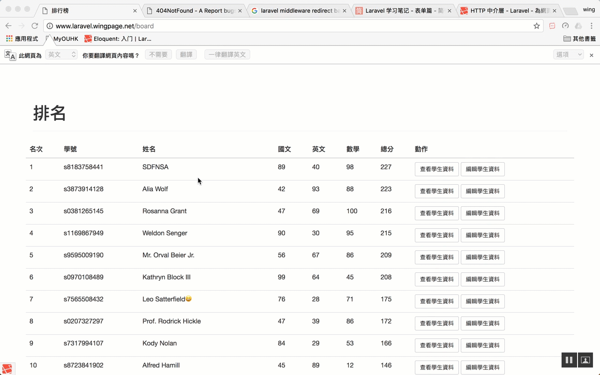

# 6 - Laravel 5.2 Middleware 中面層

> https://laravel.tw/docs/5.0/middleware

HTTP 中介層提供一個方便的機制來過濾進入應用程式的 HTTP 請求

生成`php artisan make:middleware OldMiddleware`


如果student_no不是`s8183758441` 返回上一頁

> app/Http/Middleware/OldMiddleware.php

```php
<?php

namespace App\Http\Middleware;

use Closure;

class OldMiddleware
{
    /**
     * Handle an incoming request.
     *
     * @param  \Illuminate\Http\Request  $request
     * @param  \Closure  $next
     * @return mixed
     */
    public function handle($request, Closure $next)
    {
        if ($request->student_no != 's8183758441') {
            return redirect()->back();//上一頁
        }
        return $next($request);
    }
}
```

> app/Http/Kernel.php

註冊OldMiddleware

```php
    protected $routeMiddleware = [
        ...
        'test' => \App\Http\Middleware\OldMiddleware::class,
    ];
```

> app/Http/routes.php


```php
...
Route::group(['middleware'=>'test'],function(){
    Route::get('edit/{student_no}','SchoolController@getEdit');
    Route::post('edit/{student_no}','SchoolController@postEdit');
});
```


效果: 如果student_no不是`s8183758441` 返回上一頁




