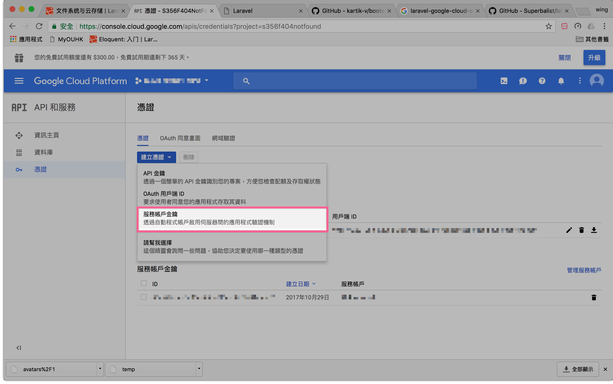
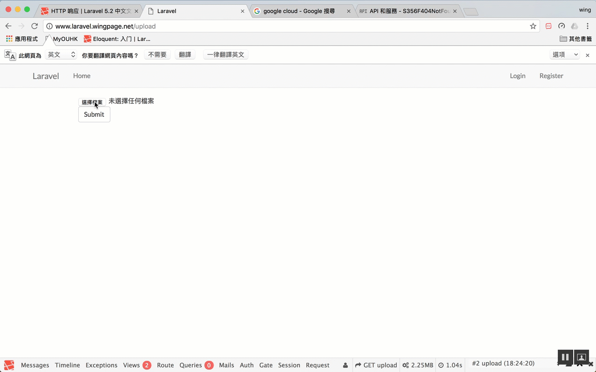

# 7 - Laravel 5.2 Google Cloud Storage


> https://github.com/Superbalist/laravel-google-cloud-storage

這個是 flysystem 的google cloud storage 接口

```
php56 /usr/local/bin/composer require superbalist/laravel-google-cloud-storage
```
**config/app.php**


```
'providers' => [
    // ...
Superbalist\LaravelGoogleCloudStorage\GoogleCloudStorageServiceProvider::class,
]
```

**config/filesystems.php**

```php
'gcs' => [
    'driver' => 'gcs',
    'project_id' => env('GOOGLE_CLOUD_PROJECT_ID', 'your-project-id'),
    'key_file' => env('GOOGLE_CLOUD_KEY_FILE', 'xxx.json'), // /public/xxx.json
    'bucket' => env('GOOGLE_CLOUD_STORAGE_BUCKET', 'your-bucket'),
    'path_prefix' => env('GOOGLE_CLOUD_STORAGE_PATH_PREFIX', null),
    'storage_api_uri' => env('GOOGLE_CLOUD_STORAGE_API_URI', null), 
],
```

key file



**app/Http/routes.php**

    
```
Route::get('upload', 'uploadController@index');
Route::POST('upload', 'uploadController@upload');
```


```php
<form action="{{ action('uploadController@upload') }}" method="POST" enctype="multipart/form-data">
                {{ csrf_field() }}
    <input name="uploadFile[]" type="file" multiple>
        <button class="btn btn-default" type="submit">
            Submit
        </button>
    </input>
</form>
    @if(session('filesLink')) {{-- check有無野 --}}
        @foreach(session('filesLink') as $fileLink)
            <a href="{{ $fileLink }}">{{ $fileLink }}</a>
            <br />
        @endforeach
    @endif
```

 **app/Http/Controllers/uploadController**
 
```php
<?php

namespace App\Http\Controllers;

use Illuminate\Http\Request;
use View;
use Illuminate\Support\Facades\Storage;
use File;

class uploadController extends Controller
{
    public function index()
    {
        return view('upload'); // link to -> resources/views/welcome.blade.php
    }

    public function upload(Request $request)
    {
        $files = $request->file('uploadFile');
        $filesLink = array();

        if ($files[0] != null) {
            foreach ($files as $file) {
                $filename = $file->getClientOriginalName();// Get the orginal filname
                Storage::disk('gcs')->put($filename, File::get($file));
                $url = Storage::disk('gcs')->url($filename);//get url after uploaded 
                array_push($filesLink, $url);//add url to $filesLink[]
            }
        }
        return redirect('upload')->with('filesLink', $filesLink);
    }
}

```




