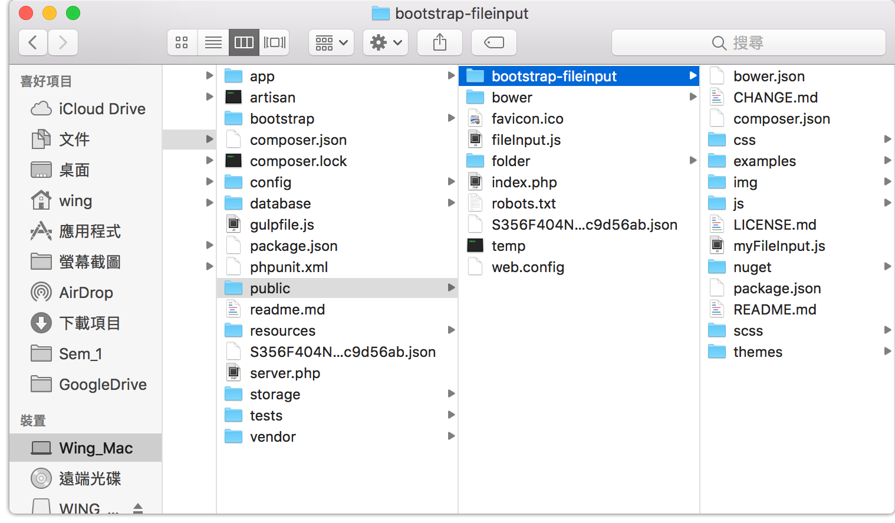

# 8 - Laravel 5.2 bootstrap-fileinput

>https://github.com/kartik-v/bootstrap-fileinput

下載`https://github.com/kartik-v/bootstrap-fileinput` 的lib 放入`public`


在頁面head 載入fileinput
**這裡沒有顯示載入bootstrap 和 jquery 的code**
> head

```html
{{-- fileinput.css --}}
<link href="/bootstrap-fileinput/css/fileinput.css" ./media="all" rel="stylesheet" type="text/css"/>
{{-- fileinput theme --}}
<link href="/bootstrap-fileinput/themes/explorer-fa/theme.css" ./media="all" rel="stylesheet" type="text/css"/>

{{-- fileinput --}}
<script src="https://cdnjs.cloudflare.com/ajax/libs/bootstrap-fileinput/4.4.5/js/fileinput.min.js"></script>
<script src="/bootstrap-fileinput/js/plugins/sortable.js" type="text/javascript"></script>
<script src="/bootstrap-fileinput/js/fileinput.js" type="text/javascript"></script>
<script src="/bootstrap-fileinput/js/locales/fr.js" type="text/javascript"></script>
<script src="/bootstrap-fileinput/js/locales/es.js" type="text/javascript"></script>
<script src="/bootstrap-fileinput/themes/explorer-fa/theme.js" type="text/javascript"></script>
<script src="/bootstrap-fileinput/themes/fa/theme.js" type="text/javascript"></script>
<script src="https://cdnjs.cloudflare.com/ajax/libs/popper.js/1.11.0/umd/popper.min.js" type="text/javascript"></script>
```
> body

```html
<form action="{{ action('uploadController@submit') }}" enctype="multipart/form-data" method="post" name="bugForm">
    {{ csrf_field() }}
    <div class="file-loading">
        <input id="kv-explorer" multiple="" name="uploadFile[]" type="file"></input>
    </div>
    <br>
    <button class="btn btn-primary" type="submit">Submit</button>                    
</form>

```

> js


```js
    $(document).ready(function() {
        $("#kv-explorer").fileinput({
            theme: 'explorer-fa',
            uploadUrl: 'http://www.laravel.wingpage.net/upload/test/upload',
            //https://github.com/kartik-v/bootstrap-fileinput/issues/325
            //拖放僅適用於AJAX模式，並且在配置為使用表單提交或使用本機HTML輸入功能時不起作用 - 因此在表單提交時不會將數據發送到服務器。
            showCaption: true,
            showPreview: true,
            showUpload: true,
            showRemove: false,
            uploadAsync: true, //逐張逐張放上去? 預設系true 逐張逐張放上去
            fileActionSettings: {
                showUpload: true, //disable upload https://github.com/kartik-v/bootstrap-fileinput/issues/925
            },
        });
        $('#kv-explorer').on('fileuploaded', function(event, data, previewId, index) {
            var fileName = data.files[index].name;
            var fileUrl = data.response;
            addHidden(document.forms.bugForm, 'fileUrl[' + index + '][]', fileName);
            addHidden(document.forms.bugForm, 'fileUrl[' + index + '][]', fileUrl);
            addHidden(document.forms.bugForm, 'fileUrl[' + index + '][]', previewId);
        });
        
        //remove
        $('#kv-explorer').on('filesuccessremove', function(event, id) {
            var fileUrlOfInputSet = findInputNameIsFileUrl();
            fileUrlOfInputSet.forEach(function(item) {
                var inputArray = document.getElementsByName(item);
                if (inputArray[2].value == id) {//[2] 系previewId
                    remove(item);
                }
            });
        });
        
    });

    function findInputNameIsFileUrl() {
        var fileUrlOfInputSet = new Set(); //save input name which ="fileUrl" Set特性不會重覆
        //搵input name有"fileUrl"的element
        var inputs, index;
        inputs = document.getElementsByTagName('input');
        for (index = 0; index < inputs.length; ++index) {
            if (inputs[index].name.indexOf("fileUrl") >= 0) {
                fileUrlOfInputSet.add(inputs[index].name);
            }
        }
        return fileUrlOfInputSet;
    }

    function addHidden(theForm, key, value) {
        // Create a hidden input element, and append it to the form:
        var input = document.createElement('input');
        input.type = 'hidden';
        input.name = key; // 'the key/name of the attribute/field that is sent to the server
        input.value = value;
        theForm.appendChild(input);
    }

    function remove(inputName) {
        var ele = document.getElementsByName(inputName);
        len = ele.length;
        parentNode = ele[0].parentNode;
        for (var i = 0; i < len; i++) {
            parentNode.removeChild(ele[0]);
        }
    }
```

> uploadController.php


```php
    public function upload(Request $request)
    {
        $files = $request->file('uploadFile');//input name
        $filesLink = array();

        //可以處理async(一個一個file處理) 和sync(多個file一次過處理)
        if ($files[0] != null) {
            foreach ($files as $file) {
                // Get the orginal filname or create the filename of your choice
                $filename = $file->getClientOriginalName();
                //掉去Google Cloud Storage
                Storage::disk('gcs')->put($filename, File::get($file));
                $url = Storage::disk('gcs')->url($filename);//get url
                array_push($filesLink, $url);
            }
        }

        return $filesLink;
    }

    public function submit(Request $request)
    {
        Debugbar::info($request->input('fileUrl'));
        return json_encode($request->input('fileUrl'));
    }
```


