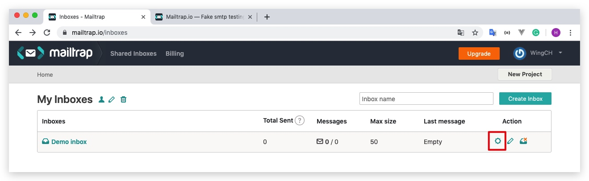
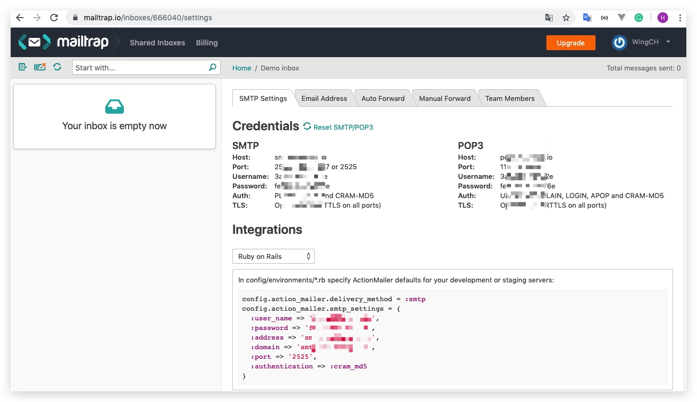
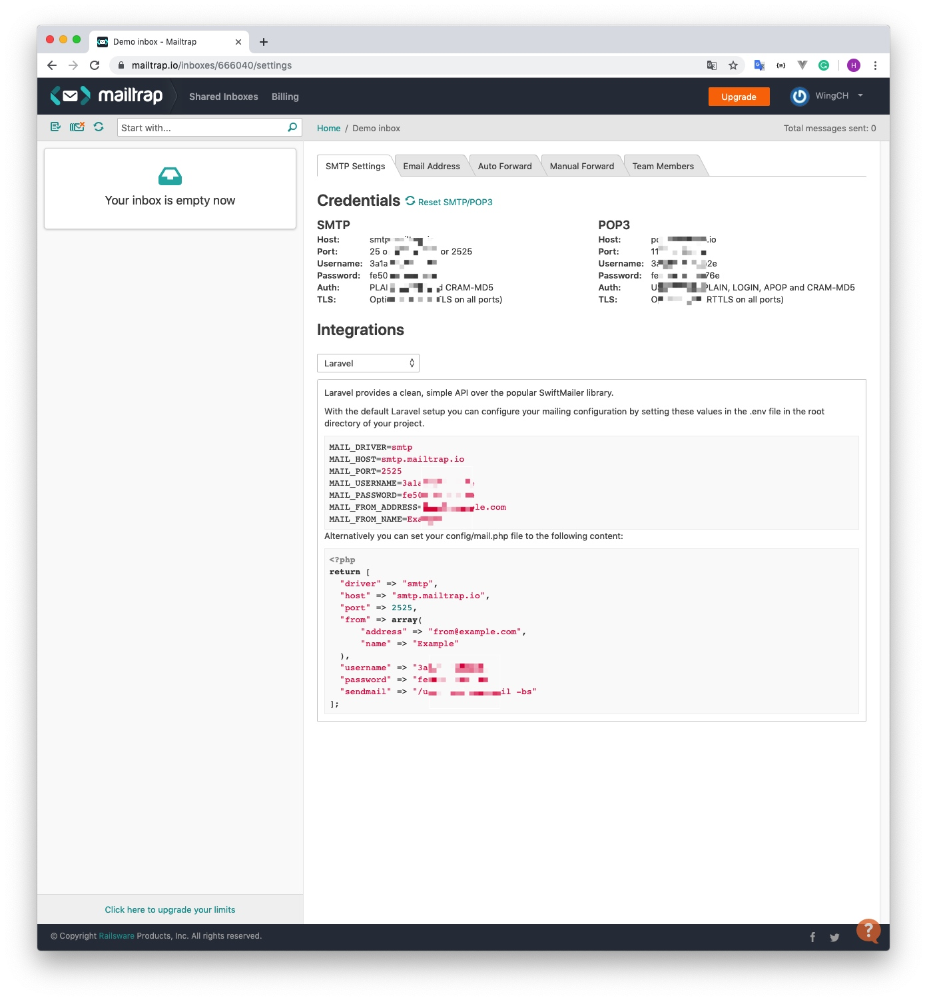
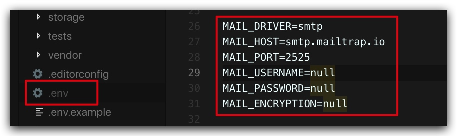
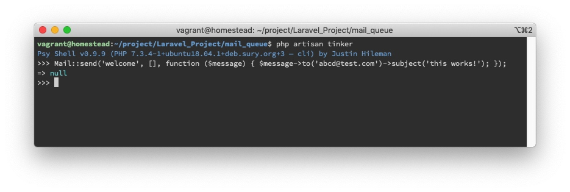
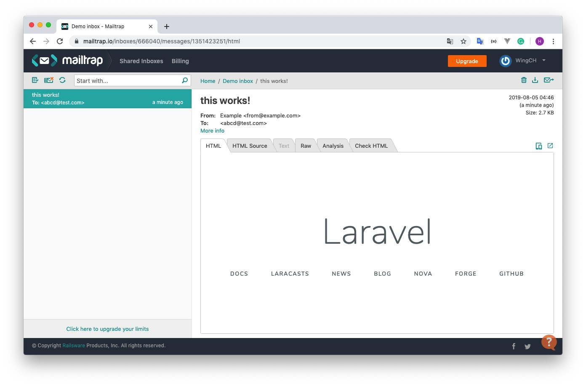
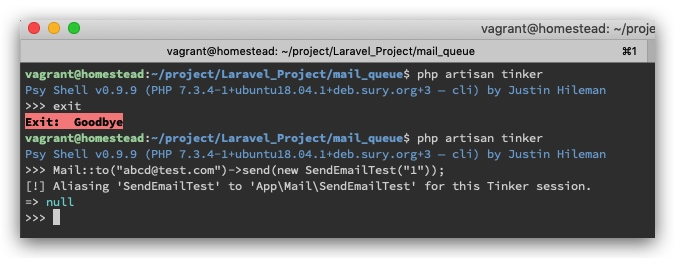
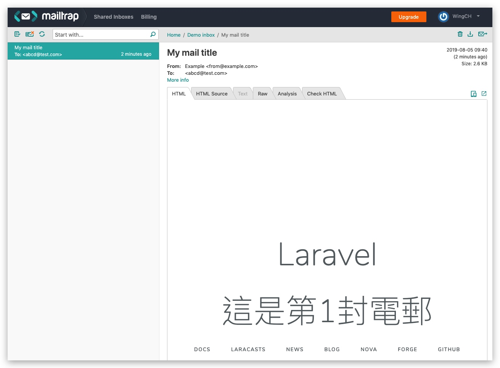
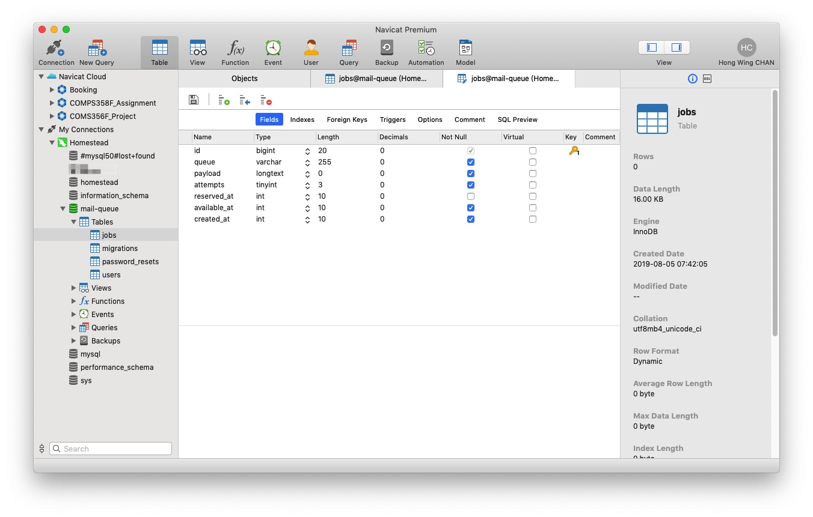
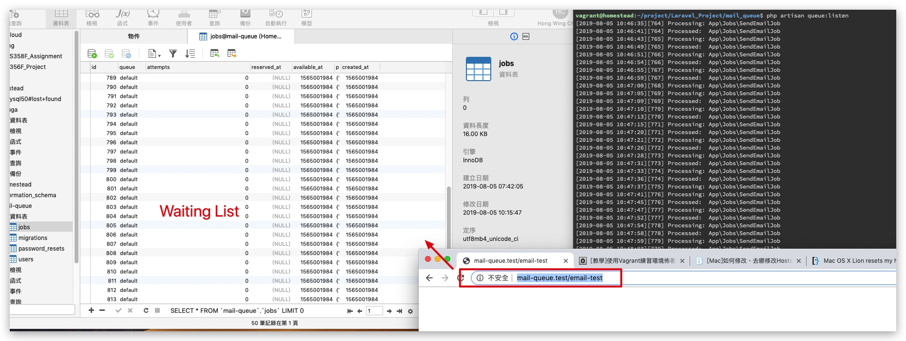

# 9 - Laravel 5.8.30 Mail queue

## Mailtrap 設定

> Mailtrap is a fake SMTP server for development teams to test...

在https://mailtrap.io/ 建立帳號

取得config資料



貼上在`.env`


### 利用 Laravel Tinker 快速測試電郵

> Laravel artisan的修補程序是一個REPL（read-eval-print-loop），REPL是指交互式命令行界面，它可以讓你輸入一段代碼去執行，並把執行結果直接打印到命令行界面裡。[[source](https://laravelacademy.org/post/4935.html)]


```shell
#進入tinker環境
php artisan tinker

# welcome代表`resources/views/welcome.blade.php`，是原本內置的view，現在用來作為mail的內容
Mail::send('welcome', [], function ($message) { $message->to('abcd@test.com')->subject('this works!'); });
```


mailtrap 會截獲到這封email，代表成功運作


## Mailable

> 上面`Mail::send`的方法是Laravel 5.2的
> Laravel 5.3官方使用了一套乾淨、簡潔的郵件 API - Mailable

**建立Mailable**
```shell
php artisan make:mail SendEmailTest
#app/Mail/SendEmailTest.php
```


```php
#SendEmailTest.php

class SendEmailTest extends Mailable
{
    use Queueable, SerializesModels;

    /**
     * Create a new message instance.
     *
     * @return void
     */
    protected  $mail_index;

    public function __construct($mail_index)
    {
        #紀錄第__封電郵
        $this->mail_index = $mail_index;
    }

    /**
     * Build the message.
     *
     * @return $this
     */
    public function build()
    {
        return $this->view('welcome')
            ->subject("My mail title")
            ->with([
                'index' => $this->mail_index,
              ]);;
    }
}
```


```html
#welcome.blade.php
...
 <div class="content">
            <div class="title m-b-md">
                Laravel
            </div>
            @if(!empty($index))
            <div class="title m-b-md">
                這是第{{$index}}封電郵
            </div>
            @endif

            ...
</div>
```

**利用tinker測試**

>當code有更新時，需要退出tinker後重新進入，否則會運行不到更新後的code
>https://laracasts.com/discuss/channels/tips/tinker-reload?page=1

```shell
Mail::to("abcd@test.com")->send(new SendEmailTest("1"));
```





## Queue
### Setup
現在隊列驅動使用database，其他隊列驅動參考:https://docs.laravel-dojo.com/laravel/5.5/queues
```text
#env
...
QUEUE_CONNECTION=database
...
```

建立一個資料表用來放置任務
```
php artisan queue:table

php artisan migrate
```



### Create Queue Job

```shell
php artisan make:job SendEmailJob
#app/Jobs/SendEmailJob.php
```


```php
#SendEmailJob

...
use App\Mail\SendEmailTest;
use Mail;

class SendEmailJob implements ShouldQueue
{
    use Dispatchable, InteractsWithQueue, Queueable, SerializesModels;
    protected $details;

    /**
     * Create a new job instance.
     *
     * @return void
     */

    public function __construct($details)
    {
        $this->details = $details;
    }

    /**
     * Execute the job.
     *
     * @return void
     */
    public function handle()
    {
        $email = new SendEmailTest($this->details['index']);
        Mail::to($this->details['email'])->send($email);
    }
}
```

## Test

> 不知道為什麼用tinker測試不到


```shell
# 要先打開Queue才會運行，不然會一直等...
php artisan queue:listen
```

```php
#routes/web.php
Route::get('email-test', function () {
    for ($i = 1; $i <= 50; $i++) {
        $details['email'] = 'abcd@test.com';
        $details['index'] = $i;
        dispatch(new App\Jobs\SendEmailJob($details));
    }
});
```

**在瀏覽器上-> http://mail-queue.test/email-test**




-------
[mail.2019-08-05 19_49_54](./media/15649757282855/mail.2019-08-05%2019_49_54.gif)
