# AWS Laravel docker

## AWS 設定

選擇EC2的主機

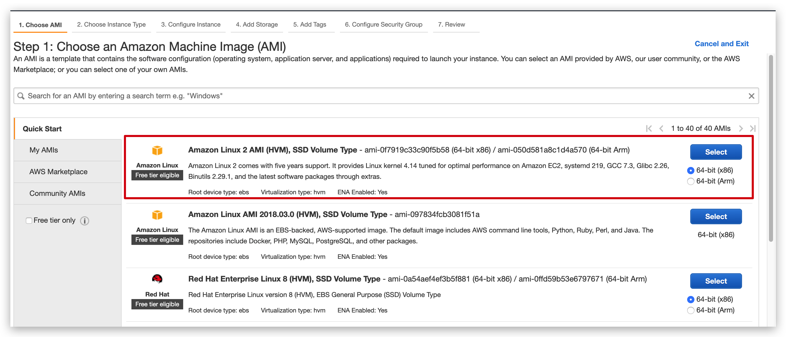

下載Key Pair `pem`, 用放ssh登入

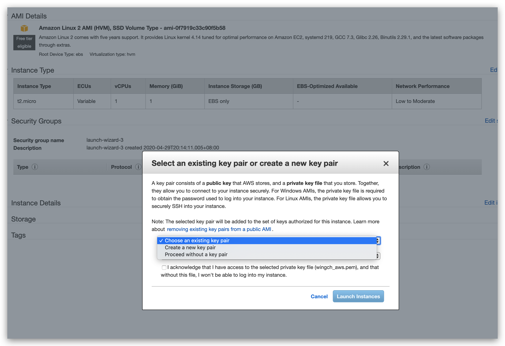

```shell
# 要增加權限才能使用 參考 https://blog.csdn.net/u013197629/article/details/73608613
chmod 600 xxx.pem
```

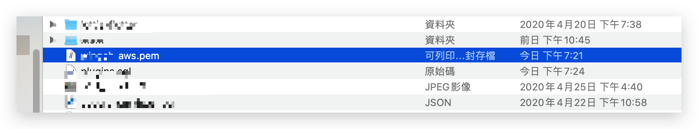

記下`Public DNS (IPv4)`

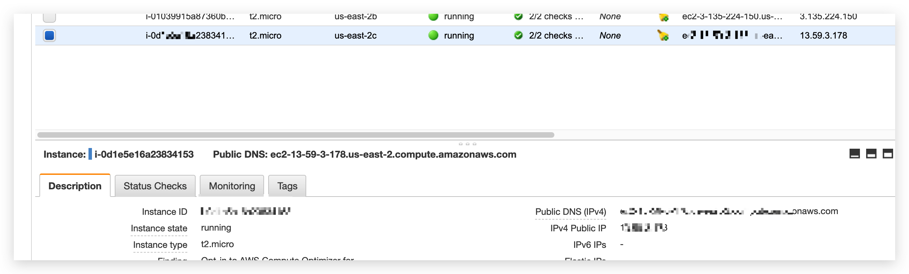

開http port 80, 443

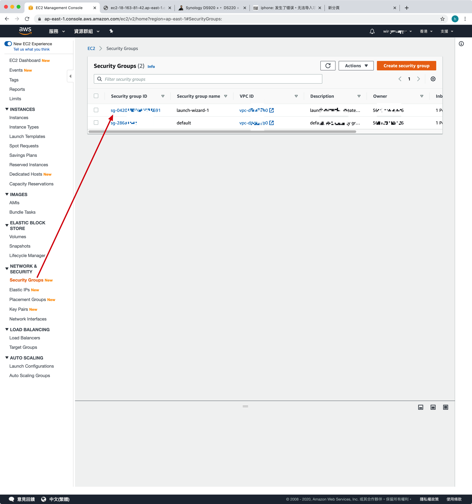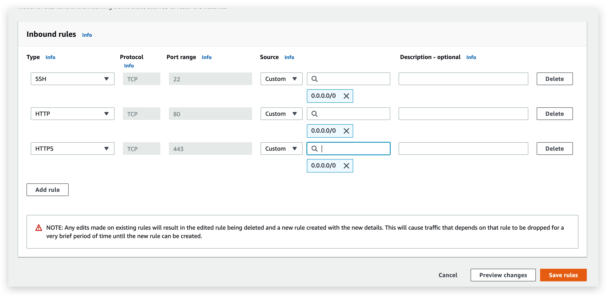

使用ssh連接server

```
ssh -i xxx.pem ec2-user@xxxxxxxxxxxxx.compute.amazonaws.com
```

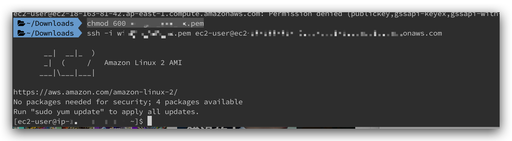


安裝git 和 docker 

```shell
sudo yum update -y
sudo yum install git -y
sudo yum install docker -y
```

[安裝 docker-compose](https://docs.docker.com/compose/install/)

```shell 
sudo curl -L "https://github.com/docker/compose/releases/download/1.25.5/docker-compose-$(uname -s)-$(uname -m)" -o /usr/local/bin/docker-compose
sudo chmod +x /usr/local/bin/docker-compose
sudo ln -s /usr/local/bin/docker-compose /usr/bin/docker-compose
docker-compose --version

docker-compose version 1.25.5, build 8a1c60f6
```

如果想clone `Private`的頂目，需要增加ssh key

[Clone GiltLab repository with SSH in AWS](https://medium.com/modulr/clone-giltlab-repository-with-ssh-in-aws-4d2be998bebb)

```shell
ssh-keygen -t rsa -C "your.email@gmail.com" -b 4096
#copy
cat ~/.ssh/id_rsa.pub
```

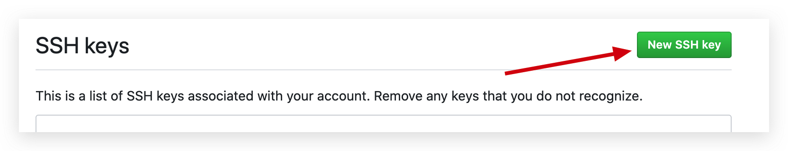

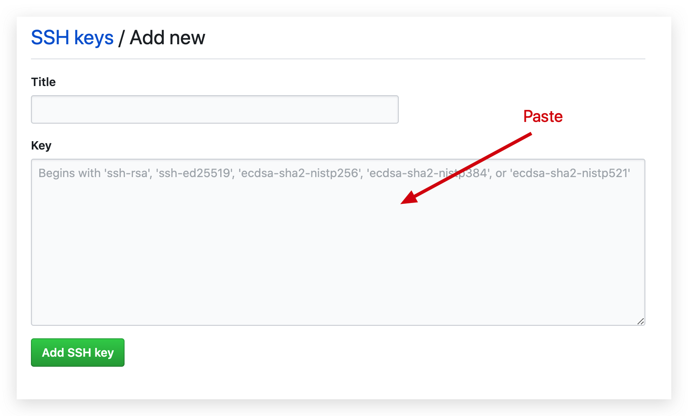

Clone GitHub `Private`頂目

```shell
git clone git@github.com:xxxxxx.git
```

---

## Laravel 設定

我是使用submodule的方式使用[Laradock](https://laradock.io/getting-started/#a-1-already-have-a-php-project)

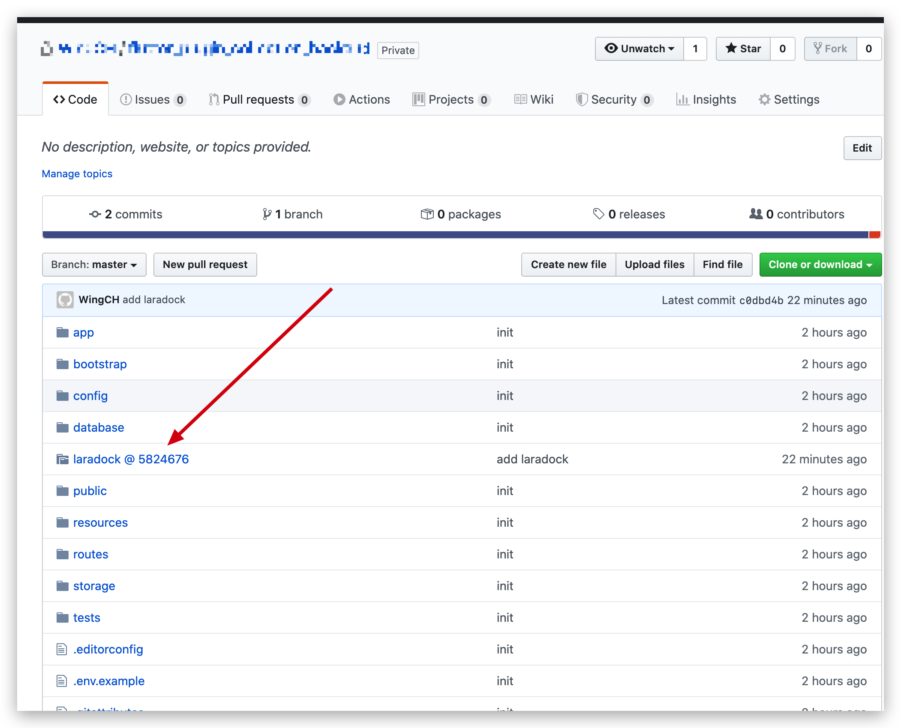

上面的`git clone` 不會下載submodule，所以需要再下載: https://blog.chh.tw/posts/git-submodule/

```shell
git submodule init
git submodule update --recursive
```

接下來，根據官方教學設定一下, https://laradock.io/getting-started/#a-2-don-t-have-a-php-project-yet

```shell
cd laradock
cp env-example .env
vim .env

APP_CODE_PATH_HOST=../project-z/
```

先把`ec2-user`加入docker 群組: 

>  [[ Solution ] 啟動 docker-compose 發生 ERROR: Couldn’t connect to Docker daemon at http+docker://localunixsocket - is it running? 錯誤](https://oranwind.org/-solution-qi-dong-docker-compose-fa-sheng-error-couldnt-connect-to-docker-daemon-at-httpdockerlocalunixsocket-is-it-running-cuo-wu/)

```shell
# 加入docker 群組
sudo gpasswd -a ${USER} docker
# 切換到su
sudo su
# 再切換到ec2-user, 藉此刷新
su ec2-user
```

啟動docker和docker-compose, 安裝需要一段時間

```shell
sudo systemctl start docker
docker-compose up -d nginx mysql


docker-compose exec workspace bash
# 安裝Laravel 依賴
composer install
cp .env.example .env
php artisan key:generate
```

```
# 參考
APP_NAME=Laravel
APP_ENV=local
APP_KEY=base64:eCCidQPpxTux5Pcp3iYF56ZcV6DTXursA7Y6ZCYB9fw=
APP_DEBUG=true
APP_URL=http://localhost

LOG_CHANNEL=stack

DB_CONNECTION=mysql
DB_HOST=mysql
DB_PORT=3306
DB_DATABASE=flutter_plugin_collection_backend
DB_USERNAME=root
DB_PASSWORD=root

BROADCAST_DRIVER=log
CACHE_DRIVER=file
QUEUE_CONNECTION=sync
SESSION_DRIVER=file
SESSION_LIFETIME=120

REDIS_HOST=127.0.0.1
REDIS_PASSWORD=null
REDIS_PORT=6379
```


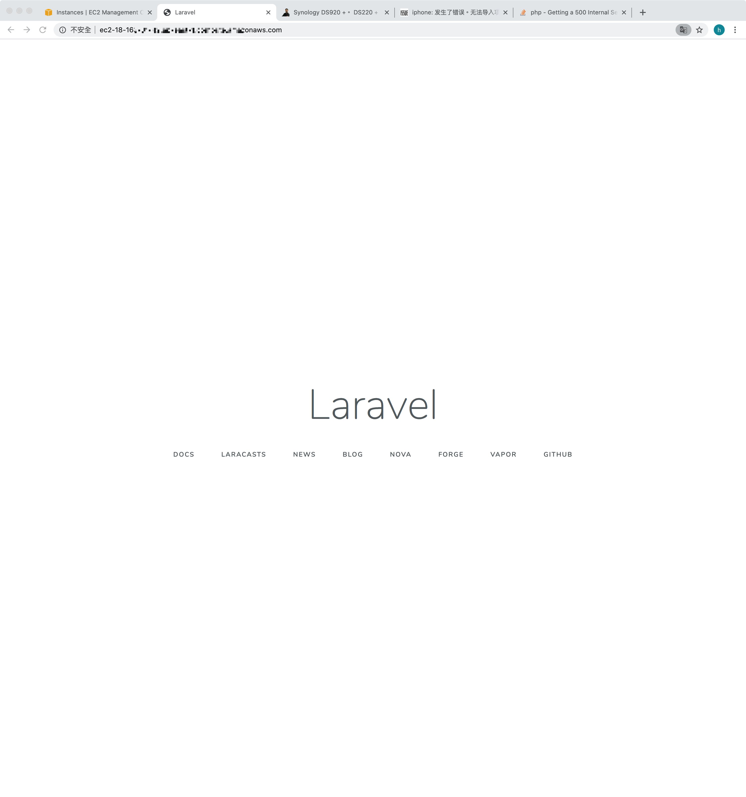

### 其他操作 

參考: http://notes.wingpage.net/content/Laravel/DockerSetup.html

---

## 相關問題:

#### was loaded over HTTPS, but requested an insecure XMLHttpRequest endpoint

https://stackoverflow.com/a/33831697/5588637

參考: 

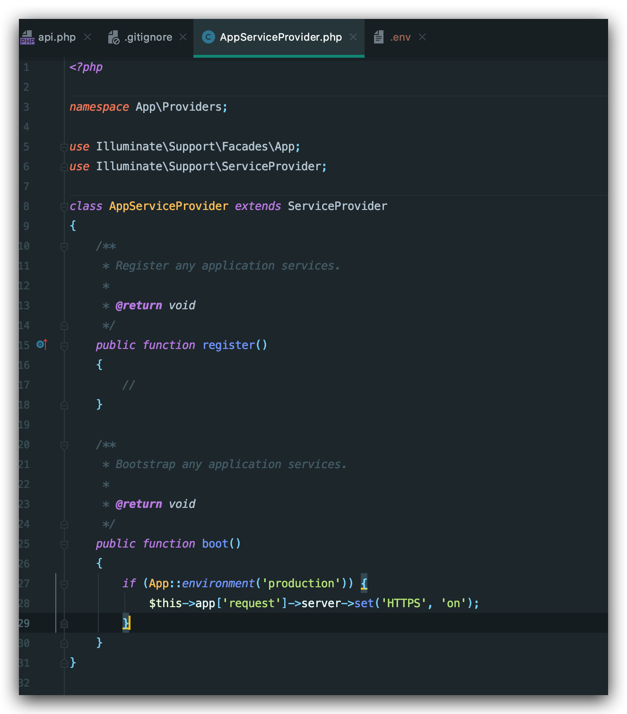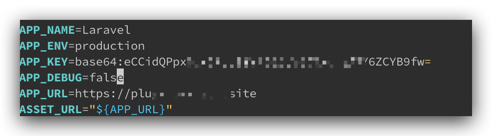