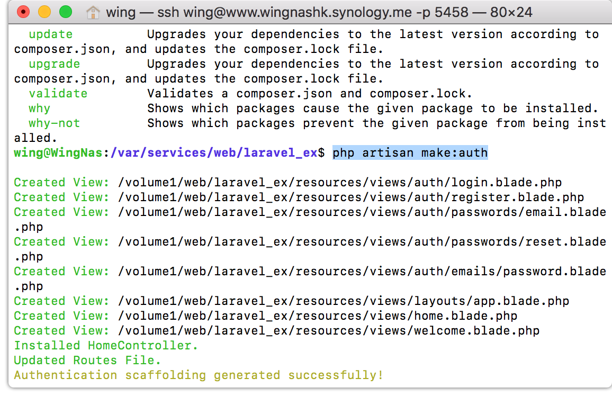
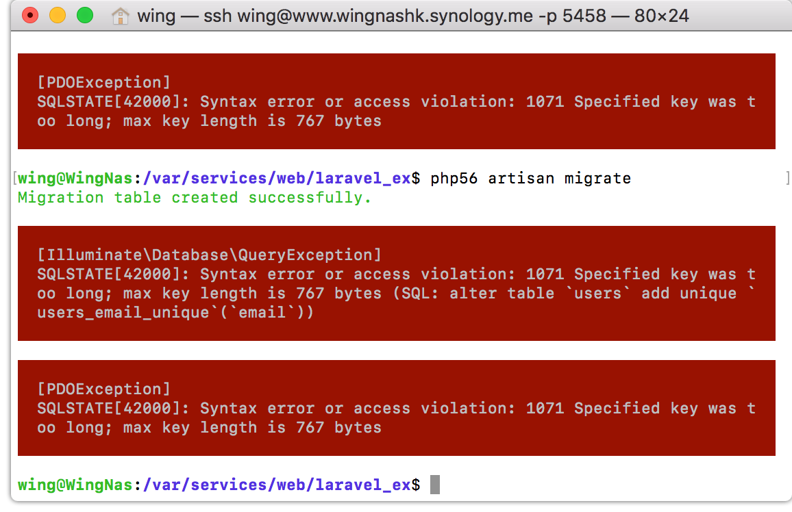

# Laravel 5.2 Auth

> 參考 ： https://laravel.tw/docs/5.2/authentication

### 最簡單官方的方法 : Email

去到Project目錄
Laravel 提供一個快速的指令來幫你建立所有認證所需的路由及視圖，指令如下：

```php
php artisan make:auth
```

這個指令應該只被用在全新的應用程式。這個指令將會安裝註冊和登入視圖，以及所有認證相關的路由。這個指令也會產生一個 HomeController，這個控制器負責處理登入後的應用程式導覽頁面。然而，你可以自由地根據你的應用程式所需來自訂或移除這些控制器。




#### 自動生成table (官方叫做遷移)

創建一個資料表來儲存密碼的重置標記，而這個資料表的遷移已經包含在 Laravel 中了，就被放在 database/migrations 資料夾裡。所以，你要做的就是做一次遷移：

```php
php56 artisan migrate
```

會有error
問題好像是我在將utf8轉了utf8mb4...
網上有解決方法但只適用在>5.4 
https://laravel-news.com/laravel-5-4-key-too-long-error
但table已正常生成... 貌似可正常使用


//http://www.laravel.wingpage.net/login


-------

php56 /usr/local/bin/composer require laravel/socialite 2.0.*

