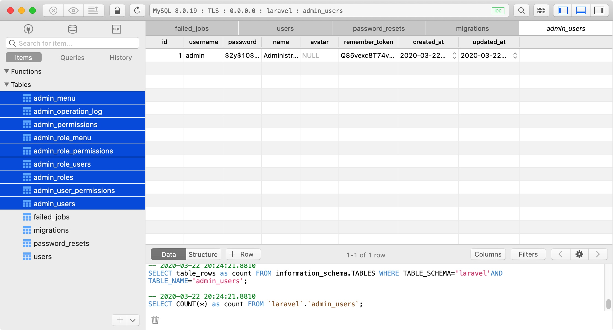
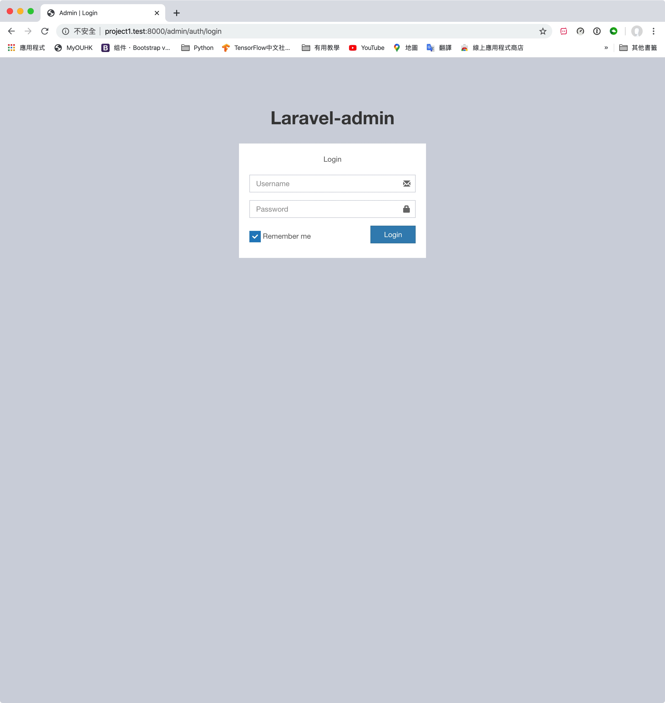
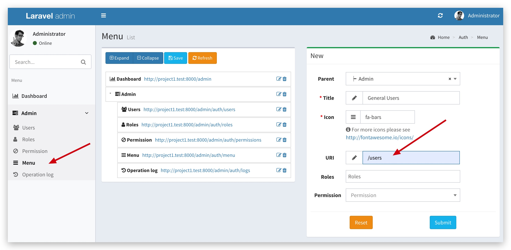
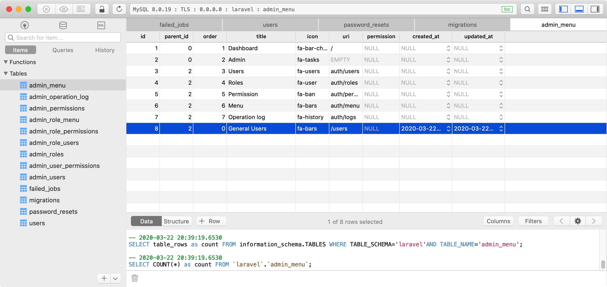
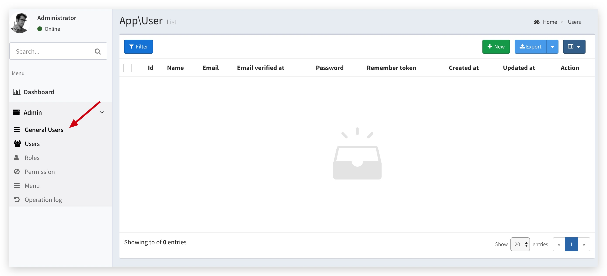
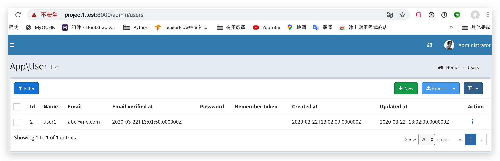
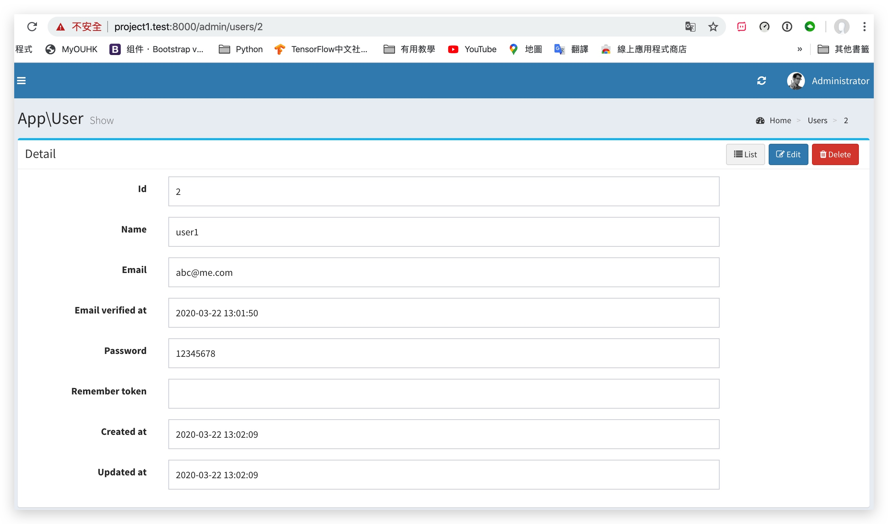
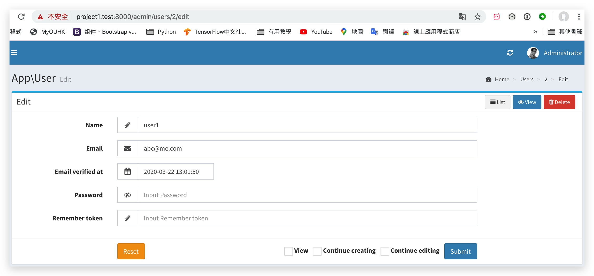
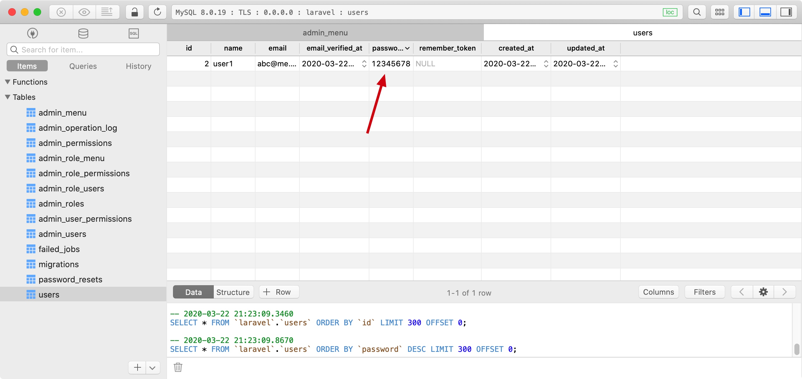
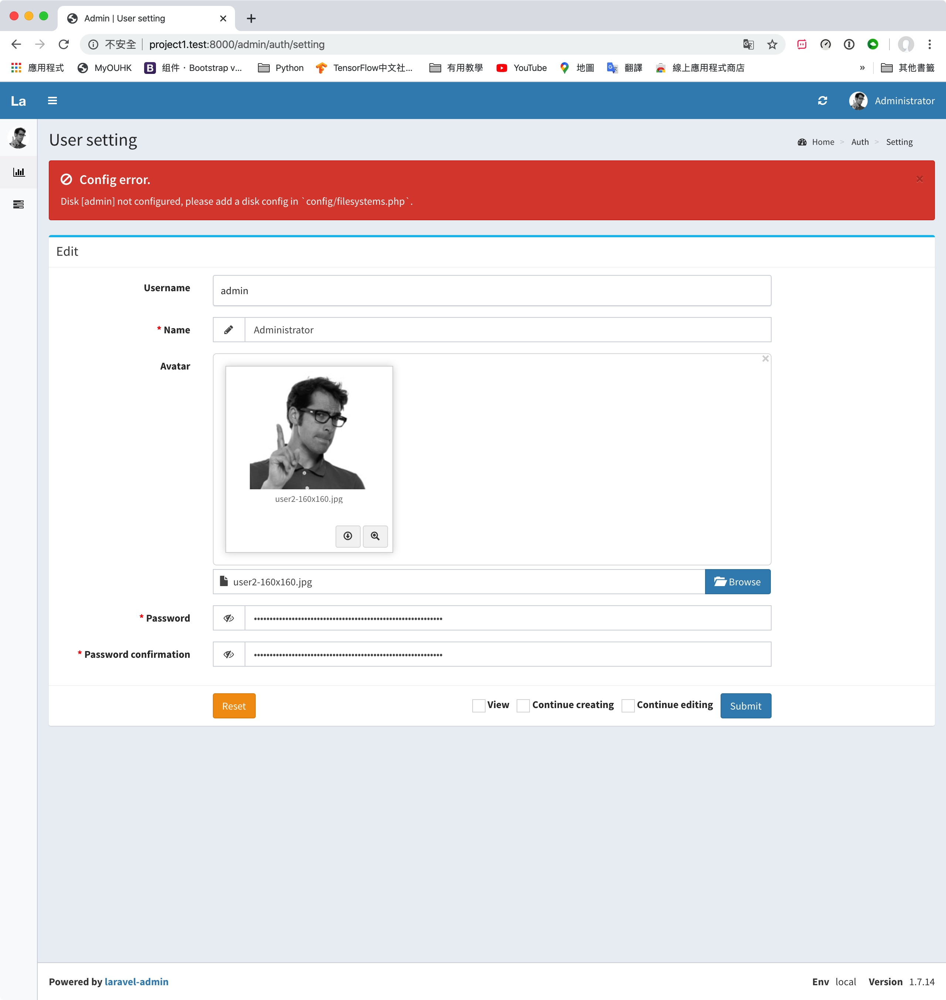

# Laravel Admin

> https://laravel-admin.org/docs/zh/installation

安裝
```
composer require encore/laravel-admin
php artisan vendor:publish --provider="Encore\Admin\AdminServiceProvider"
php artisan admin:install

```

會自動生成以下table, 另外在admin_users生成了`admin`的帳號



打開 `http://localhost/admin/`, 預設帳號密碼都是`admin`




---
打開Laravel自帶的Auth功能
> https://stackoverflow.com/a/34546836/5588637
> https://laravel.com/docs/6.x/frontend

```bash
composer require laravel/ui
php artisan ui bootstrap --auth
php artisan migrate
npm install && npm run dev
```


現在我們沒有帳號登入，嘗試使用laravel-admin 做一個User的後台
> https://laravel-admin.org/docs/zh/quick-start

利用[控制台命令](https://laravel-admin.org/docs/zh/commands)建立一個admin的UserController, 並根據model對應表的字段，默認構建出所需的`grid`, `form`和`show`三個頁面的代碼
```bash
php artisan admin:make UserController --model=App\\User
```

在laravel-admin的路由配置文件`app/Admin/routes.php`添加, `users`是route path
```bash
$router->resource('users', UserController::class);
```

添加側菜單，URL填寫剛剛的route path `/users`


laravel-admin 的側菜單是紀錄在database `admin_menu` table的


成功後會看到多了一項

 
 `admin:make`的命令已經為我們生成了 `grid`, `detail`, `form`
 
 `grid` -> `/admin/users`
 


`detail` -> `/admin/users/${id}`


 `form` -> `/admin/users/create`

 
```php
class UserController extends AdminController
{
    /**
     * Title for current resource.
     *
     * @var string
     */
    protected $title = 'App\User';

    /**
     * Make a grid builder.
     *
     * @return Grid
     */
    protected function grid()
    {
        $grid = new Grid(new User());

        $grid->column('id', __('Id'));
        $grid->column('name', __('Name'));
        $grid->column('email', __('Email'));
        $grid->column('email_verified_at', __('Email verified at'));
        $grid->column('password', __('Password'));
        $grid->column('remember_token', __('Remember token'));
        $grid->column('created_at', __('Created at'));
        $grid->column('updated_at', __('Updated at'));

        return $grid;
    }

    /**
     * Make a show builder.
     *
     * @param mixed $id
     * @return Show
     */
    protected function detail($id)
    {
        $show = new Show(User::findOrFail($id));

        $show->field('id', __('Id'));
        $show->field('name', __('Name'));
        $show->field('email', __('Email'));
        $show->field('email_verified_at', __('Email verified at'));
        $show->field('password', __('Password'));
        $show->field('remember_token', __('Remember token'));
        $show->field('created_at', __('Created at'));
        $show->field('updated_at', __('Updated at'));

        return $show;
    }

    /**
     * Make a form builder.
     *
     * @return Form
     */
    protected function form()
    {
        $form = new Form(new User());

        $form->text('name', __('Name'));
        $form->email('email', __('Email'));
        $form->datetime('email_verified_at', __('Email verified at'))->default(date('Y-m-d H:i:s'));
        # 可選，最少8位
        $form->password('password', __('Password'))->rules('nullable')->rules('min:8');;
        $form->text('remember_token', __('Remember token'));

        return $form;
    }
}
```


-------
1. 加密密碼 (預設密碼不會加密)
2. 想當為空使用原來的密碼


在`form()`入手
```php
    protected function form()
    {
        $form = new Form(new User());
        
        ...
        
        //https://github.com/z-song/laravel-admin/blob/master/src/Controllers/UserController.php#L103
        $form->saving(function (Form $form) {
            if ($form->password && $form->model()->password != $form->password) {
                $form->password = bcrypt($form->password);
            } else {
                $form->input('password', $form->model()->password);
            }
        });

        return $form;
    }
```

-------

### 展开頂端菜單欄

> https://blog.csdn.net/qq_36602939/article/details/100544753

不要`sidebar-collapse`
```php
# config/admin.php
'layout' => ['sidebar-mini'],
```


-------

### filesystems 設定



> https://laravel-admin.org/docs/zh/model-form-upload#本地上传

```php
# filesystems.php
'admin' => [
    'driver' => 'local',
    'root' => public_path('uploads'),
    'visibility' => 'public',
    'url' => '/uploads',
],
```