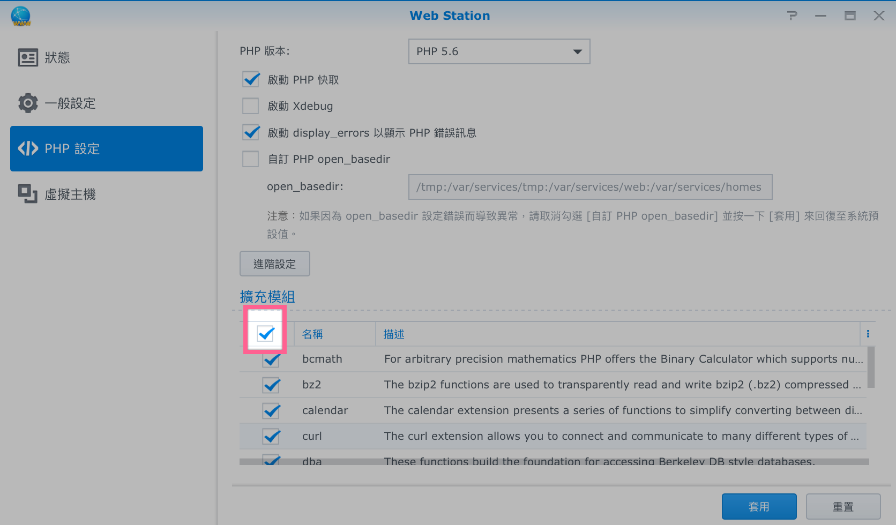
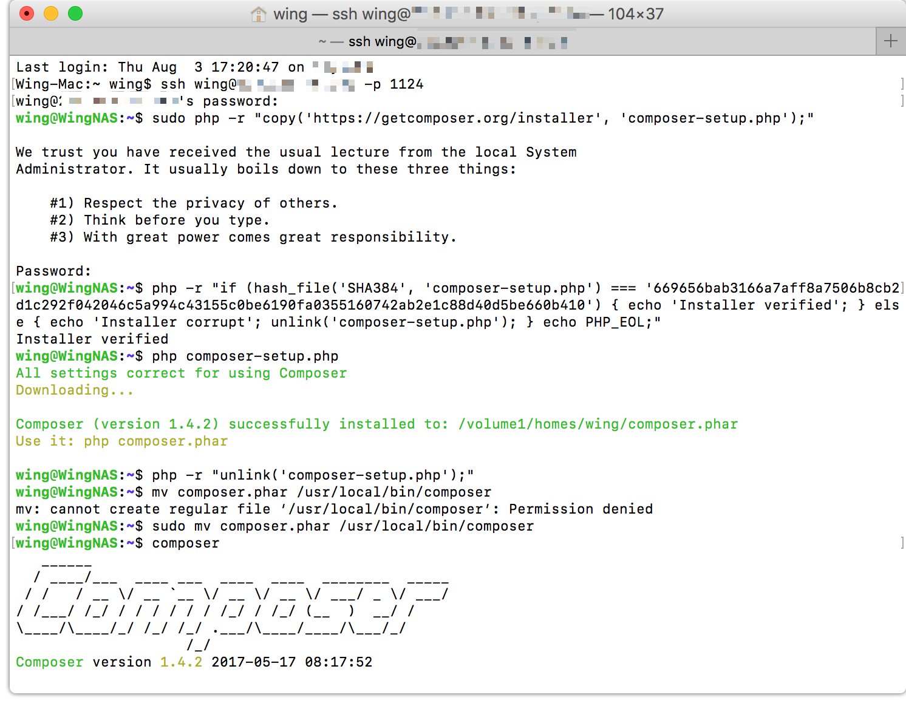
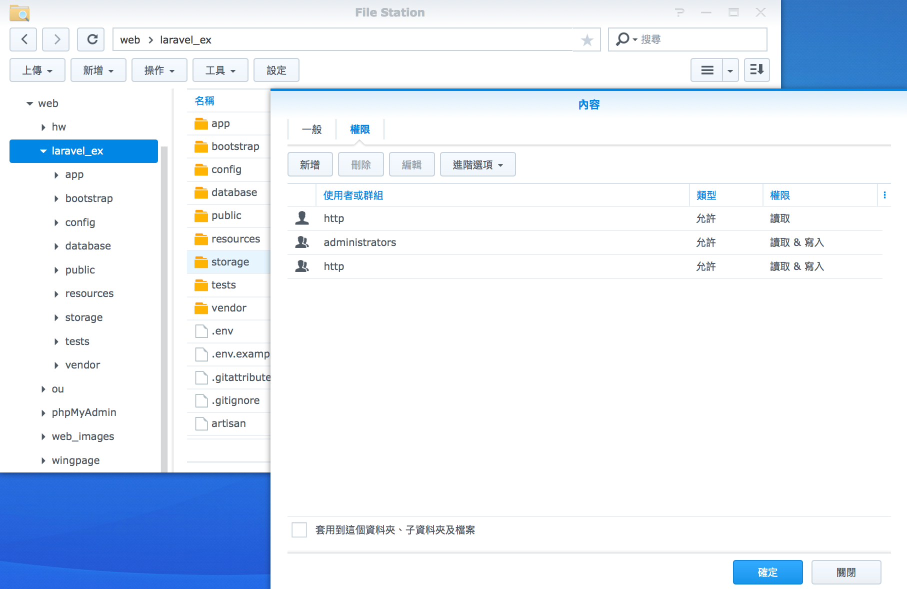
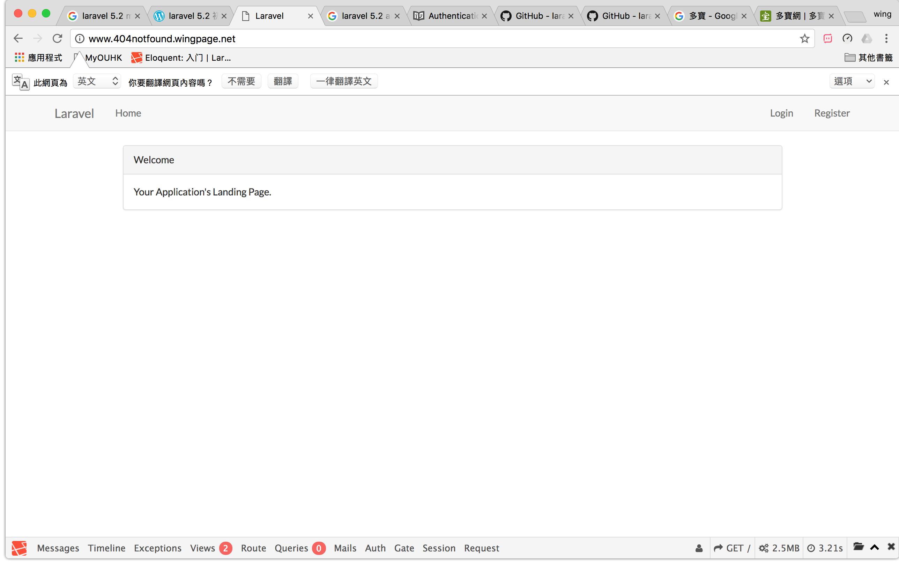
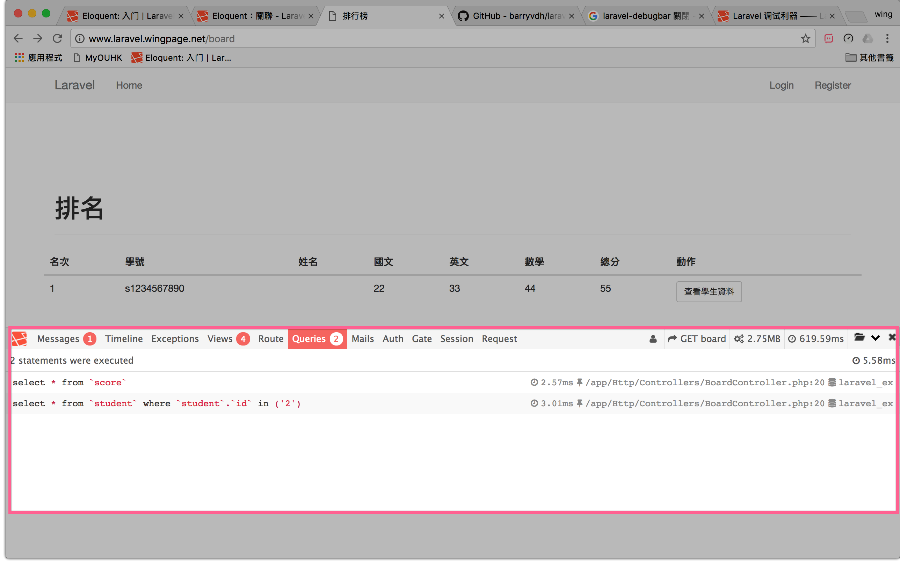
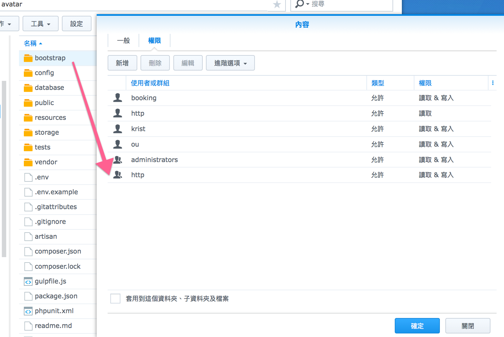

# Synology 安裝 Laravel
在套件中心安裝以下程式
* Web Satation
* PHP5.6
* Apache HTTP Server 2.2

###### 打開Web Satation


###### 安裝composer
> https://getcomposer.org/doc/00-intro.md


```
//copy on https://getcomposer.org/download/
php -r "copy('https://getcomposer.org/installer', 'composer-setup.php');"
php -r "if (hash_file('SHA384', 'composer-setup.php') === '669656bab3166a7aff8a7506b8cb2d1c292f042046c5a994c43155c0be6190fa0355160742ab2e1c88d40d5be660b410') { echo 'Installer verified'; } else { echo 'Installer corrupt'; unlink('composer-setup.php'); } echo PHP_EOL;"
php composer-setup.php
php -r "unlink('composer-setup.php');"

sudo mv composer.phar /usr/local/bin/composer

composer //測試

```



###### 安裝Laravel (使用Composer)

> https://laravel.tw/docs/5.3/installation //方式二：透過 Composer Create-Project

> https://dotblogs.com.tw/michaelfang/2017/04/23/laravel-install-php-framework

**去到相應的目錄 *Synology要用php56**
`php56 /usr/local/bin/composer create-project --prefer-dist laravel/laravel blog`

**指定版本**
~~compos~~~~er create-project laravel/laravel blog 5.3.*~~
`php56 /usr/local/bin/composer create-project --prefer-dist laravel/laravel blog 5.2.*`

-------

######安裝Laravel (使用Laravel 安裝包)
> *不能指定版本
>這個安裝方法比透過 Composer 安裝速度快上許多

```
composer global require "laravel/installer"
sudo ln -s ~/.composer/vendor/bin/laravel /usr/local/bin
laravel new blog
```

**測試**
http://www.yourdomain.com/blog/public/

***如有Error 500***



調較權限 -> 可寫入

Or

> https://stackoverflow.com/questions/31543175/getting-a-500-internal-server-error-on-laravel-5-ubuntu-14-04


-------


**Astisan**
在Project目錄下

```
eg:
php artisan -h
```

-------
開啟auth

```php
php artisan make:auth
```


-------
# 第三方套件

#### laravel-debugbar

> https://github.com/barryvdh/laravel-debugbar


```
php56 /usr/local/bin/composer require barryvdh/laravel-debugbar:~2.4
```

**config/app.php**


```
'providers' => [
    ...
    Barryvdh\Debugbar\ServiceProvider::class,
],

'aliases' => [
    ...
    'Debugbar' => Barryvdh\Debugbar\Facade::class,
],
```


```
php artisan vendor:publish --provider="Barryvdh\Debugbar\ServiceProvider"
```




##### Messages

```php
Debugbar::info($object);
Debugbar::error('Error!');
Debugbar::warning('Watch out…');
Debugbar::addMessage('Another message', 'mylabel');
```

如果`not found` 加入 `use Barryvdh\Debugbar\Facade as Debugbar;`

###### 關閉 Debugbar

**config/debugbar.php**

```
'enabled' => env('DEBUGBAR_ENABLED', null), // null -> false
```

-------

#### whoops

```
php56 /usr/local/bin/composer require filp/whoops
```

> app/Exceptions/Handler.php

```
...
public function render($request, Exception $e)
    {
        if (config('app.debug') && !$request->ajax()) {
            $whoops = new \Whoops\Run;
            $whoops->pushHandler(new \Whoops\Handler\PrettyPageHandler);

            return $whoops->handleException($e);
        }
        return parent::render($request, $e);
    }
```



-------
#### Socialite

> https://github.com/laravel/socialite/tree/2.0

```
php56 /usr/local/bin/composer require laravel/socialite 2.*
```

> config/app.php

```
'providers' => [
    ...
    Laravel\Socialite\SocialiteServiceProvider::class,
],

'aliases' => [
    ...
    'Socialite' => Laravel\Socialite\Facades\Socialite::class,
],
```


-------


