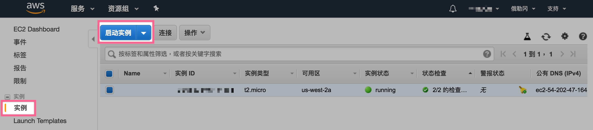
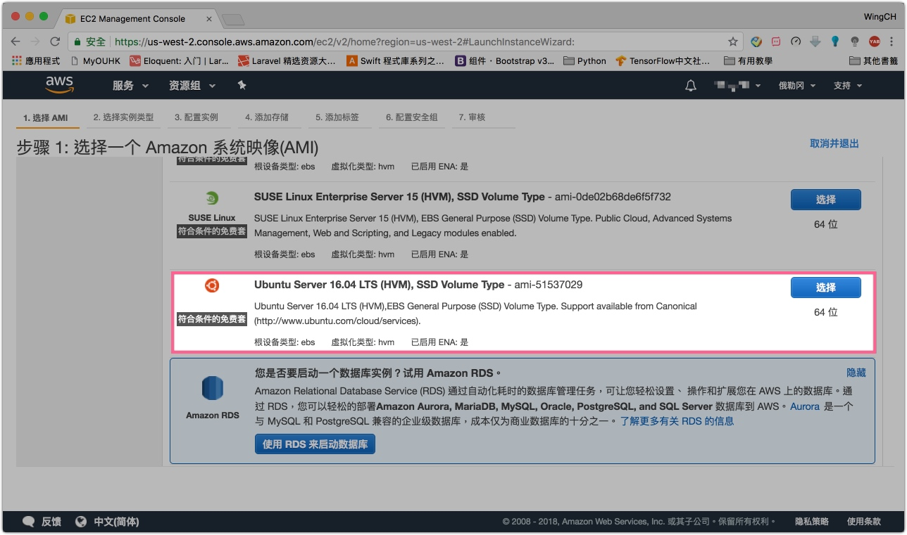
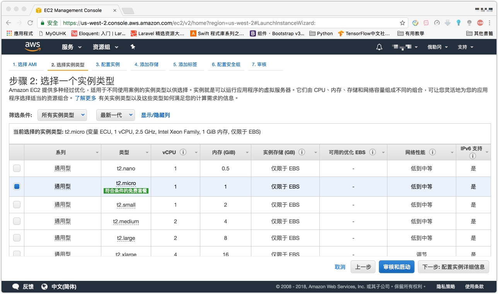
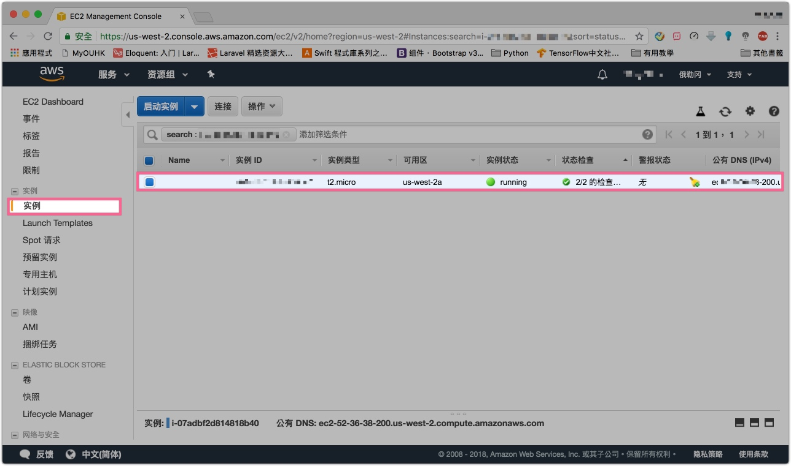
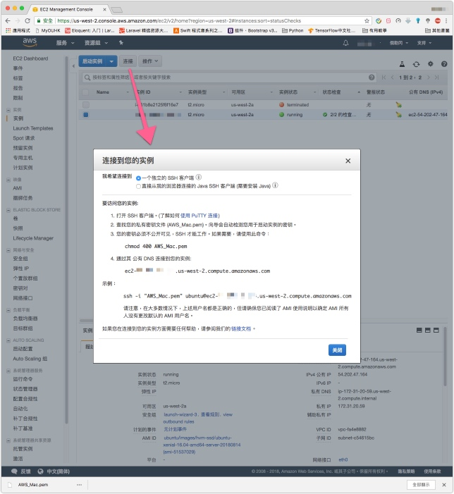

# AWS Ubuntu Setup

1. 啓動實例
2. SSH連接
3. SFTP連接

# 1. 啓動實例

> AWS控制台 
> `實例` -> `啓動實例`



> 這次選擇`Ubuntu Server 16.04 LTS (HVM), SSD Volume Type`



> 直接選擇`審核和啓動`



> 按`創建新的密鈅`，要保存好下密鈅檔案，之後用來登入SSH

> 實例狀態顯示**running**代表成功創建




# 2. SSH連接
這裡是Mac做法

> 將密鈅檔案移到 `/Users/{User Name}/.ssh`，統一管理以免日後不見了


> 進入控制台，點擊**連接**，接下來跟著官方的教學做




> 您的密鑰必須不公開可見，SSH 才能工作。

```shell
chmod 400 AWS_Mac.pem
```

```shell
#ubuntu server的用户名是ubuntu，其他OS的會有所不同
ssh -i "AWS_Mac.pem" ubuntu@{公有DNS}
```

# 3. SFTP連接

> AWS Ubuntu本身已內置SFTP等功能
> 所以可以直接使用SFTP軟件就能使用


> web doc path : /var/www/html/

